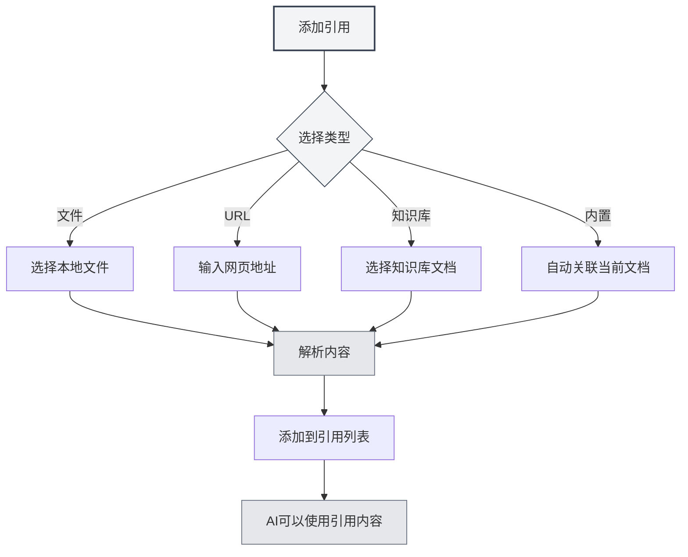

# 引用素材管理

## 概述

引用素材是Agent会话中的重要功能，允许您将外部文档、网页、文件等内容引入对话中。Agent可以基于这些引用素材进行推理和回答，让AI的回答更加准确和相关。

通过引用素材，您可以：

- 让AI参考特定的文档内容
- 基于网页信息进行讨论
- 分析本地文件的内容
- 结合知识库进行深度问答

## 打开引用管理

在Agent会话界面中，点击"引用"标签即可打开引用素材管理面板。

引用面板显示当前会话中所有已添加的引用素材，包括：

- 文件名称或URL
- 引用类型（文件/URL/知识库/内置文档）
- 启用状态
- 内容预览

您可以通过侧边栏访问Agent视图：

<ViewMenuItemsDemo mode="demo" :items='["agent"]' />

## 添加引用

### 添加文件引用

将本地文件添加为引用素材：

1. 在引用面板点击"添加引用"按钮
2. 选择"文件"类型
3. 在文件选择器中选择要引用的文件
4. 确认添加

**支持的文件格式**：

- Markdown文档（.md）
- LaTeX文档（.tex）
- PDF文件（.pdf）
- Word文档（.docx）
- 纯文本文件（.txt）
- 图片文件（.png, .jpg）

### 添加URL引用

引用网页内容：

1. 在引用面板点击"添加引用"按钮
2. 选择"URL"类型
3. 输入要引用的网页地址
4. 点击确认

MetaDoc会自动抓取网页内容并添加到引用中。

### 添加知识库引用

引用知识库中的文档：

1. 在引用面板点击"添加引用"按钮
2. 选择"知识库"类型
3. 从知识库列表中选择要引用的文档
4. 确认添加

### 内置文档引用

每个Agent会话默认启用"内置文档引用"（0号引用），它会动态获取当前打开的文档内容作为引用素材。



## 管理引用

### 启用/停用引用

每个引用素材都可以独立控制启用状态：

- **启用**：引用的内容会参与AI的推理过程
- **停用**：引用的内容暂时不参与推理，但保留在列表中

点击引用素材旁的开关即可切换启用状态。

### 预览引用内容

点击引用素材可以预览其内容：

- **文件引用**：显示文件内容的文本预览
- **URL引用**：显示抓取的网页内容
- **知识库引用**：显示知识库中的相关片段
- **内置引用**：显示当前文档的内容

### 删除引用

从引用列表中移除不再需要的引用：

1. 在引用面板中找到要删除的引用
2. 点击删除按钮（×图标）
3. 确认删除

**注意**：删除引用只会移除引用关系，不会影响原始文件。

## 引用在对话中的作用

### 引用感知

当您激活引用后，Agent在回复时会：

1. **分析引用内容**：理解引用的文档、网页或文件内容
2. **结合上下文**：将引用内容与对话历史结合
3. **生成回答**：基于引用内容生成更准确的回答

### 使用示例

**场景1：基于文档问答**

```
用户：[添加了一篇技术文档作为引用]
用户提问：这篇文档中提到的最佳实践是什么？
AI：根据您引用的文档，最佳实践包括...
```

**场景2：多文档对比**

```
用户：[添加了两篇论文作为引用]
用户提问：比较这两篇论文的研究方法
AI：第一篇论文使用了...而第二篇论文采用了...
```

**场景3：网页内容分析**

```
用户：[添加了一个新闻网页作为引用]
用户提问：总结这篇报道的主要内容
AI：根据网页内容，主要报道了...
```

## 最佳实践

### 高效使用引用

1. **选择相关素材**：只添加与当前话题相关的引用，避免信息过载
2. **控制引用数量**：建议同时激活的引用不超过5个，以保证处理效率
3. **及时清理**：对话结束后，删除不再需要的引用，保持列表整洁

### 引用策略

1. **文档分析**：分析长文档时，添加文档引用并询问具体问题
2. **知识检索**：使用知识库引用进行基于知识库的问答
3. **实时信息**：通过URL引用获取最新的网页信息
4. **上下文延续**：利用内置引用让AI理解当前编辑的文档

## 使用技巧

### 快速添加

- **拖拽添加**：将文件直接拖拽到引用面板
- **右键添加**：在文件或网页上右键选择"添加到引用"
- **快捷键**：使用快捷键快速打开引用面板

### 引用组合

可以同时添加多个不同类型的引用：

- 一份PDF文档 + 一个网页链接
- 多篇知识库文档
- 本地文件 + 内置文档引用

AI会综合分析所有启用的引用内容。

### 临时禁用

如果不确定某个引用是否有用，可以先停用它：

1. 观察AI不带该引用的回答
2. 再启用引用，对比回答差异
3. 根据效果决定是否保留

## 常见问题

### Q: 引用内容有大小限制吗？

A: 有。过大的文件可能会被截断处理。建议：

- 超大文档分章节添加
- 使用知识库处理大量文档
- 长文档可以先提取关键部分

### Q: 为什么添加了引用但AI似乎没有使用？

A: 可能原因：

- 引用未启用（检查开关状态）
- 引用内容与问题无关
- 引用解析失败（检查文件格式）

### Q: URL引用失败怎么办？

A: 可能原因：

- 网页需要登录访问
- 网页有反爬虫机制
- 网络连接问题
  建议：将网页内容保存为文件后添加文件引用

### Q: 引用会占用存储空间吗？

A: 引用本身只是链接，不占用额外空间。但引用的解析结果会缓存在本地。

## 相关文档

- [[agent.session|Agent会话管理]]
- [[agent.config|Agent配置管理]]
- [[knowledge-base.usage|知识库使用]]
- [[agent.introduction|Agent框架概述]]
