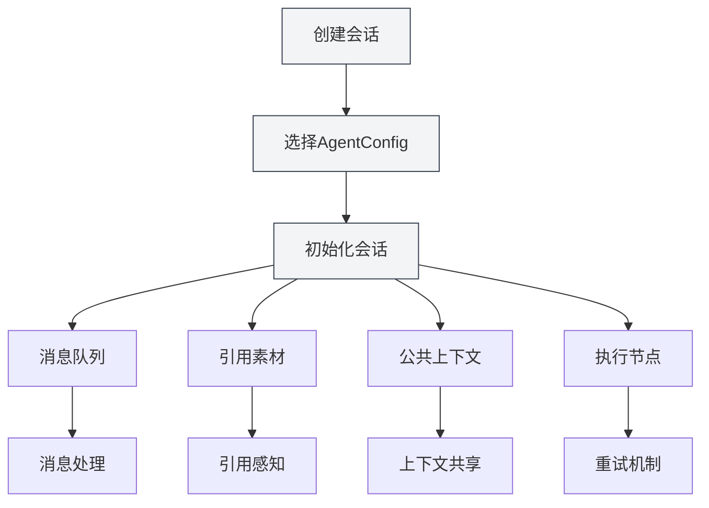
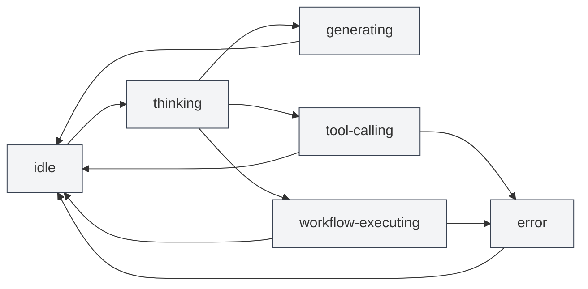

# Agent会话管理

## 概述

Agent会话是Agent框架的核心组件，代表一个独立的、有上下文的Agent执行环境。每个会话维护自己的消息历史、引用素材、公共上下文空间，并支持消息队列、重试、Duplicate等高级功能。

Agent会话基于AgentConfig创建，继承了AgentConfig的工具集和能力范围，但每个会话都有独立的执行状态和历史记录。

## 创建会话

### 创建新会话

创建Agent会话的步骤：

1. **打开Agent视图**：点击菜单栏的"AI" → "Agent"打开Agent视图
2. **选择AgentConfig**：在会话列表上方选择要使用的AgentConfig
3. **创建会话**：点击"新建会话"按钮
4. **输入标题**：可选输入会话标题（默认使用第一条消息作为标题）
5. **开始对话**：输入第一条消息开始与Agent交互

### 会话初始化

创建会话时，系统会自动：

- **创建会话ID**：生成唯一的会话标识符
- **关联AgentConfig**：绑定到指定的AgentConfig
- **初始化消息队列**：创建空的消息队列
- **初始化引用素材**：创建空的引用素材存储
- **初始化公共上下文**：创建公共上下文空间，包含当前时间等信息
- **创建问候语**：自动添加Agent的问候语消息
- **启用内置引用**：默认启用内置0号reference（动态获取当前文档内容）

## 重命名会话

### 重命名操作

重命名现有会话：

1. **右键菜单**：右键点击会话，选择"重命名"
2. **输入新名称**：在弹出的对话框中输入新的会话名称
3. **确认保存**：点击确认保存新名称

会话名称用于标识和区分不同的会话，建议使用描述性的名称。

## 删除会话

### 删除操作

删除不需要的会话：

1. **右键菜单**：右键点击会话，选择"删除"
2. **确认删除**：在弹出的确认对话框中确认删除

**注意**：删除会话会同时删除该会话的所有消息历史、引用素材和执行节点，此操作不可恢复。

### 批量删除

目前不支持批量删除，需要逐个删除会话。

## 复制会话

### 复制操作

复制现有会话：

1. **右键菜单**：右键点击会话，选择"复制"
2. **创建副本**：系统会创建一个新的会话副本

复制会话会复制：

- **消息历史**：所有消息记录
- **引用素材**：所有引用素材
- **公共上下文**：公共上下文空间的内容
- **执行节点**：所有执行节点记录

复制后的会话是独立的，修改不会影响原会话。

### 使用场景

复制会话适用于：

- **分支讨论**：基于现有对话继续讨论不同的话题
- **实验测试**：测试不同的Agent配置或工具集
- **备份保存**：保存重要的会话状态

## 导出/导入会话

### 导出会话

导出会话为JSON文件：

1. **右键菜单**：右键点击会话，选择"导出"
2. **选择位置**：选择保存位置和文件名
3. **保存文件**：点击保存导出会话

导出的JSON文件包含：

- 会话基本信息（ID、标题、描述等）
- 消息历史
- 引用素材
- 公共上下文
- 执行节点

### 导入会话

从JSON文件导入会话：

1. **打开导入**：在Agent视图中找到导入功能
2. **选择文件**：选择要导入的JSON文件
3. **验证数据**：系统验证文件格式和内容
4. **导入会话**：导入成功后创建新会话

导入的会话会创建新的会话ID，不会覆盖现有会话。

## 重试会话

### 重试功能

重试会话允许您重新执行失败的Agent任务：

1. **查看执行节点**：在会话中查看执行节点列表
2. **选择节点**：选择要重试的执行节点
3. **重试执行**：点击"重试"按钮重新执行

重试会从选定的执行节点开始重新执行，保留之前的消息历史。

### 执行节点

执行节点记录Agent执行过程中的每个步骤：

- **消息节点**：用户消息或AI回复
- **工具调用节点**：工具调用和执行结果
- **工作流调用节点**：工作流执行过程
- **LLM调用节点**：LLM调用和响应

每个节点都有状态（pending、running、succeeded、failed、cancelled）和结果。

## 会话消息管理

### 消息操作

对会话消息可以进行以下操作：

- **编辑消息**：编辑用户消息，重新发送
- **重新生成**：重新生成AI回复
- **复制消息**：复制消息内容
- **删除消息**：删除消息（会删除该消息之后的所有消息）

### 消息队列

消息队列允许在Agent执行过程中插入消息：

1. **插入时机**：当Agent正在生成回复或调用工具时，消息会暂存到队列
2. **处理时机**：当前任务执行完成后，在执行下一步之前，会先处理队列中的消息
3. **标注信息**：队列消息会标注插入时间点和插入时的消息ID，帮助Agent理解上下文

消息队列功能让您可以在Agent执行过程中提供额外的信息或指令。

## 引用素材管理

### 添加引用

为会话添加引用素材：

1. **打开引用管理**：点击会话中的"引用"标签
2. **添加引用**：点击"添加引用"按钮
3. **选择类型**：选择引用类型（文件、URL、文本等）
4. **选择内容**：选择要引用的内容

详见[[agent.references|引用素材管理]]。

### 引用类型

支持以下引用类型：

- **文件引用**：引用本地文件（Markdown、LaTeX、PDF、Word、图片等）
- **URL引用**：引用网页URL
- **文本引用**：引用自定义文本内容
- **知识库引用**：引用知识库中的内容
- **内置引用**：动态获取当前文档内容（默认启用）

### 激活引用

引用素材可以激活或停用：

- **激活引用**：激活的引用会在Agent执行时使用
- **停用引用**：停用的引用不会影响Agent执行

Agent可以感知引用素材的内容，并基于它们进行推理和操作。

## 公共上下文

### 上下文空间

公共上下文是会话级别的共享上下文空间，包含：

- **当前时间**：自动更新的时间戳
- **文档信息**：当前打开的文档信息（如果启用）
- **自定义数据**：用户自定义的上下文数据

### 使用场景

公共上下文适用于：

- **时间感知**：让Agent知道当前时间
- **文档感知**：让Agent知道当前打开的文档
- **状态共享**：在工作流中共享状态信息

## 会话状态

### 状态类型

会话有以下状态：

- **idle**：空闲状态，等待用户输入
- **thinking**：Agent正在思考
- **generating**：Agent正在生成回复
- **tool-calling**：Agent正在调用工具
- **workflow-executing**：Agent正在执行工作流
- **waiting-input**：等待用户输入
- **error**：发生错误

### 状态转换

## 使用技巧

### 会话组织

1. **分类管理**：为不同主题创建不同会话
2. **命名规范**：使用清晰的会话名称
3. **定期清理**：定期删除不需要的会话

### 消息管理

1. **编辑消息**：如果AI回复不理想，可以编辑用户消息重新发送
2. **使用引用**：添加引用素材提供更多上下文
3. **消息队列**：在Agent执行过程中使用消息队列插入额外信息

### 重试机制

1. **查看节点**：查看执行节点了解Agent的执行过程
2. **选择重试**：选择失败的节点进行重试
3. **调整配置**：如果频繁失败，考虑调整AgentConfig或工具集

## 常见问题

### Q: 如何创建新会话？

A: 在Agent视图中选择AgentConfig，然后点击"新建会话"按钮。创建会话后输入第一条消息开始对话。

### Q: 会话消息历史会保存吗？

A: 是的，会话消息历史会自动保存到文档的metadata中。重新打开文档时会恢复所有会话。

### Q: 如何删除会话？

A: 右键点击会话，选择"删除"，然后在确认对话框中确认删除。删除操作不可恢复。

### Q: 复制会话会复制什么？

A: 复制会话会复制消息历史、引用素材、公共上下文和执行节点。复制后的会话是独立的。

### Q: 如何导出会话？

A: 右键点击会话，选择"导出"，然后选择保存位置。导出的JSON文件包含会话的所有信息。

### Q: 消息队列是什么？

A: 消息队列允许在Agent执行过程中插入消息。当前任务执行完成后会处理队列中的消息。

### Q: 如何重试失败的执行？

A: 在会话中查看执行节点列表，选择失败的节点，然后点击"重试"按钮。

### Q: 引用素材如何影响Agent？

A: Agent可以感知引用素材的内容，并基于它们进行推理和操作。激活的引用会在Agent执行时使用。

## 相关文档

- [[agent.introduction|Agent框架概述]]
- [[agent.config|Agent配置管理]]
- [[agent.references|引用素材管理]]
- [[agent.workflow|工作流管理]]
- [[agent.engine|Agent引擎管理]]
