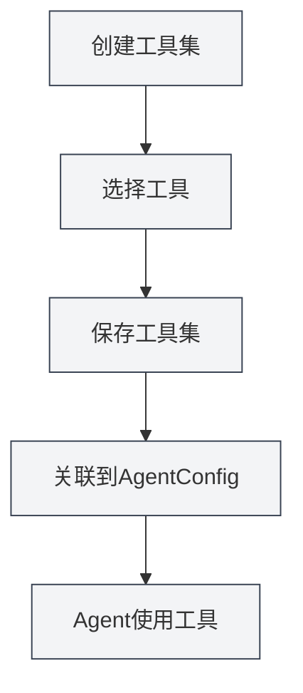

# 工具集管理

## 概述

工具集（ToolCollection）是Agent框架中用于组织和管理Agent工具的集合。工具集将相关的工具组织在一起，方便管理和复用。AgentConfig通过关联工具集来确定Agent可以使用哪些工具。

工具集支持工具的动态添加和移除，可以创建专门用途的工具集，也可以组合多个工具集使用。

## 核心概念

### 工具集结构

工具集包含以下主要部分：

- **基本信息**：ID、名称、描述、版本号
- **工具列表**：包含的工具ID列表（包括内部tool、外部tool、workflow）
- **启用状态**：是否启用该工具集
- **标签**：用于分类和搜索的标签
- **内置标识**：是否为内置工具集（不可删除）

### 工具类型

工具集可以包含以下类型的工具：

- **内部工具**：MetaDoc内置的Agent工具（如edit-tool、proofread-tool等）
- **外部工具**：用户自定义的外部工具
- **工作流工具**：Workflow工具（将工作流作为工具使用）

### 默认工具集

系统提供一个默认工具集（`default-tool-set`），包含所有内置Agent工具，不可删除但可以复制。

## 创建工具集

### 创建新工具集

创建工具集的步骤：

1. **打开工具集管理**：在Agent视图中点击"管理" → "工具集"
2. **创建工具集**：点击"新建工具集"按钮
3. **填写基本信息**：
   - 名称：工具集的名称（支持多语言）
   - 描述：工具集的描述（支持多语言）
4. **选择工具**：从下拉列表中选择一个或多个工具
   - 可以搜索工具名称
   - 支持多选
   - 显示工具的类型和描述
5. **保存工具集**：点击"保存"按钮

您可以通过侧边栏访问Agent视图：

### Agent工具集界面

下图展示了工具集管理界面的主要功能：

<AgentView mode="demo" />

### 工具选择

选择工具时，系统会显示：

- **工具名称**：工具的显示名称
- **工具ID**：工具的唯一标识符
- **工具类型**：内部工具、外部工具或工作流工具
- **工具描述**：工具的简要描述

<DialogDemo mode="demo" dialogType="tool-select" />

## 编辑工具集

### 编辑操作

编辑现有工具集：

1. **打开管理界面**：在工具集管理界面找到要编辑的工具集
2. **点击编辑**：点击工具集卡片上的"编辑"按钮
3. **修改信息**：修改名称、描述或工具列表
4. **保存更改**：点击"保存"按钮

**注意**：默认工具集（`default-tool-set`）不允许编辑，但可以复制后编辑。

### 添加工具

向工具集添加工具：

1. **打开编辑界面**：编辑工具集
2. **选择工具**：在工具下拉列表中选择要添加的工具
3. **保存更改**：点击"保存"按钮

### 移除工具

从工具集移除工具：

1. **打开编辑界面**：编辑工具集
2. **取消选择**：在工具列表中取消选择要移除的工具
3. **保存更改**：点击"保存"按钮

## 删除工具集

### 删除操作

删除不需要的工具集：

1. **打开管理界面**：在工具集管理界面找到要删除的工具集
2. **点击删除**：点击工具集卡片上的"删除"按钮
3. **确认删除**：在弹出的确认对话框中确认删除

**注意**：

- 默认工具集（`default-tool-set`）不可删除
- 删除工具集不会影响已创建的AgentConfig，但关联该工具集的AgentConfig将无法使用该工具集
- 如果工具集正在被AgentConfig使用，删除前会提示

## 复制工具集

### 复制操作

复制现有工具集：

1. **打开管理界面**：在工具集管理界面找到要复制的工具集
2. **点击复制**：点击工具集卡片上的"复制"按钮
3. **编辑副本**：系统会创建一个副本，名称自动添加"（副本）"后缀
4. **保存修改**：根据需要修改副本并保存

复制工具集会复制所有工具，包括工具列表和配置。

## 导入/导出工具集

### 导出工具集

导出工具集为JSON文件：

1. **打开管理界面**：在工具集管理界面找到要导出的工具集
2. **点击导出**：点击工具集卡片上的"导出"按钮
3. **选择位置**：选择保存位置和文件名
4. **保存文件**：点击保存导出工具集

<DialogDemo mode="demo" dialogType="export-config" />

导出的JSON文件包含工具集的所有信息，可以用于备份或分享。

### 导入工具集

从JSON文件导入工具集：

1. **打开管理界面**：在工具集管理界面
2. **点击导入**：点击"导入工具集"按钮
3. **选择文件**：选择要导入的JSON文件
4. **验证数据**：系统验证文件格式和内容
5. **导入工具集**：导入成功后创建新工具集

<DialogDemo mode="demo" dialogType="import-config" />

导入的工具集会创建新的ID，不会覆盖现有工具集（除非使用覆盖模式）。

## 工具集与AgentConfig

### 关联工具集

AgentConfig通过关联工具集来确定可用工具：

1. **创建AgentConfig**：创建新的AgentConfig
2. **选择工具集**：在AgentConfig中选择一个或多个工具集
3. **工具交集**：如果选择多个工具集，可用工具是所有工具集的交集

### 工具集交集

当AgentConfig关联多个工具集时：

- 工具集A包含：`[tool1, tool2, tool3]`
- 工具集B包含：`[tool2, tool3, tool4]`
- AgentConfig可用工具为：`[tool2, tool3]`（交集）

这种机制让您可以精确控制Agent的能力范围。

## 使用技巧

### 工具集组织

1. **按功能分类**：创建按功能分类的工具集，如"文档编辑工具集"、"数据分析工具集"
2. **按场景分类**：创建按场景分类的工具集，如"学术写作工具集"、"代码分析工具集"
3. **命名规范**：使用清晰的名称，便于识别和管理

### 工具集设计

1. **单一职责**：每个工具集专注于特定功能或场景
2. **工具组合**：合理组合相关工具，避免工具集过大
3. **复用性**：设计可复用的工具集，便于在不同AgentConfig中使用

### 工具集管理

1. **定期清理**：删除不再使用的工具集
2. **版本管理**：通过导出功能备份重要工具集
3. **文档记录**：在工具集描述中说明用途和使用场景

## 常见问题

### Q: 如何创建专门的工具集？

A: 创建新工具集，选择相关的工具，设置清晰的名称和描述。例如，创建"数据分析工具集"，选择数据分析相关的工具。

### Q: 工具集和AgentConfig的关系？

A: AgentConfig通过关联工具集来确定可用工具。一个AgentConfig可以关联多个工具集，可用工具是所有工具集的交集。

### Q: 可以修改默认工具集吗？

A: 默认工具集（`default-tool-set`）不允许编辑，但可以复制后编辑。复制默认工具集，然后修改副本。

### Q: 如何添加自定义工具到工具集？

A: 首先需要注册自定义工具，然后在创建或编辑工具集时选择该工具。自定义工具需要符合Agent工具规范。

### Q: 删除工具集会影响AgentConfig吗？

A: 删除工具集不会影响已创建的AgentConfig，但关联该工具集的AgentConfig将无法使用该工具集。如果工具集正在被使用，删除前会提示。

### Q: 工具集可以包含工作流吗？

A: 是的，工具集可以包含Workflow工具。Workflow工具是将工作流作为工具使用，可以在工具集中选择。

## 相关文档

- [[agent.introduction|Agent框架概述]]
- [[agent.config|Agent配置管理]]
- [[agent.workflow|工作流管理]]
- [[agent.session|Agent会话管理]]

<AgentSessionManager mode="demo" />

<RAGToolDisplay mode="demo" />

<WebCrawlerDisplay mode="demo" />
