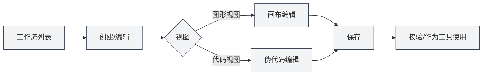

# 工作流管理

## 概述

工作流（Workflow）是 Agent 框架中用于编排多步骤任务的可视化流程。您可以在工作流中组合工具调用、LLM 决策、子工作流和 Agent 配置等节点，通过连线定义执行顺序，并将工作流作为工具在 [[agent.session|Agent会话]] 中使用。

本文介绍工作流的创建、编辑（图形视图与代码视图）、删除、校验、导入导出，以及节点类型与执行方式。

## 打开工作流管理

<WorkflowManager mode="demo" />

1. 进入 **Agent** 视图
2. 在管理区域选择 **工作流管理**（或「管理」→「工作流」）
3. 可看到当前所有工作流卡片：名称、描述、版本、节点数、启用状态，以及内置标记

您可以通过侧边栏访问Agent视图：

<AgentView mode="demo" />

## 创建工作流

1. 在工作流管理页点击 **「创建工作流」**（或「新建」）
2. 在弹窗中会打开工作流编辑画布
3. 填写或后续在属性中设置工作流 **名称**、**描述**、**版本**
4. 在画布上添加节点并连线（见下文「编辑工作流」）
5. 点击 **保存** 完成创建

新建的工作流默认为自定义（非内置），可编辑与删除。

<AgentView mode="demo" />

## 编辑工作流

点击工作流卡片进入编辑。编辑界面提供 **图形视图** 与 **代码视图** 两种方式，可随时切换，数据会同步。

<AgentView mode="demo" />

### 图形视图

在图形视图中：

- **画布**：拖拽平移、缩放查看；从工具栏向画布拖拽或点击添加节点
- **工具栏**：
  - **工具模式**：指针、框选、平移、文本编辑、删除
  - **添加节点**：「添加工具」「添加 LLM」「添加工作流」「添加 Agent」等，部分可展开选择具体工具/工作流/Agent 配置
- **节点**：可拖拽移动、选中后编辑标签或属性；节点之间通过连线表示执行顺序或数据流
- **连线**：从节点端口拖出到另一节点，形成边；可选中边编辑标签（如条件说明）

保存时会将当前图形结构写回工作流定义。

### 代码视图

在代码视图中：

- 工作流以 **伪代码** 形式展示，便于批量修改或版本对比
- 支持在编辑器中直接修改伪代码
- 修改后可点击 **「应用到图形」** 或切换回图形视图，将伪代码转换回工作流并同步到画布
- 若伪代码有语法或结构错误，会给出解析错误提示，需修正后再同步

适合熟悉工作流结构的用户做快速编辑或复制粘贴。

### 内置工作流

标记为 **内置** 的工作流由系统提供，不可编辑、不可删除，但可以 **复制** 一份再在副本上修改。

## 工作流节点类型

- ** artifact 节点（业务节点）**
  - **工具（tool）**：调用 [[agent.tools|工具集]] 中的某个工具
  - **LLM 决策（llm-decision）**：由 LLM 做判断或生成内容
  - **工作流（workflow）**：调用另一个工作流，即子工作流
  - **Agent 配置（agent-config）**：使用指定 [[agent.config|Agent配置]] 执行一段 Agent 逻辑
- **控制流节点（control-flow）**
  - 用于分支、循环等控制逻辑，与 artifact 节点通过连线组成完整流程图

具体每种节点在画布上的可配置项（如选择哪一工具、哪一工作流、哪一 Agent 配置）以界面为准。

## 删除、复制与校验

- **删除**：在工作流卡片的操作菜单中选择「删除」。内置工作流不提供删除。
- **复制**：选择「复制」可基于当前工作流生成一份新的自定义工作流，再行编辑。
- **校验**：选择「校验」可检查当前工作流定义是否合法（如连线、必填参数等），便于在保存或作为工具使用前发现问题。

<AgentView mode="demo" />

## 导入与导出

- **导出**：在操作菜单中选择「导出」，将当前工作流导出为文件，便于备份或迁移。
- **导入**：在工作流管理页点击「导入」，选择之前导出的工作流文件，可新增一条工作流或覆盖已有（以实际界面选项为准）。

导入后建议做一次「校验」并打开编辑确认节点与连线是否符合预期。

## 工作流作为工具使用

- 已保存且通过校验的工作流，可在 [[agent.tools|工具集管理]] 中作为 **工作流工具** 加入某个工具集
- 在 [[agent.config|Agent配置]] 中选用包含该工作流的工具集后，Agent 在会话中即可调用该工作流，完成多步骤任务

执行时由引擎按工作流定义依次执行节点（含 LLM、工具、子工作流等），并将结果用于后续节点或最终返回用户。

## 相关文档

- [[agent.introduction|Agent框架概述]]
- [[agent.session|Agent会话管理]]
- [[agent.config|Agent配置管理]]
- [[agent.tools|工具集管理]]
