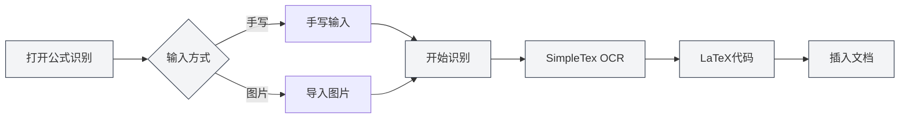

# AI助手功能

## 概述

AI助手功能提供了多种智能辅助工具，帮助您完成文档创作、公式识别、图表生成、数据分析等任务。通过AI助手，您可以高效地完成各种文档处理工作。

AI助手功能包括：AI对话、手写公式识别、智能绘图助手、数据分析工具、OCR文字识别、附件解析工具、AIGC检测等。

## AI对话

### 功能介绍

AI对话功能提供了一个智能对话助手，可以基于当前文档内容进行对话：

- **上下文理解**：理解当前文档的内容和上下文
- **智能回答**：根据文档内容回答相关问题
- **文档分析**：分析文档结构、内容、风格等

您可以通过AI助手菜单访问AI对话功能：

<MenuItemsDemo mode="demo" :items='[{"id": "ai-assistant", "items": ["ai-chat"]}]' />

### 界面预览

AI对话界面包含会话列表和对话区域，支持多会话管理和引用素材：

<AIChat mode="demo" />

详见[[ai.chat|AI对话]]。

## 手写公式识别

### 功能介绍

手写公式识别功能可以将手写的数学公式转换为LaTeX代码：

- **手写输入**：支持鼠标/触屏手写输入
- **图片导入**：支持导入公式图片进行识别
- **实时识别**：使用SimpleTex OCR API进行识别
- **LaTeX输出**：自动转换为标准LaTeX格式

### 使用方法

1. **打开公式识别**：从AI助手菜单打开公式识别窗口
2. **手写输入**：在画布上手写数学公式
3. **或导入图片**：点击导入按钮，选择公式图片
4. **开始识别**：点击识别按钮
5. **查看结果**：查看识别出的LaTeX代码
6. **插入文档**：将LaTeX代码插入到文档中

您可以通过AI助手菜单访问手写公式识别功能：

<MenuItemsDemo mode="demo" :items='[{"id": "ai-assistant", "items": ["formula-recognition"]}]' />

### 识别精度

- **高精度识别**：SimpleTex OCR API提供高精度的数学公式识别
- **支持复杂公式**：支持分数、根号、积分、求和等复杂公式
- **自动纠错**：识别结果可以手动编辑和修正

## 智能绘图助手

### 功能介绍

智能绘图助手使用AI生成图表代码，支持多种图表格式：

- **Mermaid图表**：流程图、时序图、类图、状态图等
- **PlantUML图表**：UML图、时序图、活动图等
- **ECharts图表**：折线图、柱状图、饼图、散点图等
- **直接插入**：生成的图表可以直接插入文档

### 界面预览

智能绘图助手支持多会话管理，自动选择图表引擎，生成可视化图表：

<GraphWindow mode="demo" />

### 使用方法

1. **打开绘图助手**：从菜单或工具栏打开绘图助手
2. **描述需求**：用自然语言描述要生成的图表
3. **选择类型**：选择图表类型（Mermaid、PlantUML、ECharts等）
4. **生成图表**：AI根据描述生成图表代码
5. **预览图表**：预览生成的图表
6. **插入文档**：将图表插入到文档中

### 支持的图表类型

- **Mermaid**：流程图、时序图、类图、状态图、ER图、甘特图、饼图、Git图、旅程图、思维导图、时间线等
- **PlantUML**：UML图、时序图、活动图、组件图、部署图等
- **ECharts**：折线图、柱状图、饼图、散点图、雷达图、热力图、树图、矩形树图、旭日图等

详见[[charts.introduction|图表功能介绍]]。

## 数据分析工具

### 功能介绍

数据分析工具可以分析文档中的数据表格，生成可视化图表：

- **表格识别**：自动识别文档中的表格数据
- **数据分析**：分析表格数据的统计信息
- **图表生成**：根据数据生成可视化图表
- **图表插入**：将生成的图表插入文档

### 使用方法

1. **打开数据分析**：从菜单或工具栏打开数据分析窗口
2. **选择表格**：在文档中选择要分析的表格
3. **分析数据**：点击分析按钮，AI分析表格数据
4. **生成图表**：根据分析结果生成可视化图表
5. **插入文档**：将图表插入到文档中

## OCR文字识别

### 功能介绍

OCR文字识别功能可以识别图片中的文字，提取文字内容：

- **图片识别**：识别图片中的文字内容
- **多语言支持**：支持中文、英文等多种语言
- **文字提取**：提取识别出的文字内容
- **插入文档**：将提取的文字插入文档

### 界面预览

OCR识别窗口支持多图片管理、图片预处理参数调整和识别结果编辑：

<OcrWindow mode="demo" />

### 使用方法

1. **打开OCR识别**：从菜单或工具栏打开OCR识别窗口
2. **导入图片**：导入要识别的图片
3. **开始识别**：点击识别按钮
4. **查看结果**：查看识别出的文字内容
5. **插入文档**：将文字插入到文档中

## 附件解析工具

### 功能介绍

附件解析工具可以解析PDF、Word等附件文件，提取文件内容：

- **文件解析**：解析PDF、Word等文件格式
- **内容提取**：提取文件中的文本和图片
- **添加到知识库**：将提取的内容添加到知识库
- **文档引用**：在文档中引用附件内容

### 使用方法

1. **打开附件解析**：从菜单或工具栏打开附件解析窗口
2. **选择文件**：选择要解析的PDF或Word文件
3. **开始解析**：点击解析按钮
4. **查看结果**：查看解析出的内容
5. **添加到知识库**：将内容添加到知识库（可选）

## AIGC检测

### 功能介绍

AIGC检测功能可以检测文本是否为AI生成内容：

- **文本检测**：检测文本是否为AI生成
- **置信度评分**：提供AI生成概率评分
- **检测报告**：生成详细的检测报告

### 使用方法

1. **打开AIGC检测**：从菜单或工具栏打开AIGC检测窗口
2. **选择文本**：选择要检测的文本
3. **开始检测**：点击检测按钮
4. **查看结果**：查看检测结果和置信度评分

## 使用技巧

### 高效使用AI助手

1. **明确需求**：清晰描述需求，获得更好的结果
2. **提供上下文**：提供足够的上下文信息
3. **迭代优化**：根据结果迭代优化需求

### 公式识别技巧

1. **清晰书写**：手写时保持清晰，避免潦草
2. **正确格式**：使用正确的数学符号格式
3. **检查结果**：识别后检查结果，必要时手动修正

### 图表生成技巧

1. **详细描述**：详细描述图表需求，包括数据类型、样式等
2. **选择类型**：根据需求选择合适的图表类型
3. **预览调整**：预览图表后根据需要进行调整

## 常见问题

### Q: 公式识别不准确？

A: 公式识别基于SimpleTex OCR API，可能不准确。建议手写时保持清晰，或使用图片导入。

### Q: 图表生成不符合预期？

A: 可以详细描述需求，或手动编辑生成的图表代码进行调整。

### Q: OCR识别支持哪些语言？

A: OCR识别支持中文、英文等多种语言，具体取决于使用的OCR服务。

### Q: 附件解析支持哪些格式？

A: 附件解析支持PDF、Word等常见格式，具体取决于解析服务的能力。

## 相关文档

- [[ai.chat|AI对话]]
- [[charts.introduction|图表功能介绍]]
- [[knowledge-base.usage|知识库使用]]
