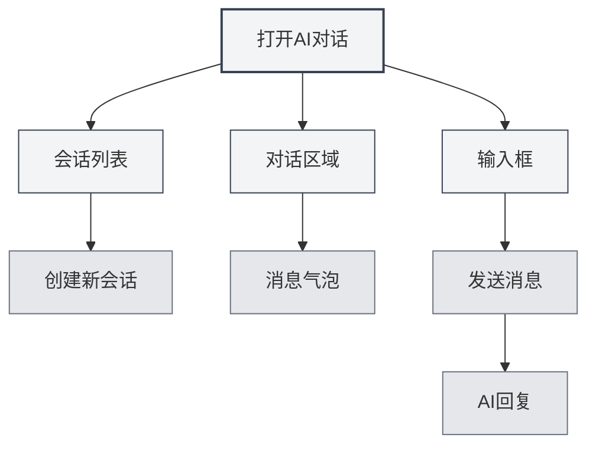
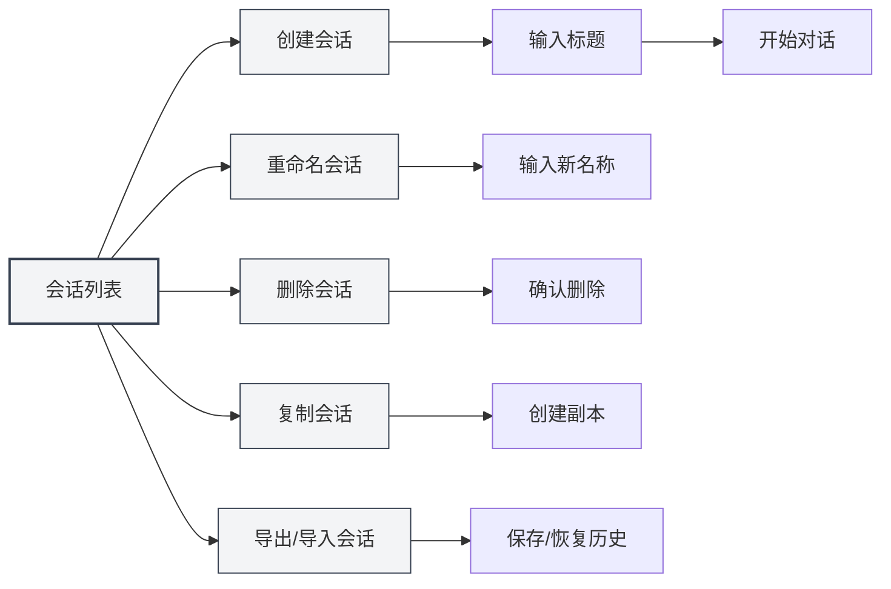
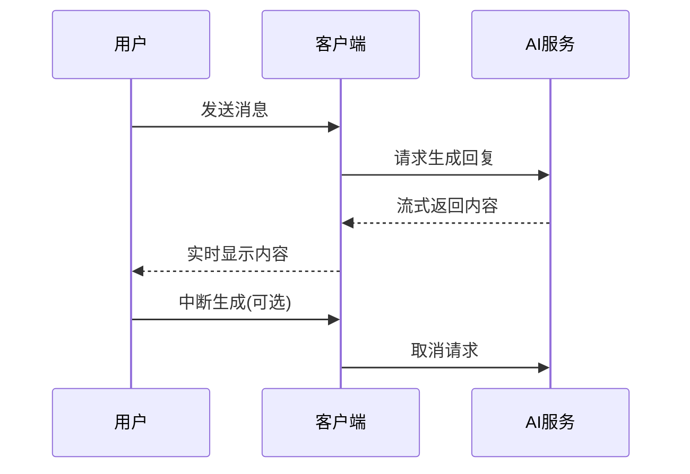
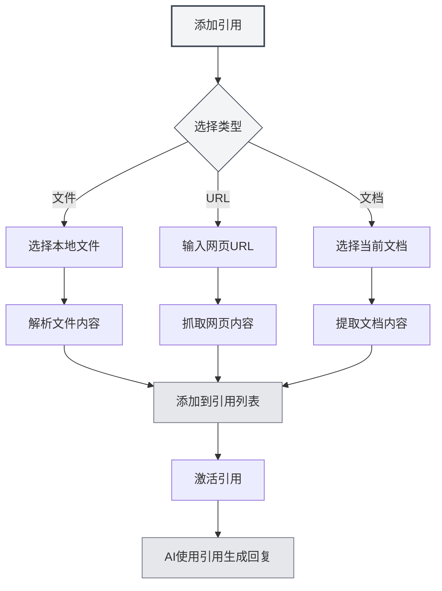

# AI对话

## 概述

AI对话功能提供了一个智能对话助手，可以帮助您解答问题、生成内容、分析文档等。通过AI对话，您可以与AI进行自然语言交互，获得智能化的帮助和建议。

AI对话支持多会话管理、引用素材、知识库集成等功能，让您能够高效地使用AI辅助完成各种任务。

## 打开AI对话

### 打开方式

有多种方式可以打开AI对话：

- **菜单栏**：点击"AI"菜单，选择"AI对话"
- **快捷键**：使用快捷键快速打开（如果配置了）
- **侧边栏**：从侧边栏打开AI对话面板

您可以通过顶部菜单栏的AI助手菜单访问AI对话功能：

<MenuItemsDemo mode="demo" :items='[{"id": "ai-assistant", "items": ["ai-chat"]}]' />

### 界面介绍

AI对话界面包含以下部分：

- **会话列表**：左侧显示所有会话列表
- **对话区域**：中间显示对话消息
- **输入框**：底部输入消息
- **引用管理**：管理引用素材

## 会话管理

### 创建会话

创建新的AI对话会话：

1. **点击新建**：点击会话列表上方的"新建会话"按钮
2. **输入标题**：可选输入会话标题（默认使用第一条消息）
3. **开始对话**：输入第一条消息开始对话

### 会话操作

### 重命名会话

重命名现有会话：

1. **右键菜单**：右键点击会话，选择"重命名"
2. **输入新名称**：输入新的会话名称
3. **确认保存**：确认后保存新名称

### 删除会话

删除不需要的会话：

1. **右键菜单**：右键点击会话，选择"删除"
2. **确认删除**：确认后删除会话

删除会话会同时删除该会话的所有消息历史。

### 复制会话

复制现有会话：

1. **右键菜单**：右键点击会话，选择"复制"
2. **创建副本**：系统会创建一个新的会话副本

复制会话会复制所有消息历史，方便您基于现有对话继续讨论。

### 导出/导入会话

导出和导入会话：

- **导出会话**：右键点击会话，选择"导出"，保存为JSON文件
- **导入会话**：从文件导入会话，恢复消息历史

导出/导入功能方便您备份和分享对话内容。

## 发送消息

### 输入消息

在输入框中输入消息：

1. **输入文本**：在输入框中输入您的问题或请求
2. **格式化**：支持Markdown格式，可以格式化文本
3. **发送消息**：点击发送按钮或按`Enter`发送

### 消息类型

支持以下消息类型：

- **文本消息**：普通文本消息
- **Markdown消息**：支持Markdown格式的消息
- **代码消息**：包含代码的消息

### 快捷键

发送消息的快捷键：

- **Enter**：发送消息
- **Shift+Enter**：换行（不发送）
- **Ctrl+Enter**：发送消息（某些配置下）

## AI回复

### 流式输出

AI回复采用流式输出：

- **实时显示**：AI生成的内容会实时显示
- **逐步生成**：内容逐步生成，无需等待完成
- **可中断**：可以随时中断AI生成

### 消息操作

对AI回复可以进行以下操作：

- **复制**：复制AI回复内容
- **重新生成**：重新生成AI回复
- **编辑**：编辑AI回复（如果支持）
- **删除**：删除AI回复

### 消息编辑

编辑用户消息：

1. **点击编辑**：点击消息旁的编辑按钮
2. **修改内容**：修改消息内容
3. **重新发送**：重新发送修改后的消息

编辑消息会删除该消息之后的所有消息，重新开始对话。

## 引用素材

### 添加引用

为会话添加引用素材：

1. **打开引用管理**：点击对话区域上方的引用标签
2. **添加引用**：点击"添加引用"按钮
3. **选择类型**：选择引用类型（文件、URL等）
4. **选择内容**：选择要引用的内容

### 引用类型

支持以下引用类型：

- **文件引用**：引用本地文件
- **URL引用**：引用网页URL
- **文档引用**：引用当前打开的文档

### 激活引用

激活和停用引用：

- **激活引用**：点击引用标签激活引用
- **停用引用**：再次点击停用引用
- **激活状态**：激活的引用会在AI回复时使用

激活引用后，AI会参考引用内容生成回复。

### 引用预览

预览引用内容：

- **点击预览**：点击引用标签查看引用内容
- **查看详情**：查看引用的详细内容
- **编辑引用**：编辑或删除引用

## 知识库集成

### 启用知识库

启用知识库查询：

1. **打开设置**：在输入框下方找到知识库开关
2. **启用查询**：切换开关启用知识库查询
3. **自动检索**：AI回复时会自动检索知识库

### 知识库检索

知识库检索功能：

- **自动检索**：发送消息时自动检索相关知识
- **上下文理解**：根据对话上下文检索相关内容
- **结果整合**：将检索结果整合到AI回复中

### 检索设置

知识库检索设置：

- **置信度阈值**：设置检索的置信度阈值
- **检索数量**：设置检索结果的数量
- **检索范围**：设置检索的范围

详见[[knowledge-base.config|知识库配置]]。

## 消息管理

### 消息操作

对消息可以进行以下操作：

- **复制消息**：复制消息内容
- **编辑消息**：编辑用户消息
- **删除消息**：删除消息
- **重新生成**：重新生成AI回复

### 消息历史

消息历史管理：

- **自动保存**：消息历史自动保存
- **会话隔离**：每个会话的消息历史独立
- **历史恢复**：重新打开会话时恢复历史

### 消息格式

消息支持以下格式：

- **Markdown**：支持Markdown格式
- **代码块**：支持代码块高亮
- **数学公式**：支持LaTeX数学公式
- **表格**：支持表格显示

## 使用技巧

### 高效对话

1. **明确问题**：提出明确的问题，获得更好的回复
2. **提供上下文**：提供足够的上下文信息
3. **使用引用**：使用引用素材提供更多信息

### 会话组织

1. **分类管理**：为不同主题创建不同会话
2. **命名规范**：使用清晰的会话名称
3. **定期清理**：定期删除不需要的会话

### 知识库使用

1. **添加相关文档**：将相关文档添加到知识库
2. **启用查询**：启用知识库查询获得更好的回复
3. **调整设置**：根据需求调整检索设置

## 常见问题

### Q: AI回复不准确？

A: AI回复基于训练数据，可能不准确。可以提供更多上下文信息或使用引用素材提高准确性。

### Q: 如何中断AI生成？

A: 点击"取消"按钮可以中断AI生成。已生成的内容不会丢失。

### Q: 消息历史丢失？

A: 消息历史会自动保存。如果丢失，检查是否删除了会话或清除了数据。

### Q: 如何提高回复质量？

A: 提供清晰的上下文、使用引用素材、启用知识库查询都可以提高回复质量。

### Q: 支持哪些LLM？

A: 支持多种LLM，包括OpenAI、Ollama、DeepSeek等。详见[[ai.llm-config|LLM配置]]。

## 相关文档

- [[ai.proofread|AI校对]]
- [[ai.completion|AI自动补全]]
- [[knowledge-base.config|知识库配置]]
- [[ai.llm-config|LLM配置]]
