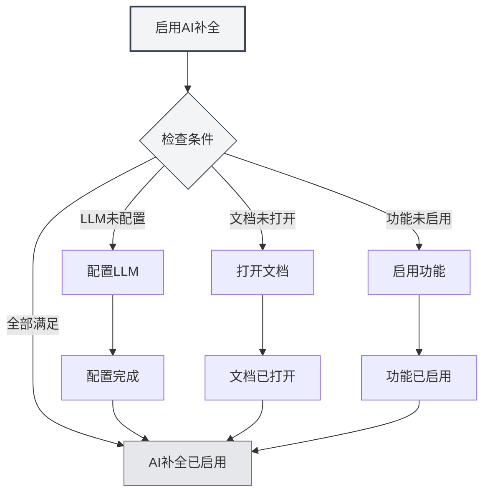
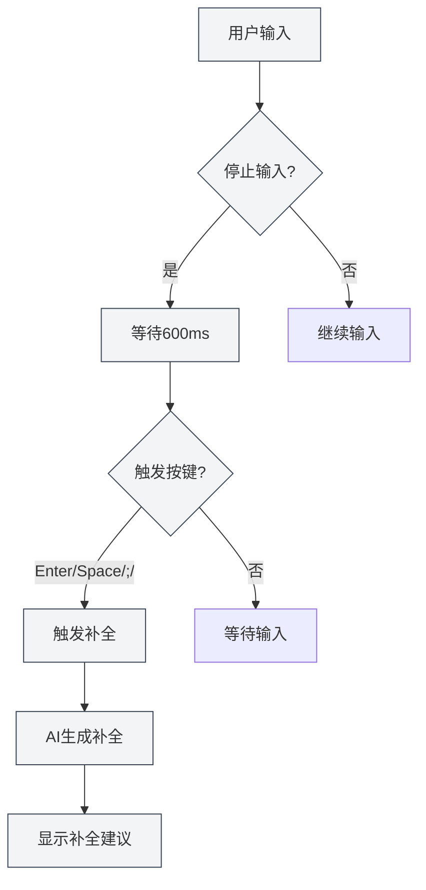
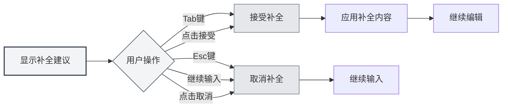

# AI自动补全

## 概述

AI自动补全功能使用AI技术自动补全您正在输入的内容。当您停止输入时，AI会根据上下文自动生成补全建议，帮助您快速完成文档编写。

AI自动补全支持多种文档格式（Markdown、LaTeX、纯文本），可以智能理解上下文，生成符合文档风格和内容的补全建议。

## 启用AI补全

### 启用方式

有多种方式可以启用AI自动补全：

- **右键菜单**：在编辑器中右键，选择"启用AI自动补全"
- **设置页面**：在设置中启用AI自动补全功能
- **快捷键**：使用快捷键快速切换（如果配置了）

您可以通过顶部菜单栏访问设置：

<MenuItemsDemo mode="demo" :items='[{"id": "settings"}]' />

<CompletionSettingsPanel mode="demo" />

### 启用条件

启用AI自动补全需要满足以下条件：

- **LLM已配置**：需要配置LLM服务
- **文档已打开**：需要在编辑器中打开文档
- **功能已启用**：需要在设置中启用AI补全功能

详见[[ai.llm-config|LLM配置]]。

<CompletionSettingsPanel mode="demo" />

## 自动触发

### 触发条件

AI自动补全会在以下情况自动触发：

- **停止输入**：停止输入600ms后自动触发
- **触发按键**：输入特定按键后触发（Enter、Space、`;`、`,`等）

### 触发延迟

触发延迟设置：

- **默认延迟**：600ms（0.6秒）
- **可配置**：可以在设置中调整延迟时间
- **平衡考虑**：延迟太短会频繁触发，延迟太长会影响体验

<CompletionSettingsPanel mode="demo" />

### 触发按键

支持的触发按键：

- **Enter**：回车键触发
- **Space**：空格键触发
- **;**：分号触发
- **,**：逗号触发

可以在设置中配置触发按键，支持同时启用多个按键。

## 手动触发

### 触发方式

手动触发补全的方式：

- **快捷键**：按`Shift+Tab`手动触发补全
- **右键菜单**：右键选择"手动触发补全"

手动触发会立即启动补全，跳过自动触发的延迟。

<CompletionSettingsPanel mode="demo" />

### 使用场景

适合手动触发的场景：

- **需要立即补全**：需要立即获得补全建议
- **自动触发失败**：自动触发没有生效
- **特定位置**：在特定位置需要补全

## 补全内容

### 上下文理解

AI补全会理解以下上下文：

- **当前段落**：理解当前段落的内容
- **文档结构**：理解文档的整体结构
- **文档风格**：理解文档的写作风格
- **文档主题**：理解文档的主题和内容

### 补全模式

AI补全支持两种模式：

- **完全生成**：生成完整的补全内容
- **部分生成**：只生成部分内容（根据设置）

补全模式可以在设置中配置。

<CompletionSettingsPanel mode="demo" />

### 补全长度

补全内容长度控制：

- **最大Token数**：可以设置补全的最大Token数
- **默认值**：50 Token
- **范围**：20 Token到无限制（0表示无限制）

Token数越大，补全的内容越多，但生成时间也会更长。

<CompletionSettingsPanel mode="demo" />

## 接受补全

### 接受方式

接受补全建议的方式：

- **Tab键**：按`Tab`键接受补全建议
- **点击接受**：点击补全建议上的"接受"按钮

### 取消补全

取消补全建议的方式：

- **Esc键**：按`Esc`键取消补全建议
- **继续输入**：继续输入会自动取消补全
- **点击取消**：点击补全建议上的"取消"按钮

### 编辑补全

接受补全后可以继续编辑：

- **直接编辑**：接受后可以直接编辑补全内容
- **部分接受**：可以只接受部分补全内容
- **修改补全**：可以修改补全内容后再使用

## 知识库集成

### 启用知识库

启用知识库集成：

1. **打开设置**：在设置中启用知识库集成
2. **配置知识库**：配置知识库相关设置
3. **自动检索**：补全时会自动检索知识库

详见[[knowledge-base.config|知识库配置]]。

<KnowledgeBase mode="demo" />

### 上下文检索

知识库检索功能：

- **自动检索**：补全时自动检索相关知识
- **语义匹配**：根据语义相似度匹配相关内容
- **结果整合**：将检索结果整合到补全建议中

### 检索设置

知识库检索设置：

- **置信度阈值**：设置检索的置信度阈值
- **检索数量**：设置检索结果的数量
- **检索范围**：设置检索的范围

<KnowledgeBase mode="demo" />

## 补全设置

### 基本设置

AI补全的基本设置：

- **启用/关闭**：启用或关闭AI补全功能
- **触发延迟**：设置自动触发的延迟时间
- **触发按键**：配置触发按键
- **最大Token数**：设置补全的最大Token数

<CompletionSettingsPanel mode="demo" />

### 高级设置

AI补全的高级设置：

- **补全模式**：选择补全模式（完全生成/部分生成）
- **上下文长度**：设置补全使用的上下文长度
- **温度设置**：设置AI生成的温度参数
- **知识库集成**：配置知识库集成选项

<CompletionSettingsPanel mode="demo" />

### 格式设置

不同格式的补全设置：

- **Markdown**：Markdown格式的补全设置
- **LaTeX**：LaTeX格式的补全设置
- **纯文本**：纯文本格式的补全设置

不同格式可能有不同的补全策略和设置。

## 使用技巧

### 提高补全质量

1. **提供上下文**：在文档中提供足够的上下文信息
2. **启用知识库**：启用知识库集成可以提高补全质量
3. **调整设置**：根据需求调整补全设置

### 高效使用

1. **合理使用**：不要过度依赖AI补全
2. **检查内容**：接受补全后检查内容是否正确
3. **手动调整**：必要时手动调整补全内容

### 避免问题

1. **避免频繁触发**：避免频繁触发补全，影响输入体验
2. **检查准确性**：检查补全内容的准确性
3. **及时取消**：不需要的补全及时取消

## 常见问题

### Q: 补全不准确？

A: AI补全基于上下文和训练数据，可能不准确。可以提供更多上下文信息或启用知识库集成提高准确性。

### Q: 补全很慢？

A: 补全速度取决于AI服务响应速度。可以调整补全设置或使用更快的LLM服务。

### Q: 如何关闭自动补全？

A: 在设置中关闭AI自动补全功能，或使用右键菜单关闭。

### Q: 可以自定义触发按键吗？

A: 可以。在设置中配置触发按键，支持同时启用多个按键。

### Q: 补全内容太长？

A: 可以在设置中调整补全的最大Token数，限制补全内容的长度。

## 相关文档

- [[ai.chat|AI对话]]
- [[ai.proofread|AI校对]]
- [[knowledge-base.config|知识库配置]]
- [[ai.llm-config|LLM配置]]
