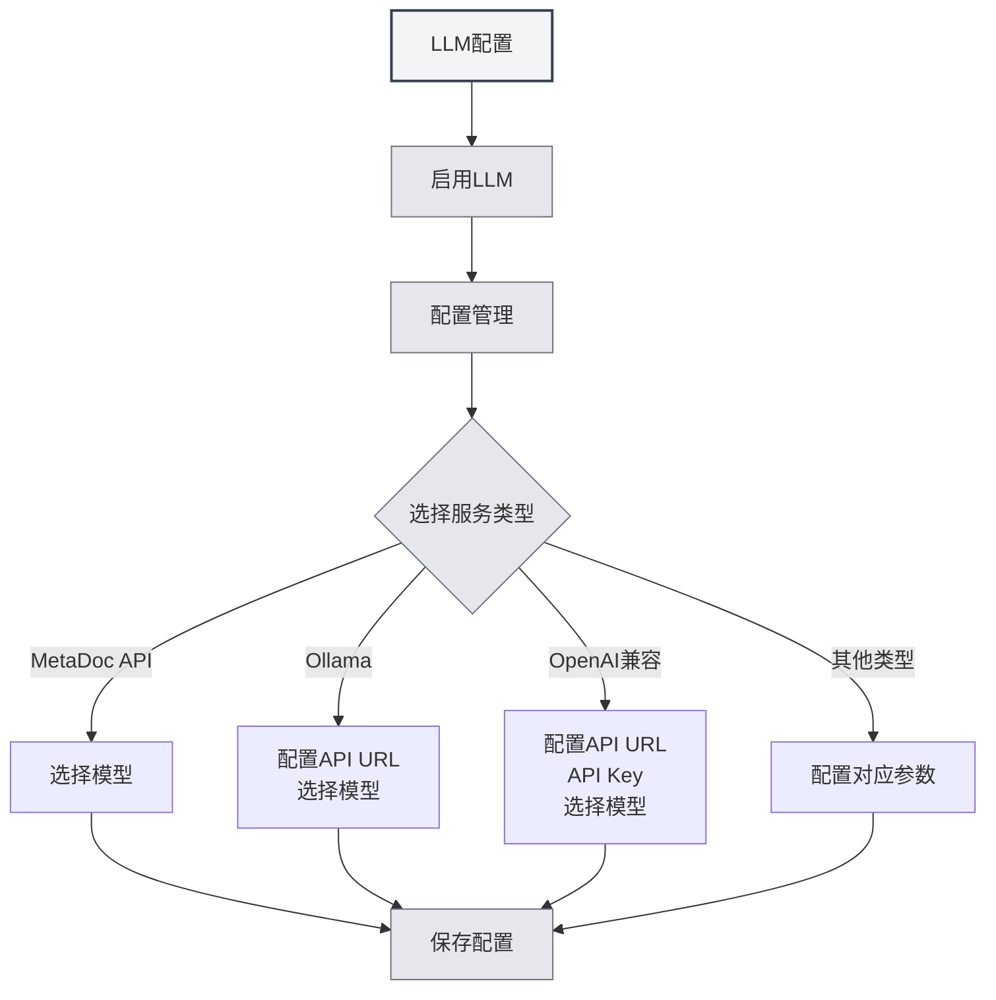

# LLM配置引导

## 概述

LLM（大语言模型）是 MetaDoc 中 AI 对话、校对、补全、助手与 Agent 等功能的共同基础。本文说明为何需要配置 LLM、配置会影响哪些功能，以及如何进入具体配置界面。

<Demo component="SettingLlmSection" mode="demo" />

## 为何要配置 LLM

- **API 调用**：对话、补全、校对等会请求您所选的 LLM 接口，需正确配置地址与密钥。
- **模型差异**：不同模型在质量、速度、成本上差异较大，按场景选择合适的模型可提升体验并控制成本。
- **统一入口**：在[[settings.llm|LLM配置]]中集中管理启用状态、温度、推理标签等，一次设置即可影响所有 AI 功能。

## 配置会影响哪些功能

配置并启用 LLM 后，将影响以下能力：

| 功能        | 说明                 |
| ----------- | -------------------- | ---------------------------------------------- |
| **AI 对话** | [[ai.chat            | AI对话功能]]：与 AI 多轮对话、基于上下文的回答 |
| **AI 校对** | [[ai.proofread       | AI校对功能]]：语法与拼写检查、修改建议         |
| **AI 补全** | [[ai.completion      | AI自动补全]]：写作时的智能续写与补全           |
| **AI 助手** | [[ai.assistants      | AI助手功能]]：公式识别、绘图助手、数据分析等   |
| **Agent**   | [[agent.introduction | Agent框架]]：会话、工具调用、工作流执行        |

关闭 LLM 或未配置可用服务时，上述功能将不可用或会提示先完成配置。

## 如何配置 LLM

### 进入配置页

1. 打开 **设置** → **LLM 配置**（或应用内等价入口）。
2. 在「[[settings.llm|LLM配置]]」页中可：
   - 启用/关闭 LLM
   - 设置温度、是否自动移除推理标签等全局选项
   - 管理多个 LLM 配置（创建、编辑、删除、排序）

您可以通过顶部菜单栏访问LLM设置：

<MenuItemsDemo mode="demo" :items='[{"id": "settings"}]' />

### 配置具体服务

在 **LLM 配置管理** 中选择或新建一条配置，并按服务类型填写：

- **MetaDoc API / Ollama / OpenAI 兼容 / OpenAI 官方 / DeepSeek / Gemini** 等  
  详细字段与步骤见 [[settings.llm-types|LLM类型配置]]（API 地址、API Key、模型名、最大 Token 等）。

### 使用建议

- **首次使用**：先完成一条可用的 LLM 配置并保存，再开启「启用 LLM」。
- **多配置**：可为不同场景建多条配置（如「日常对话」「校对专用」），在对应功能或 Agent 配置中选择使用。
- **成本与隐私**：使用云端 API 会产生费用并可能上传内容；若需本地与隐私，可优先考虑 Ollama 等本地部署方式（见 [[settings.llm-types|LLM类型配置]]）。

## 相关文档

- [[settings.llm|LLM配置]]
- [[settings.llm-types|LLM类型配置]]
- [[settings.llm-management|LLM配置管理]]
- [[ai.chat|AI对话功能]]
- [[agent.introduction|Agent框架概述]]
