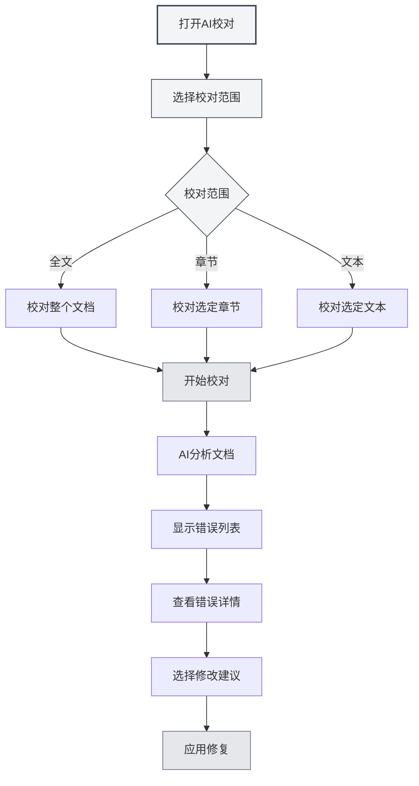
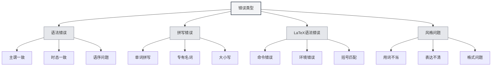
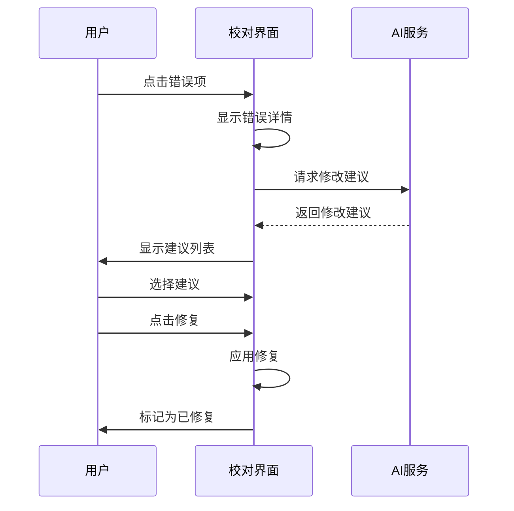

# AI校对

## 概述

AI校对功能使用AI技术自动检查文档中的语法错误、拼写错误、LaTeX语法错误等问题，并提供修改建议。通过AI校对，您可以快速发现和修复文档中的错误，提高文档质量。

AI校对支持多种文档格式（Markdown、LaTeX、纯文本），可以校对全文或特定章节，提供详细的错误信息和修改建议。

## 打开AI校对

### 打开方式

有多种方式可以打开AI校对：

- **菜单栏**：点击"AI"菜单，选择"AI校对"
- **快捷键**：使用快捷键快速打开（如果配置了）
- **侧边栏**：从侧边栏打开AI校对面板

您可以通过顶部菜单栏的AI助手菜单访问AI校对功能：

<MenuItemsDemo mode="demo" :items='[{"id": "ai-assistant", "items": ["proofread"]}]' />

### 界面介绍

AI校对界面包含以下部分：

- **错误列表**：左侧显示所有错误
- **文档预览**：右侧显示文档内容
- **错误统计**：顶部显示错误统计信息
- **操作按钮**：顶部提供操作按钮

<ProofreadViewDemo />

## 校对范围

### 校对全文

校对整个文档：

1. **打开校对**：打开AI校对面板
2. **点击开始**：点击"开始校对"按钮
3. **等待完成**：等待AI完成校对

校对全文会自动检查文档中的所有内容。

### 校对特定章节

校对文档的特定章节：

1. **选择章节**：在大纲视图中选择要校对的章节
2. **打开校对**：打开AI校对面板
3. **指定章节**：在校对设置中指定章节路径
4. **开始校对**：点击"开始校对"按钮

校对特定章节只检查选定章节及其子章节的内容。

### 校对指定文本

校对指定的文本内容：

1. **选择文本**：在编辑器中选择要校对的文本
2. **打开校对**：打开AI校对面板
3. **粘贴文本**：将文本粘贴到校对输入框
4. **开始校对**：点击"开始校对"按钮

## 错误类型

AI校对可以检测以下类型的错误：

### 语法错误

检查文档中的语法错误：

- **主谓一致**：检查主谓一致问题
- **时态一致**：检查时态一致问题
- **语序问题**：检查语序问题
- **其他语法**：检查其他语法问题

### 拼写错误

检查文档中的拼写错误：

- **单词拼写**：检查单词拼写错误
- **专有名词**：检查专有名词拼写
- **大小写**：检查大小写问题

### LaTeX语法错误

检查LaTeX文档中的语法错误：

- **命令错误**：检查LaTeX命令错误
- **环境错误**：检查LaTeX环境错误
- **括号匹配**：检查括号匹配问题
- **其他语法**：检查其他LaTeX语法问题

### 风格问题

检查文档的风格问题：

- **用词不当**：检查用词是否恰当
- **表达不清**：检查表达是否清晰
- **格式问题**：检查格式问题

## 错误信息

### 错误显示

错误信息包含以下内容：

- **错误类型**：显示错误类型（语法、拼写、LaTeX等）
- **错误位置**：显示错误所在的行号和列号
- **错误文本**：显示错误的文本内容
- **修改建议**：显示修改建议
- **严重程度**：显示错误的严重程度

### 严重程度

错误按严重程度分类：

- **错误（Error）**：必须修复的错误
- **警告（Warning）**：建议修复的问题
- **信息（Info）**：仅供参考的信息

### 错误定位

快速定位错误位置：

1. **点击错误**：点击错误列表中的错误项
2. **自动定位**：编辑器自动滚动到错误位置
3. **高亮显示**：错误位置会高亮显示

## 修改建议

### 查看建议

查看AI提供的修改建议：

- **单个建议**：如果只有一个建议，直接显示
- **多个建议**：如果有多个建议，以标签形式显示
- **选择建议**：点击建议标签选择建议

### 应用修复

应用修改建议：

1. **选择建议**：点击建议标签选择建议
2. **点击修复**：点击"修复"按钮
3. **确认修复**：确认后应用修复

修复后，错误会被标记为"已修复"。

### 一键修复

一键修复所有错误：

1. **点击修复全部**：点击"一键修复全部"按钮
2. **确认修复**：确认后修复所有错误

一键修复会使用第一个建议修复所有错误。

## 错误管理

### 忽略错误

忽略不需要修复的错误：

1. **选择错误**：选择要忽略的错误
2. **点击忽略**：点击"忽略"按钮
3. **确认忽略**：确认后忽略错误

忽略的错误会从错误列表中移除。

### 添加到词典

将单词添加到词典：

1. **选择错误**：选择拼写错误
2. **添加到词典**：点击"添加到词典"按钮
3. **确认添加**：确认后添加到词典

添加到词典后，该单词不会再被标记为拼写错误。

### 清空已修复

清空已修复的错误：

1. **点击清空**：点击"清空已修复"按钮
2. **确认清空**：确认后清空已修复的错误

清空已修复的错误可以让错误列表更清晰。

## 使用技巧

### 高效校对

1. **先校对全文**：先校对全文了解整体情况
2. **再校对章节**：针对问题章节进行详细校对
3. **批量修复**：使用一键修复快速修复常见错误

### 错误处理

1. **优先处理错误**：优先处理严重错误
2. **检查建议**：仔细检查修改建议
3. **手动调整**：必要时手动调整修改内容

### 词典管理

1. **添加专业术语**：将专业术语添加到词典
2. **定期更新**：定期更新词典内容
3. **导出词典**：导出词典备份

## 常见问题

### Q: 校对结果不准确？

A: AI校对基于AI模型，可能不准确。建议人工检查校对结果，特别是专业术语和特殊表达。

### Q: 如何校对特定章节？

A: 在校对设置中指定章节路径（如"1.1"），或使用大纲视图选择章节。

### Q: 可以忽略某些错误吗？

A: 可以。点击"忽略"按钮可以忽略不需要修复的错误。

### Q: 如何添加到词典？

A: 选择拼写错误，点击"添加到词典"按钮可以将单词添加到词典。

### Q: 校对很慢？

A: 校对速度取决于文档大小和AI服务响应速度。对于大文档，建议分段校对。

## 相关文档

- [[ai.chat|AI对话]]
- [[ai.completion|AI自动补全]]
- [[outline.basics|大纲视图功能]]
