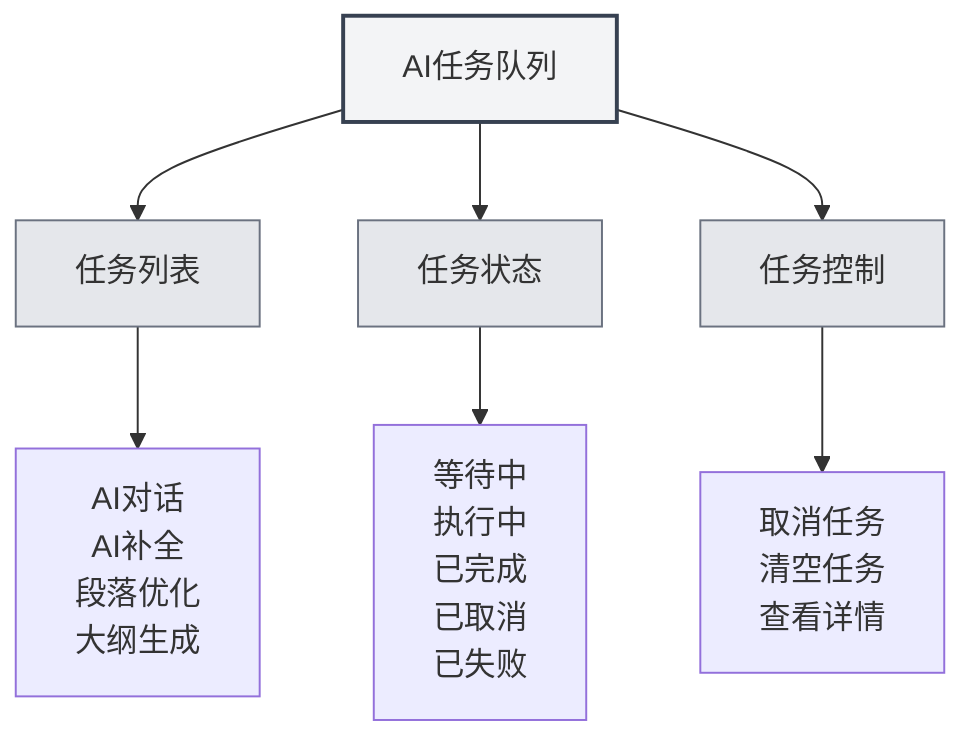

# AI任务队列

## 概述

AI任务队列用于管理和监控所有正在执行的AI任务。通过任务队列，您可以查看任务状态、取消任务、查看任务进度，确保AI功能的高效运行。

## 任务队列介绍

<AITaskQueue mode="demo" />

### 什么是任务队列

AI任务队列是一个管理界面，显示所有正在执行或等待执行的AI任务：

- **任务列表**：显示所有任务及其状态
- **任务状态**：显示任务的执行状态
- **任务进度**：显示任务的执行进度
- **任务控制**：可以取消或管理任务

### 任务类型

任务队列中可能包含以下类型的任务：

- **AI对话**：AI对话任务
- **AI补全**：AI自动补全任务
- **段落优化**：段落优化任务
- **大纲生成**：大纲生成任务
- **其他AI任务**：其他AI相关任务

## 打开任务队列

### 访问方式

可以通过以下方式打开任务队列：

- **侧边栏**：在侧边栏中可能有任务队列入口
- **菜单选项**：某些菜单中可能有任务队列选项
- **快捷键**：某些情况下可能有快捷键（未来可能支持）

### 任务队列面板

<AITaskQueue mode="demo" />

任务队列通常显示为侧边面板：

- **任务列表**：显示所有任务
- **任务详情**：显示选中任务的详细信息
- **控制按钮**：提供任务控制功能

## 任务查看

<AITaskQueue mode="demo" />

### 任务列表

任务列表显示所有任务：

- **任务名称**：显示任务的名称
- **任务状态**：显示任务的当前状态
- **任务进度**：显示任务的执行进度
- **任务时间**：显示任务的创建时间

### 任务状态

任务可能处于以下状态：

- **等待中**：任务已创建，等待执行
- **执行中**：任务正在执行
- **已完成**：任务执行完成
- **已取消**：任务已被取消
- **已失败**：任务执行失败

### 任务详情

可以查看任务的详细信息：

- **任务名称**：任务的名称
- **任务类型**：任务的类型
- **任务参数**：任务的参数
- **任务结果**：任务的结果（如果已完成）
- **错误信息**：任务的错误信息（如果失败）

## 任务控制

<AITaskQueue mode="demo" />

### 取消任务

可以取消正在执行的任务：

1. **选择任务**：在任务列表中选择要取消的任务
2. **点击取消**：点击"取消"按钮
3. **确认取消**：确认取消操作
4. **任务取消**：任务会被取消并移除

<AITaskQueue mode="demo" />

### 清空任务

可以清空所有任务：

1. **打开任务队列**：打开任务队列面板
2. **点击清空**：点击"清空"按钮
3. **确认清空**：确认清空操作
4. **任务清空**：所有任务会被取消并移除

### 任务优先级

某些任务可能有优先级：

- **高优先级**：重要的任务优先执行
- **普通优先级**：普通任务按顺序执行
- **低优先级**：低优先级任务最后执行

## 任务进度显示

<AITaskQueue mode="demo" />

### 进度条

任务进度通过进度条显示：

- **进度百分比**：显示任务完成的百分比
- **进度条**：可视化显示任务进度
- **进度更新**：进度实时更新

### 进度信息

可以查看任务的进度信息：

- **当前步骤**：显示当前执行的步骤
- **已完成步骤**：显示已完成的步骤
- **总步骤数**：显示总步骤数
- **预计时间**：显示预计完成时间

<AITaskQueue mode="demo" />

## 任务延迟

<AITaskQueue mode="demo" />

### 延迟补全

可以延迟AI补全任务：

1. **打开任务队列**：打开任务队列面板
2. **选择延迟时间**：选择延迟时间（分钟）
3. **应用延迟**：应用延迟设置
4. **任务延迟**：补全任务会延迟执行

### 延迟显示

延迟时间会显示在任务队列中：

- **剩余时间**：显示剩余的延迟时间
- **倒计时**：实时倒计时显示
- **自动执行**：延迟时间结束后自动执行

## 任务历史

<AITaskQueue mode="demo" />

### 历史记录

任务队列可能保存任务历史：

- **已完成任务**：显示已完成的任务
- **失败任务**：显示失败的任务
- **取消任务**：显示取消的任务

### 历史查看

可以查看任务历史：

- **历史列表**：显示历史任务列表
- **任务详情**：查看历史任务的详细信息
- **结果查看**：查看任务的结果

## 最佳实践

<AITaskQueue mode="demo" />

1. **定期查看**：定期查看任务队列，了解任务执行情况
2. **及时取消**：不需要的任务及时取消，释放资源
3. **监控进度**：关注任务进度，确保任务正常执行
4. **错误处理**：失败的任务及时处理，避免影响后续任务
5. **资源管理**：合理管理任务，避免资源浪费

## 注意事项

1. **任务数量**：过多任务可能影响性能
2. **任务取消**：取消任务可能影响正在执行的操作
3. **任务状态**：任务状态可能实时变化
4. **资源占用**：任务会占用系统资源
5. **网络依赖**：某些任务需要网络连接

## 相关文档

- [[ai.chat|AI对话功能]]
- [[ai.completion|AI自动补全]]
- [[features.paragraph-optimization|段落优化功能]]
