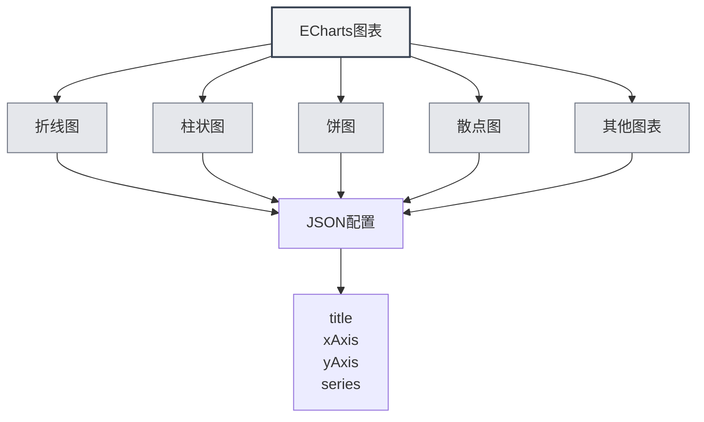

# ECharts图表

## 概述

ECharts是一个强大的数据可视化图表库，支持多种图表类型。MetaDoc支持ECharts图表，可以在Markdown文档中使用ECharts配置创建各种数据可视化图表。

<DataAnalysisWindow mode="demo" />

## ECharts语法

### 基本语法

ECharts使用JSON配置格式：

````markdown
```echarts
{
  "title": {
    "text": "示例图表"
  },
  "xAxis": {
    "type": "category",
    "data": ["A", "B", "C"]
  },
  "yAxis": {
    "type": "value"
  },
  "series": [{
    "data": [10, 20, 30],
    "type": "bar"
  }]
}
```
````

### 配置格式

ECharts配置必须是有效的JSON：

- **JSON格式**：使用标准JSON格式
- **英文标点**：使用英文逗号、冒号、引号
- **配置完整**：包含必要的配置项



## 支持的图表类型

### 折线图

创建折线图：

````markdown
```echarts
{
  "xAxis": {
    "type": "category",
    "data": ["Mon", "Tue", "Wed"]
  },
  "yAxis": {
    "type": "value"
  },
  "series": [{
    "data": [120, 200, 150],
    "type": "line"
  }]
}
```
````

### 柱状图

创建柱状图：

````markdown
```echarts
{
  "xAxis": {
    "type": "category",
    "data": ["A", "B", "C"]
  },
  "yAxis": {
    "type": "value"
  },
  "series": [{
    "data": [10, 20, 30],
    "type": "bar"
  }]
}
```
````

### 饼图

创建饼图：

````markdown
```echarts
{
  "series": [{
    "type": "pie",
    "data": [
      {"value": 335, "name": "类别A"},
      {"value": 310, "name": "类别B"},
      {"value": 234, "name": "类别C"}
    ]
  }]
}
```
````

### 散点图

创建散点图：

````markdown
```echarts
{
  "xAxis": {
    "type": "value"
  },
  "yAxis": {
    "type": "value"
  },
  "series": [{
    "type": "scatter",
    "data": [[10, 20], [15, 25], [20, 30]]
  }]
}
```
````

### 雷达图

创建雷达图：

````markdown
```echarts
{
  "radar": {
    "indicator": [
      {"name": "指标1", "max": 100},
      {"name": "指标2", "max": 100}
    ]
  },
  "series": [{
    "type": "radar",
    "data": [{
      "value": [80, 90]
    }]
  }]
}
```
````

### 热力图

创建热力图：

````markdown
```echarts
{
  "xAxis": {
    "type": "category",
    "data": ["A", "B", "C"]
  },
  "yAxis": {
    "type": "category",
    "data": ["X", "Y", "Z"]
  },
  "series": [{
    "type": "heatmap",
    "data": [[0, 0, 10], [0, 1, 20], [1, 0, 30]]
  }]
}
```
````

## 图表配置

### 标题配置

设置图表标题：

```json
{
  "title": {
    "text": "图表标题",
    "subtext": "副标题"
  }
}
```

### 坐标轴配置

配置坐标轴：

```json
{
  "xAxis": {
    "type": "category",
    "data": ["A", "B", "C"]
  },
  "yAxis": {
    "type": "value"
  }
}
```

### 系列配置

配置数据系列：

```json
{
  "series": [
    {
      "name": "系列名称",
      "type": "bar",
      "data": [10, 20, 30]
    }
  ]
}
```

### 图例配置

配置图例：

```json
{
  "legend": {
    "data": ["系列1", "系列2"]
  }
}
```

### 工具提示配置

配置工具提示：

```json
{
  "tooltip": {
    "trigger": "axis"
  }
}
```

## 高级功能

### 多系列图表

创建多系列图表：

````markdown
```echarts
{
  "xAxis": {
    "type": "category",
    "data": ["Mon", "Tue", "Wed"]
  },
  "yAxis": {
    "type": "value"
  },
  "series": [
    {
      "name": "系列1",
      "type": "bar",
      "data": [10, 20, 30]
    },
    {
      "name": "系列2",
      "type": "line",
      "data": [15, 25, 35]
    }
  ]
}
```
````

### 数据缩放

添加数据缩放：

```json
{
  "dataZoom": [
    {
      "type": "slider",
      "start": 0,
      "end": 100
    }
  ]
}
```

### 视觉映射

添加视觉映射：

```json
{
  "visualMap": {
    "min": 0,
    "max": 100,
    "inRange": {
      "color": ["#50a3ba", "#eac736", "#d94e5d"]
    }
  }
}
```

## 渲染方式

### 主进程渲染

ECharts使用主进程渲染：

- **服务器端渲染**：在主进程中渲染图表
- **SVG格式**：默认渲染为SVG格式
- **PNG格式**：可以转换为PNG格式

### 渲染性能

ECharts渲染特点：

- **渲染速度**：主进程渲染速度较快
- **资源占用**：渲染时占用主进程资源
- **错误处理**：渲染错误会在控制台显示

## 注意事项

### 语法注意事项

1. **JSON格式**：必须使用有效的JSON格式
2. **英文标点**：使用英文逗号、冒号、引号
3. **配置完整**：包含必要的配置项
4. **语法正确**：确保JSON语法正确，否则无法渲染

### 渲染注意事项

1. **配置验证**：渲染前会验证配置格式
2. **语法错误**：JSON语法错误时图表无法渲染
3. **复杂图表**：过于复杂的图表可能影响渲染性能
4. **导出兼容**：导出时确保图表在目标格式中正常显示

## 最佳实践

1. **配置规范**：遵循ECharts官方配置规范
2. **JSON格式**：确保JSON格式正确
3. **代码清晰**：保持配置代码清晰易读
4. **测试渲染**：编辑后测试图表渲染效果
5. **参考文档**：参考ECharts官方文档和示例

## 相关文档

- [[charts.introduction|图表功能介绍]]
- [[charts.mermaid|Mermaid图表]]
- [[charts.plantuml|PlantUML图表]]
