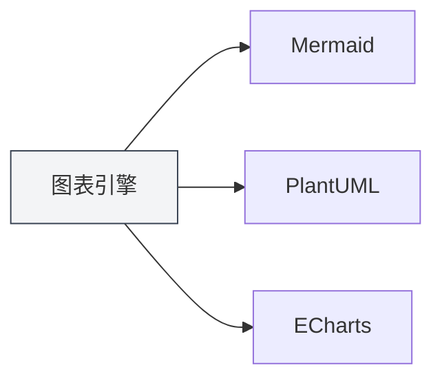
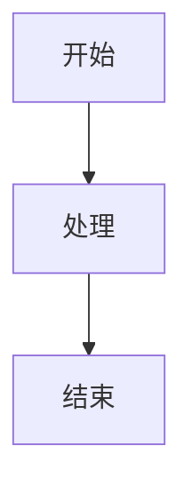

# 图表功能介绍

## 概述

MetaDoc支持多种图表绘制引擎，可以在Markdown文档中插入和渲染各种类型的图表。图表功能让您能够创建流程图、UML图、数据可视化图表等，丰富文档内容。

<GraphWindow mode="demo" />

## 支持的图表引擎

<ChartGenerationDisplay mode="demo" />

### 图表类型

MetaDoc支持以下图表引擎：

- **Mermaid**：流程图、UML图、甘特图等
- **PlantUML**：专业UML建模图表
- **ECharts**：数据可视化图表
- **Flowchart**：基础流程图
- **Graphviz**：图形可视化
- **Mindmap**：思维导图
- **Markmap**：Markdown思维导图
- **SMILES**：化学结构式
- **ABC**：音乐乐谱

### 引擎对比

<DataAnalysisDisplay mode="demo" />

| 引擎      | 适用场景                       | 渲染方式   |
| --------- | ------------------------------ | ---------- |
| Mermaid   | 流程图、序列图、类图、甘特图   | 浏览器渲染 |
| PlantUML  | 专业UML建模                    | 主进程渲染 |
| ECharts   | 数据可视化（折线图、柱状图等） | 主进程渲染 |
| Flowchart | 基础流程图                     | Vditor渲染 |
| Graphviz  | 图形可视化                     | Vditor渲染 |
| Mindmap   | 思维导图                       | Vditor渲染 |

### 引擎对比图表

<OutlineTreeDisplay mode="demo" />



## 插入图表

<DataAnalysisWindow mode="demo" />

### 代码块语法

在Markdown文档中使用代码块插入图表：

````markdown

````

### 图表类型标识

不同的图表类型使用不同的代码块标识：

- **Mermaid**：` ```mermaid `
- **PlantUML**：` ```plantuml `
- **ECharts**：` ```echarts `
- **Flowchart**：` ```flowchart `
- **Graphviz**：` ```graphviz `
- **Mindmap**：` ```mindmap `

## 图表渲染

<ChartGenerationDisplay mode="demo" />

### 实时渲染

图表会在编辑器中实时渲染：

- **自动渲染**：输入图表代码后自动渲染
- **实时预览**：在预览窗口中实时显示图表
- **错误提示**：语法错误时会显示错误提示

### 渲染方式

不同图表使用不同的渲染方式：

- **浏览器渲染**：Mermaid等使用浏览器API渲染
- **主进程渲染**：PlantUML、ECharts使用主进程渲染
- **Vditor渲染**：Flowchart等使用Vditor渲染

### 渲染格式

图表可以渲染为不同格式：

- **SVG**：矢量图格式（默认）
- **PNG**：位图格式（可转换）

## 图表导出

<OutlineTreeDisplay mode="demo" />

### 导出支持

图表支持导出到多种格式：

- **PDF导出**：图表会包含在PDF中
- **HTML导出**：图表会包含在HTML中
- **图片导出**：可以单独导出图表为图片

### 导出质量

导出时保持图表质量：

- **矢量图**：SVG格式保持清晰度
- **位图**：PNG格式适合打印
- **分辨率**：根据导出格式调整分辨率

## 图表编辑

<DataAnalysisDisplay mode="demo" />

### 代码编辑

可以直接编辑图表代码：

- **语法高亮**：代码块支持语法高亮
- **自动补全**：某些编辑器支持自动补全
- **错误检查**：实时检查语法错误

### 预览更新

编辑代码后预览会自动更新：

- **实时更新**：代码修改后预览立即更新
- **错误显示**：语法错误时显示错误信息
- **渲染状态**：显示图表的渲染状态

## 多语言支持

<DataAnalysisWindow mode="demo" />

### 图表代码多语言

图表代码支持多语言：

- **中文支持**：可以使用中文标签和文本
- **英文支持**：可以使用英文标签和文本
- **混合使用**：可以混合使用中英文

### 国际化

图表功能支持国际化：

- **界面语言**：图表相关界面跟随系统语言
- **错误提示**：错误提示使用当前语言
- **帮助文档**：帮助文档支持多语言

## 最佳实践

1. **选择合适的引擎**：根据需求选择合适的图表引擎
2. **语法规范**：遵循各引擎的语法规范
3. **代码清晰**：保持图表代码清晰易读
4. **测试渲染**：编辑后测试图表渲染效果
5. **导出测试**：导出前测试图表在目标格式中的显示效果

## 注意事项

1. **语法正确**：确保图表代码语法正确，否则无法渲染
2. **渲染性能**：复杂图表可能影响渲染性能
3. **导出兼容**：某些图表格式可能在某些导出格式中不兼容
4. **代码安全**：注意图表代码的安全性，避免恶意代码
5. **版本兼容**：不同版本的图表引擎可能有语法差异

## 相关文档

- [[charts.mermaid|Mermaid图表]]
- [[charts.plantuml|PlantUML图表]]
- [[charts.echarts|ECharts图表]]
- [[markdown.features|Markdown编辑器功能]]
