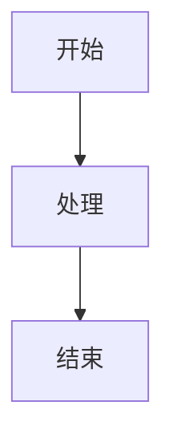
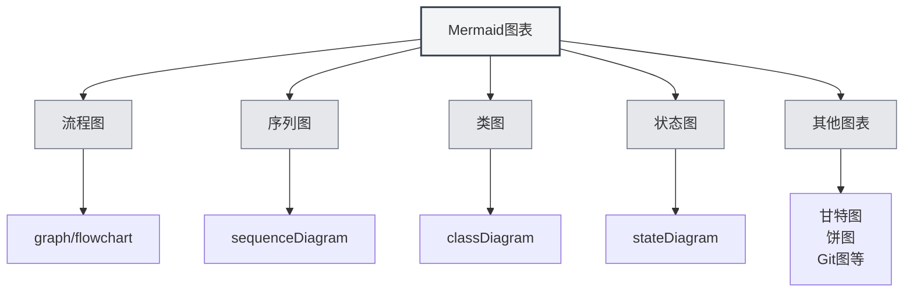
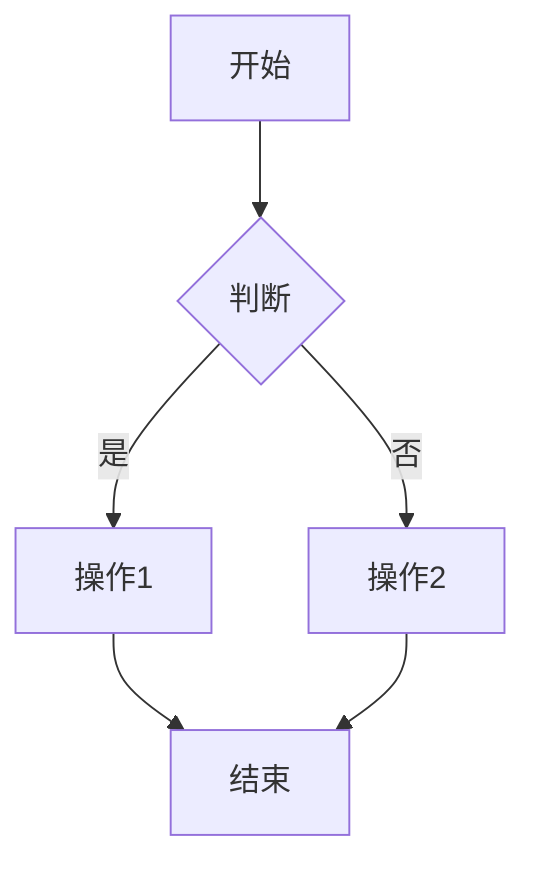
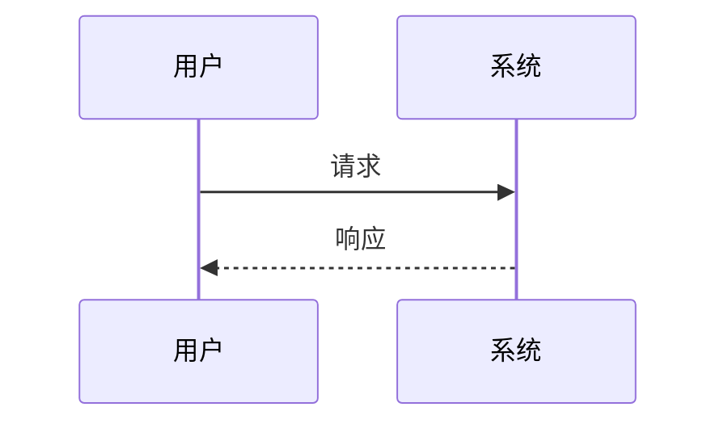
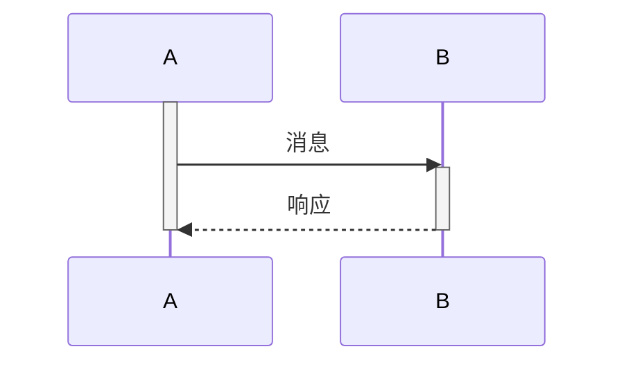
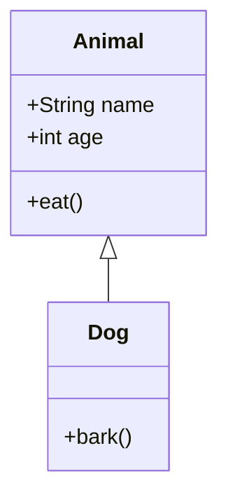
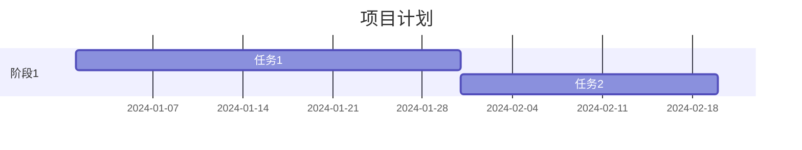
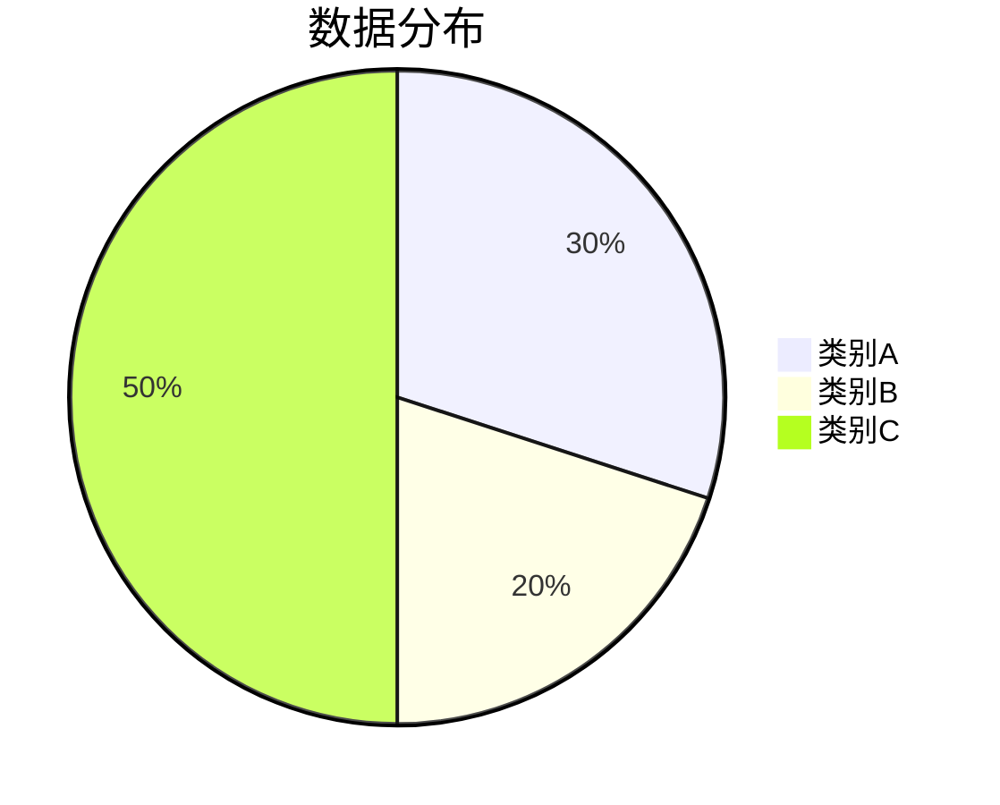
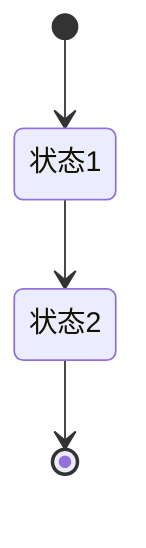
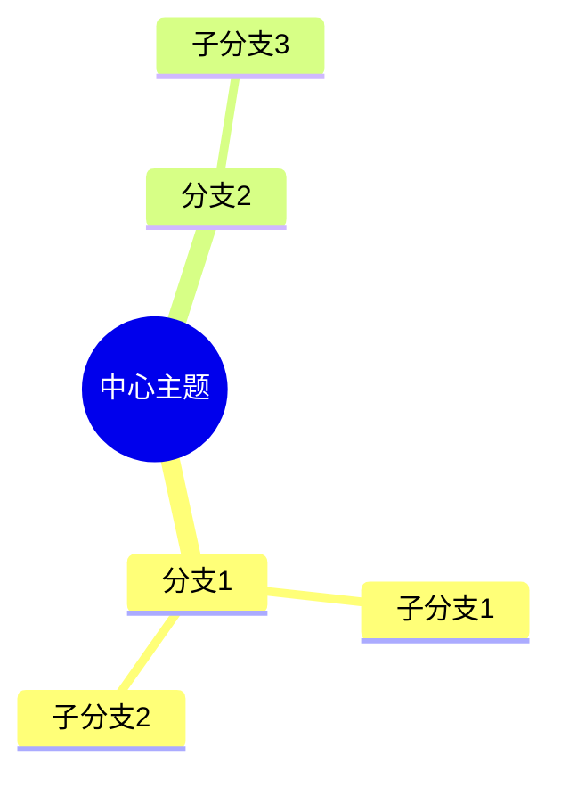

# Mermaid图表

## 概述

Mermaid是一个流行的图表绘制工具，适合快速绘制流程图、序列图、类图、甘特图等。MetaDoc支持Mermaid图表，可以在Markdown文档中直接使用Mermaid语法创建各种图表。

<GraphWindow mode="demo" initialTool="mermaid" />

## Mermaid语法

<OutlineTreeDisplay mode="demo" />

### 基本语法

Mermaid使用简单的文本语法描述图表：

````markdown

````

### 图表类型

<ChartGenerationDisplay mode="demo" />

Mermaid支持多种图表类型：

- **流程图**（graph/flowchart）
- **序列图**（sequenceDiagram）
- **类图**（classDiagram）
- **状态图**（stateDiagram）
- **实体关系图**（erDiagram）
- **甘特图**（gantt）
- **饼图**（pie）
- **Git图**（gitgraph）
- **用户旅程图**（journey）
- **思维导图**（mindmap）
- **时间线**（timeline）



## 流程图

<OutlineTreeDisplay mode="demo" />

### 基本流程图

创建基本流程图：

````markdown

````

### 流程图方向

可以设置流程图的方向：

- **TD**：从上到下（Top Down）
- **BT**：从下到上（Bottom Top）
- **LR**：从左到右（Left Right）
- **RL**：从右到左（Right Left）

### 节点形状

可以使用不同的节点形状：

- **矩形**：`[文本]`
- **圆角矩形**：`(文本)`
- **菱形**：`{文本}`
- **圆形**：`((文本))`
- **六边形**：`{{文本}}`
- **梯形**：`[/文本\]`
- **倒梯形**：`[\文本/]`

## 序列图

<DataAnalysisDisplay mode="demo" />

### 基本序列图

创建序列图：

````markdown

````

### 消息类型

可以使用不同类型的消息：

- **实线箭头**：`->>` 同步消息
- **虚线箭头**：`-->>` 异步消息
- **实线**：`->` 同步消息（不返回）
- **虚线**：`-->` 异步消息（不返回）

### 激活框

可以添加激活框表示对象活动：

````markdown

````

## 类图

<ChartGenerationDisplay mode="demo" />

### 基本类图

创建类图：

````markdown

````

### 类关系

可以表示不同的类关系：

- **继承**：`<|--` 或 `--|>`
- **实现**：`<|..` 或 `..|>`
- **组合**：`*--` 或 `--*`
- **聚合**：`o--` 或 `--o`
- **关联**：`-->` 或 `<--`
- **依赖**：`..>` 或 `<..`

### 类成员

可以定义类的成员：

- **属性**：`+name: String`（公有）、`-name: String`（私有）
- **方法**：`+method()`（公有）、`-method()`（私有）

## 甘特图

<OutlineTreeDisplay mode="demo" />

### 基本甘特图

创建甘特图：

````markdown

````

### 日期格式

可以设置日期格式：

- **YYYY-MM-DD**：年-月-日
- **MM/DD/YYYY**：月/日/年
- **其他格式**：支持多种日期格式

### 任务关系

可以设置任务关系：

- **after**：在某个任务之后
- **里程碑**：使用`milestone`标记里程碑

## 饼图

<DataAnalysisDisplay mode="demo" />

### 基本饼图

创建饼图：

````markdown

````

## 状态图

<ChartGenerationDisplay mode="demo" />

### 基本状态图

创建状态图：

````markdown

````

## 思维导图

<OutlineTreeDisplay mode="demo" />

### 基本思维导图

创建思维导图：

````markdown

````

## 注意事项

<DataAnalysisDisplay mode="demo" />

### 语法注意事项

1. **字符串包裹**：建议使用 `["..."]` 包裹字符串避免转义错误
2. **标识符**：在类图中避免使用带空格或特殊字符的标识符
3. **中文支持**：可以使用中文，但建议使用英文标识符
4. **语法版本**：注意Mermaid语法版本，不同版本可能有差异

### 渲染注意事项

1. **语法错误**：语法错误时图表无法渲染
2. **复杂图表**：过于复杂的图表可能影响渲染性能
3. **浏览器兼容**：某些浏览器可能不支持某些Mermaid特性
4. **导出兼容**：导出时确保图表在目标格式中正常显示

## 最佳实践

1. **语法规范**：遵循Mermaid官方语法规范
2. **代码清晰**：保持图表代码清晰易读
3. **测试渲染**：编辑后测试图表渲染效果
4. **使用示例**：参考Mermaid官方文档的示例
5. **版本兼容**：注意Mermaid版本兼容性

## 相关文档

- [[charts.introduction|图表功能介绍]]
- [[charts.plantuml|PlantUML图表]]
- [[charts.echarts|ECharts图表]]
