# PlantUML图表

## 概述

PlantUML是一个专业的UML建模工具，支持多种UML图表类型。MetaDoc支持PlantUML图表，可以在Markdown文档中使用PlantUML语法创建专业的UML图表。

## PlantUML语法

### 基本语法

PlantUML使用特定的标记和语法：

````markdown
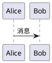
````

### 必需标记

PlantUML图表必须包含：

- **@startuml**：图表开始标记
- **@enduml**：图表结束标记

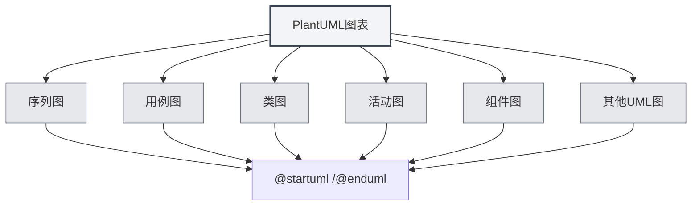

## 支持的图表类型

### 序列图

创建序列图：

````markdown
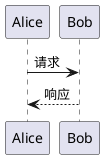
````

### 用例图

创建用例图：

````markdown
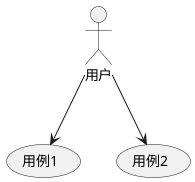
````

### 类图

创建类图：

````markdown
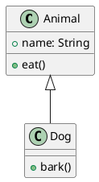
````

### 活动图

创建活动图：

````markdown
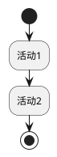
````

### 组件图

创建组件图：

````markdown
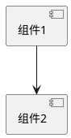
````

### 部署图

创建部署图：

````markdown
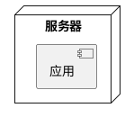
````

### 状态图

创建状态图：

````markdown

````

## 序列图详解

### 参与者

定义参与者：

````markdown
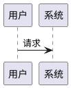
````

### 消息类型

可以使用不同类型的消息：

- **同步消息**：`->`
- **异步消息**：`-->`
- **返回消息**：`<-` 或 `<--`
- **自调用**：`->` 指向自己

### 激活框

添加激活框：

````markdown
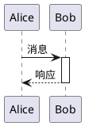
````

## 类图详解

### 类定义

定义类：

````markdown
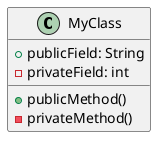
````

### 类关系

表示类关系：

- **继承**：`<|--` 或 `--|>`
- **实现**：`<|..` 或 `..|>`
- **组合**：`*--` 或 `--*`
- **聚合**：`o--` 或 `--o`
- **关联**：`-->` 或 `<--`
- **依赖**：`..>` 或 `<..`

### 接口和抽象类

定义接口和抽象类：

````markdown
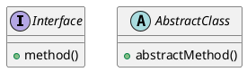
````

## 活动图详解

### 基本活动

定义活动：

````markdown

````

### 判断节点

添加判断：

````markdown
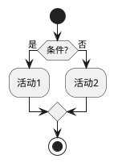
````

### 循环

添加循环：

````markdown
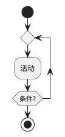
````

## 样式和主题

### 主题设置

可以设置主题：

````markdown
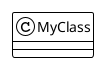
````

### 颜色设置

可以设置颜色：

````markdown
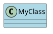
````

## 渲染方式

### 主进程渲染

PlantUML使用主进程渲染：

- **服务器端渲染**：在主进程中渲染图表
- **SVG格式**：默认渲染为SVG格式
- **PNG格式**：可以转换为PNG格式

### 渲染性能

PlantUML渲染特点：

- **渲染速度**：主进程渲染速度较快
- **资源占用**：渲染时占用主进程资源
- **错误处理**：渲染错误会在控制台显示

## 注意事项

### 语法注意事项

1. **必需标记**：必须包含 `@startuml` 和 `@enduml`
2. **语法规范**：遵循PlantUML官方语法规范
3. **中文支持**：可以使用中文，但建议使用英文标识符
4. **版本兼容**：注意PlantUML版本兼容性

### 渲染注意事项

1. **代码提取**：确保代码提取正确，避免包含XML标签
2. **语法错误**：语法错误时图表无法渲染
3. **复杂图表**：过于复杂的图表可能影响渲染性能
4. **导出兼容**：导出时确保图表在目标格式中正常显示

## 最佳实践

1. **语法规范**：遵循PlantUML官方语法规范
2. **代码清晰**：保持图表代码清晰易读
3. **使用标记**：始终使用 `@startuml` 和 `@enduml` 标记
4. **测试渲染**：编辑后测试图表渲染效果
5. **参考文档**：参考PlantUML官方文档

## 相关文档

- [[charts.introduction|图表功能介绍]]
- [[charts.mermaid|Mermaid图表]]
- [[charts.echarts|ECharts图表]]
