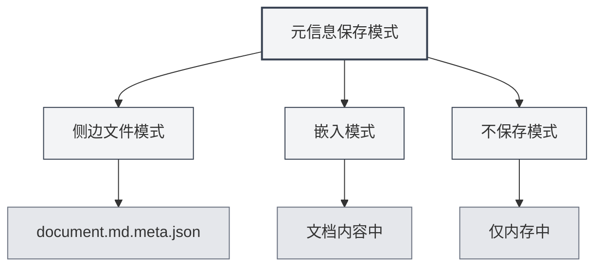

# 文档元信息

## 概述

文档元信息是描述文档基本属性的数据，包括标题、作者、描述、关键词等。合理设置元信息有助于文档管理和检索，并且在导出文档时会自动包含这些信息。

MetaDoc支持为每个文档设置元信息，这些信息可以保存在侧边文件中、嵌入到文档内容中，或者不保存。您也可以使用AI自动生成元信息。

## 元信息介绍

### 标题（Title）

文档的标题，通常显示在文档顶部和标签页中。

- **用途**：标识文档的主要内容
- **显示位置**：标签页标题、导出文档的标题页
- **示例**：`"MetaDoc用户手册"`

### 作者（Author）

文档的作者或创建者。

- **用途**：标识文档的创建者
- **显示位置**：导出文档的作者信息
- **示例**：`"张三"`

### 描述（Description）

文档的简要描述或摘要。

- **用途**：概括文档的主要内容
- **显示位置**：导出文档的摘要部分
- **示例**：`"本文档介绍MetaDoc的基本使用方法"`

### 关键词（Keywords）

文档的关键词列表，用于文档检索和分类。

- **用途**：帮助检索和分类文档
- **格式**：字符串数组
- **示例**：`["MetaDoc", "用户手册", "文档编辑"]`

## 设置元信息

### 手动设置

1. **打开元信息面板**：

   - 在编辑器中点击工具栏的"元信息"按钮
   - 或使用快捷键（如果配置了）

2. **填写元信息**：

   - **标题**：输入文档标题
   - **作者**：输入作者名称
   - **描述**：输入文档描述（支持多行）
   - **关键词**：输入关键词，多个关键词用逗号分隔

3. **保存**：点击"保存"按钮保存元信息

元信息面板界面如下：

<MetaInfoPanel mode="demo" :meta='{"title": "示例文档", "author": "作者名", "description": "文档描述", "keywords": ["关键词1", "关键词2"]}' :outlineJson='""' />

### 批量设置

您可以一次性设置所有元信息字段：

1. 打开元信息面板
2. 填写所有字段
3. 点击"保存"按钮

### 编辑元信息

已设置的元信息可以随时修改：

1. 打开元信息面板
2. 修改需要更改的字段
3. 点击"保存"按钮

修改后的元信息会立即生效，并在下次保存文档时保存。

## 元信息保存模式

MetaDoc支持三种元信息保存模式，可在[[settings.basic|基础设置]]中配置：



### 侧边文件模式

元信息保存在与文档同名的侧边文件中（`.meta.json`）。

**优点**：

- 不修改原文档内容
- 可以随时删除侧边文件恢复原文档
- 适合版本控制

**缺点**：

- 会产生额外的文件
- 移动文档时需要同时移动侧边文件

**示例**：

- 文档：`document.md`
- 元信息文件：`document.md.meta.json`

### 嵌入模式

元信息嵌入到文档内容中（Markdown的front matter或LaTeX的注释）。

**优点**：

- 文档和元信息在一起，便于管理
- 不需要额外的文件

**缺点**：

- 修改了原文档内容
- 某些格式可能不支持嵌入

**示例**（Markdown）：

```markdown
---
title: 文档标题
author: 作者名称
description: 文档描述
keywords: [关键词1, 关键词2]
---

文档内容...
```

### 不保存模式

元信息仅在编辑时使用，不保存到文件。

**优点**：

- 不影响原文档
- 不产生额外文件

**缺点**：

- 关闭文档后元信息会丢失
- 无法在导出时使用元信息

## AI生成元信息

MetaDoc支持使用AI自动生成文档元信息，基于文档内容和大纲结构智能生成。

### 生成单个字段

生成特定字段的元信息：

1. 打开元信息面板
2. 点击字段旁的"AI生成"按钮
3. 等待AI生成结果
4. 查看生成的内容，可以接受或重新生成

### 生成所有字段

一次性生成所有元信息字段：

1. 打开元信息面板
2. 点击"AI生成全部"按钮
3. 等待AI生成结果
4. 查看生成的内容，可以接受、修改或重新生成

### 生成原理

AI生成元信息基于：

- **文档大纲**：分析文档的标题结构
- **文档内容**：分析文档的主要内容
- **上下文理解**：理解文档的主题和目的

生成的结果会根据文档内容自动调整，确保元信息准确反映文档内容。

<AIChat mode="demo" />

<KnowledgeBase mode="demo" />

<ProofreadView mode="demo" />

<QuickStartPanel mode="demo" />

<AgentView mode="demo" />

<MenuItemsDemo mode="demo" :items='[{"id": "file", "items": ["new", "open", "save"]}]' />

<ViewMenuItemsDemo mode="demo" :items='["editor", "outline"]' />

<Outline mode="demo" />

<MainTabs mode="demo" />

<GraphWindow mode="demo" />

<OcrWindow mode="demo" />

## 元信息在导出中的应用

导出的文档会自动包含元信息：

### PDF导出

- **标题**：显示在PDF文档属性中
- **作者**：显示在PDF文档属性中
- **描述**：作为PDF主题（Subject）
- **关键词**：显示在PDF文档属性中

### DOCX导出

- **标题**：显示在Word文档属性中
- **作者**：显示在Word文档属性中
- **描述**：作为Word摘要
- **关键词**：显示在Word文档属性中

### HTML导出

- **标题**：显示在HTML的`<title>`标签中
- **作者**：显示在HTML的`<meta>`标签中
- **描述**：显示在HTML的`<meta>`标签中
- **关键词**：显示在HTML的`<meta>`标签中

## 使用技巧

### 合理设置标题

- **简洁明了**：标题应该简洁地概括文档内容
- **避免过长**：标题过长会影响显示效果
- **使用关键词**：在标题中包含重要的关键词

### 关键词设置

- **数量适中**：建议设置3-10个关键词
- **相关性高**：关键词应该与文档内容高度相关
- **避免重复**：避免设置重复或相似的关键词

### AI生成优化

- **生成后检查**：AI生成的内容需要人工检查
- **适当修改**：根据实际需要修改生成的内容
- **多次生成**：如果不满意，可以多次生成选择最佳结果

## 常见问题

### Q: 元信息保存在哪里？

A: 根据保存模式不同，元信息可能保存在侧边文件、嵌入文档内容中，或不保存。可以在设置中配置保存模式。

### Q: 如何删除元信息？

A: 在元信息面板中清空所有字段并保存，即可删除元信息。

### Q: AI生成的内容不准确怎么办？

A: AI生成的内容仅供参考，您可以手动修改或重新生成。建议生成后检查并调整。

### Q: 元信息会影响文档内容吗？

A: 如果使用嵌入模式，元信息会嵌入到文档内容中。如果使用侧边文件模式或不保存模式，不会影响原文档内容。

### Q: 导出时元信息会丢失吗？

A: 不会。导出时会自动包含元信息，显示在导出文档的属性中。

## 相关文档

- [[core.file-operations|文件操作]]
- [[core.export|导出功能]]
- [[settings.basic|基础设置]]
- [[ai.assistants|AI助手功能]]
