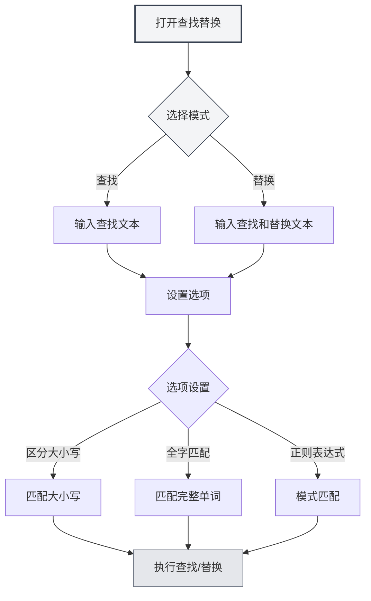

# 编辑器基础操作

## 概述

编辑器基础操作是使用MetaDoc编辑文档的基本技能。掌握这些操作能显著提高您的编辑效率。

MetaDoc的编辑器支持标准的文本编辑操作，包括撤销、重做、复制、粘贴、剪切、全选和查找替换等功能。

<SearchReplaceMenu mode="demo" :position='{"top": 100, "left": 200}' :adapter='null' />

<MenuItemsDemo mode="demo" :items='[{"id": "edit"}]' />

## 撤销和重做

### 撤销操作

撤销上一次编辑操作：

- **快捷键**：`Ctrl+Z`（Windows/Linux）或 `Cmd+Z`（macOS）
- **菜单**：点击"编辑" → "撤销"

可以连续撤销多次操作，直到恢复到文档的初始状态。

### 重做操作

<MenuItemsDemo mode="demo" :items='[{"id": "edit"}]' />

恢复被撤销的操作：

- **快捷键**：`Ctrl+Y` 或 `Ctrl+Shift+Z`（Windows/Linux）或 `Cmd+Shift+Z`（macOS）
- **菜单**：点击"编辑" → "重做"

重做操作会按照撤销的相反顺序恢复操作。

## 复制、粘贴、剪切

<MenuItemsDemo mode="demo" :items='[{"id": "edit"}]' />

### 复制

将选中的文本复制到剪贴板：

- **快捷键**：`Ctrl+C`（Windows/Linux）或 `Cmd+C`（macOS）
- **菜单**：点击"编辑" → "复制"
- **右键菜单**：选中文本后右键选择"复制"

### 粘贴

<MenuItemsDemo mode="demo" :items='[{"id": "edit"}]' />

将剪贴板中的内容粘贴到当前位置：

- **快捷键**：`Ctrl+V`（Windows/Linux）或 `Cmd+V`（macOS）
- **菜单**：点击"编辑" → "粘贴"
- **右键菜单**：右键选择"粘贴"

粘贴操作会将内容插入到光标位置，如果已有选中文本，会替换选中的内容。

### 剪切

<MenuItemsDemo mode="demo" :items='[{"id": "edit"}]' />

将选中的文本剪切到剪贴板（删除原位置的内容）：

- **快捷键**：`Ctrl+X`（Windows/Linux）或 `Cmd+X`（macOS）
- **菜单**：点击"编辑" → "剪切"
- **右键菜单**：选中文本后右键选择"剪切"

剪切操作会删除原位置的文本，并将其保存到剪贴板，之后可以粘贴到其他位置。

## 全选

<MenuItemsDemo mode="demo" :items='[{"id": "edit"}]' />

选中文档中的所有内容：

- **快捷键**：`Ctrl+A`（Windows/Linux）或 `Cmd+A`（macOS）
- **菜单**：点击"编辑" → "全选"

全选后，您可以：

- 复制整个文档内容
- 删除整个文档内容
- 统一格式化所有文本

## 查找替换

### 查找

<SearchReplaceMenu mode="demo" :position='{"top": 100, "left": 200}' :adapter='null' />

在文档中查找指定的文本：

- **快捷键**：`Ctrl+F`（Windows/Linux）或 `Cmd+F`（macOS）
- **菜单**：点击"编辑" → "查找"

查找功能支持：

- **大小写匹配**：区分大小写查找
- **全字匹配**：只匹配完整的单词
- **正则表达式**：使用正则表达式进行高级查找
- **高亮显示**：查找结果会在文档中高亮显示

### 替换

<SearchReplaceMenu mode="demo" :position='{"top": 100, "left": 200}' :adapter='null' />

查找并替换文本：

- **快捷键**：`Ctrl+H`（Windows/Linux）或 `Cmd+H`（macOS）
- **菜单**：点击"编辑" → "查找替换"

替换功能支持：

- **单个替换**：逐个替换匹配的文本
- **全部替换**：一次性替换所有匹配的文本
- **预览替换**：在替换前预览替换结果

### 查找替换选项

查找替换对话框提供以下选项：

- **区分大小写**：只匹配大小写完全相同的文本
- **全字匹配**：只匹配完整的单词（不匹配单词的一部分）
- **正则表达式**：使用正则表达式进行模式匹配
- **循环查找**：到达文档末尾后自动从头开始查找

查找替换菜单界面如下：

<SearchReplaceMenu mode="demo" :position='{"top": 100, "left": 200}' :adapter='null' />

## 文本选择

### 基本选择

- **单击**：将光标定位到点击位置
- **拖拽**：选中从起始位置到结束位置的文本
- **双击**：选中整个单词
- **三击**：选中整行

### 扩展选择

- **Shift+点击**：扩展选择范围到点击位置
- **Ctrl+点击**：添加多个不连续的选择区域（如果编辑器支持）
- **Alt+拖拽**：列选择模式（如果编辑器支持）

## 光标移动

### 基本移动

- **方向键**：上下左右移动光标
- **Home/End**：移动到行首/行尾
- **Ctrl+Home/End**：移动到文档开头/结尾
- **Page Up/Page Down**：向上/向下翻页

### 单词移动

- **Ctrl+左/右箭头**：按单词移动光标
- **Ctrl+上/下箭头**：向上/向下移动段落

## 删除操作

### 基本删除

- **Backspace**：删除光标前的字符
- **Delete**：删除光标后的字符
- **Ctrl+Backspace**：删除光标前的整个单词
- **Ctrl+Delete**：删除光标后的整个单词

## 编辑器差异

MetaDoc提供两种主要的编辑器：

### Markdown编辑器（Vditor）

- 支持实时预览
- 提供格式化工具栏
- 支持多种编辑模式（IR/WYSIWYG/SV）
- 详见[[markdown.editor|Markdown编辑器使用指南]]

### LaTeX编辑器（Monaco）

- 专业的代码编辑体验
- 语法高亮和自动补全
- 支持代码折叠
- 详见[[latex.editor|LaTeX编辑器使用指南]]

两种编辑器的基础操作基本相同，但在高级功能上有所差异。

## 快捷键参考

### 通用快捷键

| 操作     | Windows/Linux              | macOS         |
| -------- | -------------------------- | ------------- |
| 撤销     | `Ctrl+Z`                   | `Cmd+Z`       |
| 重做     | `Ctrl+Y` 或 `Ctrl+Shift+Z` | `Cmd+Shift+Z` |
| 复制     | `Ctrl+C`                   | `Cmd+C`       |
| 粘贴     | `Ctrl+V`                   | `Cmd+V`       |
| 剪切     | `Ctrl+X`                   | `Cmd+X`       |
| 全选     | `Ctrl+A`                   | `Cmd+A`       |
| 查找     | `Ctrl+F`                   | `Cmd+F`       |
| 查找替换 | `Ctrl+H`                   | `Cmd+H`       |

## 注意事项

1. **撤销历史**：撤销历史在关闭文档后会清空，建议及时保存文档
2. **剪贴板**：复制和剪切的内容保存在系统剪贴板中，关闭应用后可能丢失
3. **查找替换**：使用正则表达式时，注意转义特殊字符
4. **大文档**：在处理大文档时，查找替换操作可能需要一些时间

## 相关文档

- [[core.file-operations|文件操作]]
- [[core.editor-settings|编辑器设置]]
- [[markdown.editor|Markdown编辑器使用指南]]
- [[latex.editor|LaTeX编辑器使用指南]]
