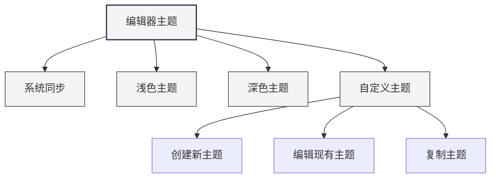
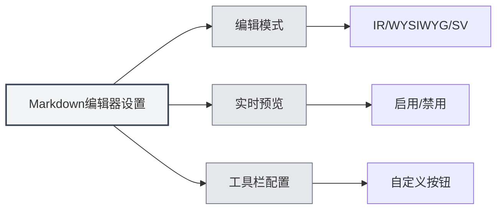

# 编辑器设置

## 概述

编辑器设置允许您自定义编辑器的外观和行为，包括主题、字体、行号显示等。合理的设置能提升您的编辑体验和工作效率。

编辑器设置分为全局设置和编辑器特定设置。全局设置会影响所有编辑器，而某些设置可能只适用于特定类型的编辑器（如Markdown编辑器或LaTeX编辑器）。

<MenuItemsDemo mode="demo" :items='[{"id": "settings"}]' />

## 编辑器主题

<MenuItemsDemo mode="demo" :items='[{"id": "settings"}]' />

### 主题类型

MetaDoc支持多种主题模式：

- **系统同步**：自动跟随系统主题（浅色/深色）
- **浅色主题**：始终使用浅色主题
- **深色主题**：始终使用深色主题
- **自定义主题**：使用自定义颜色配置

### 设置主题

<SettingThemeSection mode="demo" />

1. 打开设置页面（点击菜单"设置"或使用快捷键）
2. 进入"主题设置"部分
3. 选择您喜欢的主题

您可以通过顶部菜单栏访问设置：

点击顶部菜单栏的"设置"菜单，可以打开设置面板，配置编辑器主题、内容主题、代码主题等选项。

<MenuItemsDemo mode="demo" :items='[{"id": "settings"}]' />

主题设置会立即生效，无需重启应用。

### 自定义主题

<SettingThemeSection mode="demo" />

您可以创建和编辑自定义主题：

1. 在主题设置页面点击"新建主题"
2. 设置主题名称和主题颜色
3. 保存后即可使用

自定义主题支持：

- **编辑**：修改主题名称和颜色
- **复制**：复制现有主题作为新主题的起点
- **删除**：删除不需要的自定义主题

## 内容主题

<SettingThemeSection mode="demo" />

内容主题控制文档预览区域的显示样式：

- **自动**：根据全局主题自动选择
- **浅色**：始终使用浅色预览样式
- **深色**：始终使用深色预览样式

内容主题主要影响Markdown预览和PDF预览的显示效果。

## 代码主题

<SettingThemeSection mode="demo" />

代码主题控制代码块的语法高亮样式：

- **自动**：根据全局主题自动选择
- **预设主题**：选择预设的代码主题（如GitHub、Monokai、Solarized等）

代码主题影响：

- Markdown代码块的语法高亮
- LaTeX编辑器的代码高亮
- 控制台输出的显示样式

## 字体设置

<SettingBasicSection mode="demo" />

### 编辑器字体

编辑器使用的字体可以在系统设置中配置。默认使用等宽字体，如：

- JetBrains Mono
- Consolas
- Courier New
- Microsoft YaHei Mono

### 字体大小

- **放大**：使用 `Ctrl+=` 或 `Ctrl+鼠标滚轮向上`
- **缩小**：使用 `Ctrl+-` 或 `Ctrl+鼠标滚轮向下`
- **重置**：使用 `Ctrl+0` 重置为默认大小

字体大小调整会立即生效，但不会保存到设置中。

## 行号显示

<SettingBasicSection mode="demo" />

### 显示/隐藏行号

行号显示设置控制编辑器是否显示行号：

- **启用**：显示行号，方便定位代码位置
- **禁用**：隐藏行号，获得更大的编辑区域

### 设置行号显示

1. 打开设置页面
2. 在"编辑器设置"部分找到"行号显示"
3. 切换开关启用或禁用行号

行号设置会影响：

- LaTeX编辑器
- 纯文本编辑器
- 代码预览区域

注意：Markdown编辑器（Vditor）的行号显示由其自身配置控制。

## 小地图显示

小地图（Minimap）是编辑器右侧的代码缩略图，帮助您快速浏览和定位文档内容。

### 显示/隐藏小地图

小地图显示设置：

- **启用**：显示小地图，方便浏览长文档
- **禁用**：隐藏小地图，获得更大的编辑区域

### 设置小地图

小地图设置通常在编辑器的右键菜单或工具栏中：

1. 在编辑器中右键
2. 查找"小地图"或"Minimap"选项
3. 切换显示状态

小地图功能主要适用于：

- LaTeX编辑器（Monaco）
- 纯文本编辑器（Monaco）

## 编辑器特定设置

### Markdown编辑器设置

Markdown编辑器（Vditor）的特定设置：

- **编辑模式**：IR模式、WYSIWYG模式、SV模式
- **实时预览**：启用/禁用实时预览功能
- **工具栏配置**：自定义工具栏按钮

详见[[markdown.editor|Markdown编辑器使用指南]]。

### LaTeX编辑器设置

LaTeX编辑器（Monaco）的特定设置：

- **代码折叠**：启用/禁用代码折叠功能
- **自动换行**：控制长行的显示方式
- **语法检查**：启用/禁用LaTeX语法检查

详见[[latex.editor|LaTeX编辑器使用指南]]。

## 设置同步

编辑器设置会保存在本地配置中，包括：

- 主题选择
- 行号显示偏好
- 字体大小（当前会话）
- 小地图显示状态

设置会在应用重启后自动恢复。

## 快捷键参考

### 字体调整

| 操作         | Windows/Linux | macOS      |
| ------------ | ------------- | ---------- |
| 放大字体     | `Ctrl+=`      | `Cmd+=`    |
| 缩小字体     | `Ctrl+-`      | `Cmd+-`    |
| 重置字体     | `Ctrl+0`      | `Cmd+0`    |
| 鼠标滚轮缩放 | `Ctrl+滚轮`   | `Cmd+滚轮` |

## 最佳实践

1. **主题选择**：
   - 长时间编辑建议使用深色主题，减少眼部疲劳
   - 打印预览时使用浅色主题，获得更好的打印效果

2. **行号显示**：
   - 编写代码时建议启用行号，方便定位错误
   - 纯文本编辑时可以关闭行号，获得更大编辑区域

3. **小地图**：
   - 编辑长文档时启用小地图，快速浏览文档结构
   - 编辑短文档时可以关闭小地图

4. **字体大小**：
   - 根据屏幕大小和个人习惯调整字体大小
   - 建议使用14-16px的字体大小，平衡可读性和屏幕空间

## 注意事项

1. **主题同步**：选择"系统同步"后，主题会跟随系统设置自动切换
2. **设置范围**：某些设置只影响特定编辑器，不影响其他编辑器
3. **性能影响**：启用某些功能（如实时预览）可能会影响编辑性能
4. **自定义主题**：自定义主题的颜色会影响整个应用的配色方案

## 相关文档

- [[core.editor-basics|编辑器基础操作]]
- [[settings.basic|基础设置]]
- [[settings.theme|主题设置]]
- [[markdown.editor|Markdown编辑器使用指南]]
- [[latex.editor|LaTeX编辑器使用指南]]
