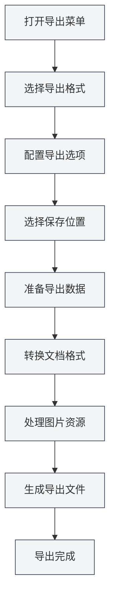

# 导出功能

## 概述

MetaDoc支持将文档导出为多种格式，包括PDF、HTML、DOCX、LaTeX、Markdown、JSON等。导出功能会根据文档格式提供不同的导出选项，确保导出的文档保持原有的格式和样式。

导出功能会自动包含文档元信息（标题、作者、描述、关键词），并在导出过程中处理图片、表格、数学公式等元素。

## 导出格式支持

### Markdown文档导出

Markdown文档（`.md`）可以导出为以下格式：

- **PDF**：适合打印和分享
- **HTML**：适合网页展示
- **DOCX**：适合Word编辑
- **LaTeX**：适合学术论文
- **JSON**：适合程序处理

### LaTeX文档导出

LaTeX文档（`.tex`）可以导出为以下格式：

- **PDF**：通过LaTeX编译生成
- **Markdown**：转换为Markdown格式
- **HTML**：转换为HTML格式
- **DOCX**：转换为Word格式

### JSON文档导出

JSON文档（`.json`）可以导出为：

- **JSON**：保持JSON格式

## 导出操作

### 基本导出

1. **打开导出菜单**：
   - 点击菜单栏的"文件" → "导出"
   - 或使用快捷键（如果配置了）

2. **选择导出格式**：
   - 在导出菜单中选择目标格式
   - 系统会根据当前文档格式显示可用的导出选项

3. **选择保存位置**：
   - 在文件保存对话框中选择保存位置
   - 输入文件名（系统会自动添加正确的扩展名）

4. **等待导出完成**：
   - 导出过程中会显示进度条
   - 导出完成后会显示成功提示

### 快速导出

对于常用格式，可以使用快捷键快速导出：

- **导出为PDF**：`Ctrl+Shift+E`（如果配置了）
- **导出为HTML**：通过菜单选择

## Markdown导出详解

### 导出为PDF

PDF导出会将Markdown转换为PDF格式：

- **包含内容**：文档正文、图片、表格、数学公式
- **包含元信息**：标题、作者、描述、关键词
- **样式**：使用PDF专用样式，适合打印
- **图片处理**：图片会自动调整大小以适应页面

**使用场景**：
- 打印文档
- 分享文档给他人
- 归档保存

### 导出为HTML

HTML导出会将Markdown转换为网页格式：

- **包含内容**：文档正文、图片、表格、数学公式
- **包含元信息**：标题、作者、描述、关键词（在HTML的meta标签中）
- **样式**：使用HTML样式，适合网页展示
- **图片处理**：可以选择保留原始URL、转换为base64或保存到文件夹

**使用场景**：
- 发布到网站
- 在浏览器中查看
- 分享给他人

### 导出为DOCX

DOCX导出会将Markdown转换为Word格式：

- **包含内容**：文档正文、图片、表格、数学公式
- **包含元信息**：标题、作者、描述、关键词（在Word文档属性中）
- **样式**：使用Word样式，可以在Word中进一步编辑
- **图片处理**：图片会嵌入到Word文档中

**使用场景**：
- 在Word中进一步编辑
- 与他人协作编辑
- 提交文档

### 导出为LaTeX

LaTeX导出会将Markdown转换为LaTeX格式：

- **包含内容**：文档正文、图片、表格、数学公式
- **包含元信息**：标题、作者、描述、关键词（在LaTeX文档中）
- **格式转换**：Markdown语法转换为对应的LaTeX命令
- **数学公式**：保持LaTeX数学公式格式

**使用场景**：
- 学术论文写作
- 需要LaTeX格式的场景
- 进一步编辑LaTeX文档

### 导出为JSON

JSON导出会将文档保存为JSON格式：

- **包含内容**：文档的所有数据（内容、元信息、大纲等）
- **格式**：结构化的JSON数据
- **用途**：程序处理、数据备份

## LaTeX导出详解

### 导出为PDF

LaTeX文档导出为PDF需要通过LaTeX编译：

1. **编译LaTeX**：系统会自动编译LaTeX文档
2. **生成PDF**：编译成功后生成PDF文件
3. **包含元信息**：PDF文档属性中包含元信息

**注意事项**：
- 需要安装LaTeX发行版（如TeX Live）
- 编译可能需要一些时间
- 如果编译失败，会显示错误信息

### 导出为Markdown

LaTeX文档可以转换为Markdown格式：

- **格式转换**：LaTeX命令转换为Markdown语法
- **数学公式**：LaTeX公式转换为Markdown数学公式格式
- **表格**：LaTeX表格转换为Markdown表格

### 导出为HTML

LaTeX文档可以转换为HTML格式：

- **格式转换**：LaTeX命令转换为HTML标签
- **数学公式**：使用MathJax或KaTeX渲染
- **样式**：使用HTML样式展示

### 导出为DOCX

LaTeX文档可以转换为Word格式：

- **格式转换**：LaTeX命令转换为Word格式
- **数学公式**：转换为Word数学公式格式
- **表格**：转换为Word表格格式

## 导出选项配置

### 图片处理选项

导出时可以配置图片处理方式：

- **保留原始URL**：保持图片的原始URL（适用于HTML导出）
- **转换为Base64**：将图片嵌入到文档中（适用于HTML、DOCX导出）
- **保存到文件夹**：将图片保存到指定文件夹（适用于HTML导出）

### PDF导出选项

PDF导出支持以下选项：

- **页面大小**：A4、Letter等
- **页边距**：自定义页边距
- **字体**：选择字体和字号
- **图片质量**：调整图片质量

### HTML导出选项

HTML导出支持以下选项：

- **样式**：选择HTML样式主题
- **数学公式渲染**：选择MathJax或KaTeX
- **代码高亮**：启用或禁用代码高亮

## 导出进度

导出过程中会显示进度条：

- **准备阶段**：准备导出数据
- **转换阶段**：转换文档格式
- **处理图片**：处理文档中的图片
- **生成文件**：生成最终文件

如果导出时间较长，您可以：

- **查看进度**：在进度条中查看当前进度
- **取消导出**：点击"取消"按钮取消导出操作

## 导出文件命名

导出的文件会自动命名：

- **默认名称**：使用文档标题或文件名
- **自动扩展名**：根据导出格式自动添加扩展名
- **自定义名称**：可以在保存对话框中选择自定义名称

## 使用技巧

### 选择合适的格式

- **PDF**：适合打印和正式分享
- **HTML**：适合网页展示和在线查看
- **DOCX**：适合需要进一步编辑的场景
- **LaTeX**：适合学术写作和需要LaTeX格式的场景

### 图片处理建议

- **HTML导出**：如果要在网页上展示，建议使用Base64或保存到文件夹
- **DOCX导出**：图片会自动嵌入，无需额外处理
- **PDF导出**：图片会自动调整大小，确保适合页面

### 批量导出

如果需要导出多个文档：

1. 逐个打开文档
2. 分别导出为需要的格式
3. 或使用脚本批量处理（高级用户）

## 常见问题

### Q: 导出失败怎么办？

A: 检查文档是否有错误，确保所有图片和资源都可访问。如果导出PDF失败，检查LaTeX编译是否有错误。

### Q: 导出的PDF格式不正确？

A: 检查PDF导出选项设置，调整页面大小和页边距。确保文档内容格式正确。

### Q: 图片在导出后不显示？

A: 检查图片路径是否正确，确保图片文件存在。对于HTML导出，选择合适的图片处理方式。

### Q: 可以自定义导出样式吗？

A: 部分格式支持自定义样式，可以在导出选项中配置。PDF和HTML导出支持样式自定义。

### Q: 导出会包含元信息吗？

A: 是的，导出时会自动包含文档元信息（标题、作者、描述、关键词），显示在导出文档的属性中。

## 相关文档

- [[core.file-operations|文件操作]]
- [[core.document-metadata|文档元信息]]
- [[markdown.basics|Markdown语法]]
- [[latex.basics|LaTeX语法]]
- [[latex.compilation|LaTeX编译与预览]]
