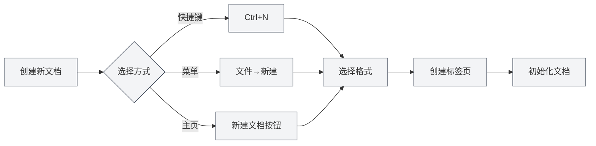
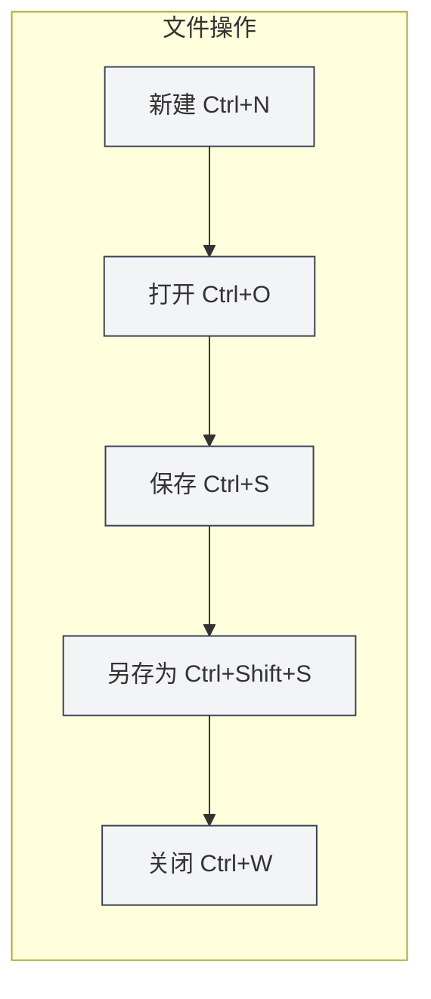

# 文件操作

## 概述

文件操作是MetaDoc的基础功能，包括创建、打开、保存、关闭文档等操作。掌握这些操作能让您更高效地管理文档。

## 新建文档

### 创建空白文档

有多种方式可以创建新文档：

1. **快捷键方式**：按 `Ctrl+N` 快速创建新文档
2. **菜单方式**：点击顶部菜单栏的"文件" → "新建"
3. **主页方式**：在主页点击"新建文档"按钮

创建新文档时，系统会：
- 自动创建一个新的标签页
- 根据您选择的格式（Markdown/LaTeX/纯文本）初始化文档
- 将文档标记为"未命名文档"，直到您首次保存

### 选择文档格式

创建文档时，您可以选择以下格式：

- **Markdown (.md)**：适合日常笔记、博客、技术文档
- **LaTeX (.tex)**：适合学术论文、科技文档
- **纯文本 (.txt)**：适合代码、配置文件等

## 打开文档

### 打开已有文件

1. **快捷键方式**：按 `Ctrl+O` 打开文件选择对话框
2. **菜单方式**：点击"文件" → "打开"
3. **主页方式**：在主页点击"打开文件"按钮

### 支持的文件格式

MetaDoc支持打开以下格式的文件：

- `.md` - Markdown文档
- `.tex` - LaTeX文档
- `.txt` - 纯文本文件
- `.json` - JSON格式文件

### 最近文件列表

主页会显示最近打开的文档列表，方便您快速访问：

- 点击最近文档卡片即可快速打开
- 右键点击可以删除最近文档记录
- 最多显示12个最近文档

### 文件关联

MetaDoc支持文件关联功能：

- 双击系统中的 `.md` 或 `.tex` 文件，会自动使用MetaDoc打开
- 如果文件已在其他窗口中打开，会提示您文件已在其他窗口打开

## 保存文档

### 保存当前文档

- **快捷键**：`Ctrl+S`
- **菜单**：点击"文件" → "保存"

如果文档尚未保存过，会弹出"另存为"对话框让您选择保存位置。

### 另存为

将当前文档保存为新文件：

- **快捷键**：`Ctrl+Shift+S`
- **菜单**：点击"文件" → "另存为"

另存为功能允许您：
- 更改文件名
- 更改保存位置
- 更改文件格式（如果支持）

### 保存全部文档

一次性保存所有打开的文档：

- **快捷键**：`Ctrl+K S`（先按 `Ctrl+K`，然后按 `S`）
- **菜单**：点击"文件" → "保存全部"

### 自动保存

MetaDoc支持自动保存功能，可在[[settings.basic|基础设置]]中配置：

- **关闭**：不自动保存
- **1分钟/5分钟/10分钟/30分钟/1小时**：按设定时间间隔自动保存

自动保存功能可以防止意外丢失文档内容。

## 关闭文件

### 关闭当前标签页

- **快捷键**：`Ctrl+W`
- **点击标签页关闭按钮**：点击标签页右侧的 × 按钮

### 关闭前提示

如果文档有未保存的更改，关闭时会提示您：

- **保存**：保存更改后关闭
- **不保存**：放弃更改直接关闭
- **取消**：取消关闭操作

### 重新打开已关闭的标签页

- **快捷键**：`Ctrl+Shift+T`

可以恢复最近关闭的标签页（最多恢复20个）。

## 多标签页管理

MetaDoc支持同时打开多个文档，每个文档在独立的标签页中显示：

- **切换标签页**：使用 `Ctrl+Tab` 切换到下一个标签页，`Ctrl+Shift+Tab` 切换到上一个
- **拖拽排序**：拖拽标签页可以重新排序
- **固定标签页**：右键标签页选择"固定"，固定后的标签页始终靠左显示且不可关闭

更多标签页操作详见[[core.multi-tab|多标签页管理]]。

## 文件状态指示

标签页会显示文档的状态：

- **未保存**：标签页标题旁显示圆点（●），表示有未保存的更改
- **已保存**：无特殊标记
- **只读**：显示锁定图标，表示文件为只读模式

## 注意事项

1. **文件路径**：保存文件时，确保有足够的磁盘空间和写入权限
2. **文件格式**：保存时注意选择合适的文件格式，避免格式不兼容
3. **备份**：重要文档建议定期备份，可以使用"另存为"功能创建副本
4. **文件冲突**：如果文件在外部被修改，MetaDoc会检测并提示您处理冲突

## 相关文档

- [[core.editor-basics|编辑器基础操作]]
- [[core.multi-tab|多标签页管理]]
- [[core.document-metadata|文档元信息]]
- [[core.export|导出功能]]
- [[settings.basic|基础设置]]
