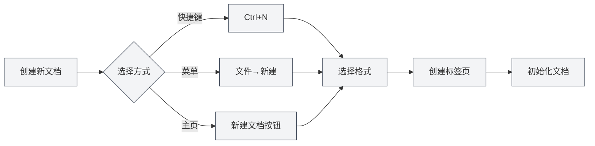
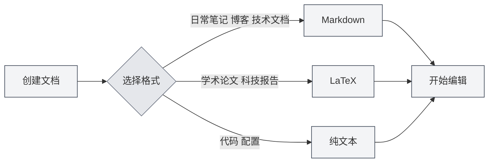
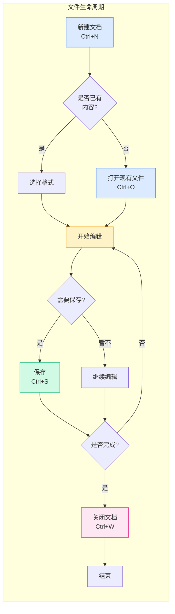

# 文件操作

## 概述

文件操作是MetaDoc的基础功能。无论您是在撰写技术文档、学术论文，还是记录日常笔记，熟练的文件操作都能让创作过程更加顺畅。本文将详细介绍如何创建、打开、保存和管理文档。

## 新建文档

### 创建空白文档

MetaDoc提供了多种便捷方式创建新文档，您可以根据当前操作习惯选择最适合的方法：

**方法一：快捷键（最快）**
- 按下 `Ctrl+N`，立即创建新文档
- 适合正在编辑时快速创建新文档

**方法二：文件菜单**
- 点击左侧菜单栏的"文件"图标
- 在展开的菜单中选择"新建"

**方法三：主页入口**
- 在主页点击"新建文档"按钮
- 适合刚打开应用时开始创作

下方展示了文件菜单的界面，包含新建、打开、保存等常用操作：

<MenuItemsDemo mode="demo" :items='[{"id": "file", "items": ["new", "open", "save", "save-as", "save-all", "close"]}]' />

**创建文档后的状态**：

创建新文档后，您会看到：
- 顶部出现一个新的标签页，标题显示为"未命名"
- 系统会询问您选择文档格式（Markdown、LaTeX或纯文本）
- 此时文档只在内存中，需要保存后才能保留到磁盘

### 选择文档格式

创建文档时，您需要选择文档格式。不同格式适用于不同场景：

**Markdown (.md)** —— 最常用的轻量级格式
- 适合：日常笔记、博客文章、技术文档、项目文档
- 优点：语法简单、易于阅读、导出格式丰富
- 示例使用场景：记录会议要点、写技术博客、整理学习笔记

**LaTeX (.tex)** —— 专业的学术排版格式
- 适合：学术论文、学位论文、科技报告、数学文档
- 优点：排版精美、公式支持完善、自动生成目录和引用
- 示例使用场景：撰写科研论文、编写数学教材、准备学术报告

**纯文本 (.txt)** —— 最简单的文本格式
- 适合：代码片段、配置文件、临时笔记
- 优点：通用性强、任何编辑器都能打开
- 示例使用场景：保存代码片段、记录临时信息

## 打开文档

### 打开已有文件

1. **快捷键方式**：按 `Ctrl+O` 打开文件选择对话框
2. **菜单方式**：点击"文件" → "打开"
3. **主页方式**：在主页点击"打开文件"按钮

### 支持的文件格式

MetaDoc支持打开以下格式的文件：

- `.md` - Markdown文档
- `.tex` - LaTeX文档
- `.txt` - 纯文本文件
- `.json` - JSON格式文件

### 最近文件列表

主页会显示最近打开的文档列表，方便您快速访问：

- 点击最近文档卡片即可快速打开
- 右键点击可以删除最近文档记录
- 最多显示12个最近文档

### 文件关联

MetaDoc支持文件关联功能：

- 双击系统中的 `.md` 或 `.tex` 文件，会自动使用MetaDoc打开
- 如果文件已在其他窗口中打开，会提示您文件已在其他窗口打开

## 保存文档

### 保存当前文档

养成经常保存的好习惯，可以避免因意外情况丢失工作成果。

**保存方式**：
- **快捷键**（推荐）：`Ctrl+S` —— 最常用的保存方式，一手不离键盘
- **菜单操作**：点击"文件"菜单 → "保存"

**首次保存**：
如果文档是新建的，第一次保存时会弹出"另存为"对话框，您需要：
1. 选择保存位置（如"文档"文件夹）
2. 输入文件名（如"项目计划.md"）
3. 点击"保存"按钮

**已保存文档的更新保存**：
如果文档之前已经保存过，按 `Ctrl+S` 会直接覆盖原文件，不会有对话框弹出。

### 另存为 —— 创建文档副本

当您需要保留原文档的同时创建一个新版本时，使用"另存为"功能。

**使用场景**：
- 修改文档前创建备份副本
- 将文档保存到不同位置
- 以不同文件名保存文档的不同版本

**操作方式**：
- **快捷键**：`Ctrl+Shift+S`
- **菜单**：点击"文件" → "另存为"

**示例**：
您正在编辑"报告v1.md"，想保存一个备份后再大幅修改：
1. 按 `Ctrl+Shift+S`
2. 输入新文件名"报告v1_备份.md"
3. 点击保存
4. 继续编辑原文档，安心修改

### 保存全部 —— 一键保存所有文档

当您同时打开了多个文档，可以使用"保存全部"功能一次性保存所有文档。

**操作方式**：
- **快捷键**：`Ctrl+K S`（先按 `Ctrl+K`，再按 `S`）
- **菜单**：点击"文件" → "保存全部"

**使用场景**：
- 工作结束时快速保存所有打开的文档
- 确保所有修改都被保存

### 自动保存 —— 让系统帮您保存

MetaDoc支持自动保存功能，可以在您专注于创作时自动保存文档。

**设置方法**：
进入 [[settings.basic|基础设置]]，找到"自动保存"选项，选择合适的时间间隔：
- **关闭**：手动控制保存时机
- **1分钟**：最保险，但会增加磁盘写入
- **5分钟**：平衡方案（推荐）
- **10分钟/30分钟/1小时**：适合长文档，减少保存频率

**工作原理**：
- 自动保存在后台静默进行，不会打断您的编辑
- 自动保存时，标签页上的"未保存"标记会消失
- 您可以随时手动保存（`Ctrl+S`），不受自动保存影响

**建议**：
- 对于重要文档，建议启用5分钟自动保存
- 即使启用了自动保存，在关键节点（如完成一个章节）仍建议手动保存

## 关闭文件

### 关闭当前标签页

- **快捷键**：`Ctrl+W`
- **点击标签页关闭按钮**：点击标签页右侧的 × 按钮

### 关闭前提示

如果文档有未保存的更改，关闭时会提示您：

- **保存**：保存更改后关闭
- **不保存**：放弃更改直接关闭
- **取消**：取消关闭操作

### 重新打开已关闭的标签页

- **快捷键**：`Ctrl+Shift+T`

可以恢复最近关闭的标签页（最多恢复20个）。

## 多标签页管理

MetaDoc支持同时打开多个文档，每个文档在独立的标签页中显示：

标签页栏显示所有打开的文档，支持切换、关闭、拖拽等操作：

<MainTabs mode="demo" />

- **切换标签页**：使用 `Ctrl+Tab` 切换到下一个标签页，`Ctrl+Shift+Tab` 切换到上一个
- **拖拽排序**：拖拽标签页可以重新排序
- **固定标签页**：右键标签页选择"固定"，固定后的标签页始终靠左显示且不可关闭

更多标签页操作详见[[core.multi-tab|多标签页管理]]。

## 文件状态指示

标签页会显示文档的状态：

- **未保存**：标签页标题旁显示圆点（●），表示有未保存的更改
- **已保存**：无特殊标记
- **只读**：显示锁定图标，表示文件为只读模式

## 注意事项

1. **文件路径**：保存文件时，确保有足够的磁盘空间和写入权限
2. **文件格式**：保存时注意选择合适的文件格式，避免格式不兼容
3. **备份**：重要文档建议定期备份，可以使用"另存为"功能创建副本
4. **文件冲突**：如果文件在外部被修改，MetaDoc会检测并提示您处理冲突

## 相关文档

- [[core.editor-basics|编辑器基础操作]]
- [[core.multi-tab|多标签页管理]]
- [[core.document-metadata|文档元信息]]
- [[core.export|导出功能]]
- [[settings.basic|基础设置]]
