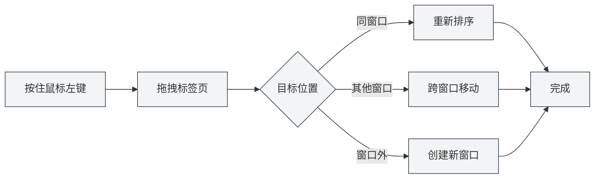

# 多标签页管理

## 概述

MetaDoc支持多标签页管理，允许您同时打开多个文档，每个文档在独立的标签页中显示。掌握标签页操作能显著提高您的工作效率。

标签页管理包括新建、切换、关闭、拖拽排序、固定等功能，让您能够灵活地组织和管理多个文档。

## 新建标签页

### 创建新标签页

有多种方式可以创建新标签页：

1. **快捷键**：按 `Ctrl+T` 快速创建新标签页
2. **点击按钮**：点击标签栏右侧的"+"按钮
3. **菜单**：点击"文件" → "新建"

新建的标签页会打开一个空白文档，您可以选择文档格式（Markdown/LaTeX/纯文本）。

### 从文件创建标签页

打开文件时会自动创建新标签页：

1. **快捷键**：按 `Ctrl+O` 打开文件选择对话框
2. **菜单**：点击"文件" → "打开"
3. **主页**：在主页点击"打开文件"按钮

打开的文件会在新标签页中显示。

## 切换标签页

### 快捷键切换

- **下一个标签页**：`Ctrl+Tab` 切换到下一个标签页
- **上一个标签页**：`Ctrl+Shift+Tab` 切换到上一个标签页

切换时会循环显示，到达最后一个标签页后会自动回到第一个。

### 鼠标切换

- **点击标签页**：直接点击标签页标题即可切换到该标签页
- **鼠标滚轮**：在标签栏上滚动鼠标滚轮可以切换标签页
  - **向下滚动**：切换到下一个标签页
  - **向上滚动**：切换到上一个标签页

### 标签页切换指示器

使用快捷键切换标签页时，会显示切换指示器，显示当前选中的标签页，方便您快速定位。

## 关闭标签页

### 关闭当前标签页

- **快捷键**：`Ctrl+W` 关闭当前激活的标签页
- **点击关闭按钮**：点击标签页右侧的 × 按钮
- **中键点击**：使用鼠标中键点击标签页即可关闭

### 关闭前提示

如果标签页中的文档有未保存的更改，关闭时会提示您：

- **保存**：保存更改后关闭标签页
- **不保存**：放弃更改直接关闭标签页
- **取消**：取消关闭操作，继续编辑

### 重新打开已关闭的标签页

- **快捷键**：`Ctrl+Shift+T` 重新打开最近关闭的标签页

系统会保存最近关闭的20个标签页，您可以按关闭的相反顺序依次恢复。

## 标签页拖拽

### 重新排序

您可以拖拽标签页来改变它们的顺序：

1. **按住鼠标左键**：在标签页标题上按住鼠标左键
2. **拖拽**：拖动标签页到目标位置
3. **释放**：释放鼠标左键完成排序

拖拽时会有视觉反馈，显示标签页的目标位置。

### 跨窗口拖拽

标签页可以拖拽到其他窗口：

1. **拖拽标签页**：按住鼠标左键拖拽标签页
2. **移动到其他窗口**：将标签页拖拽到另一个MetaDoc窗口
3. **释放**：在目标窗口中释放鼠标，标签页会移动到该窗口

跨窗口拖拽让您可以在多个窗口间灵活组织文档。

### 创建新窗口

拖拽标签页到窗口外部可以创建新窗口：

1. **拖拽标签页**：按住鼠标左键拖拽标签页
2. **移动到窗口外**：将标签页拖拽到当前窗口外部
3. **释放**：释放鼠标，系统会创建新窗口并打开该标签页

## 标签页固定

### 固定标签页

固定标签页会始终显示在标签栏最左侧，且不可关闭：

- **双击标签页**：双击标签页标题可以固定该标签页
- **右键菜单**：右键点击标签页，选择"固定"

固定后的标签页：
- 显示在标签栏最左侧
- 显示锁定图标
- 无法通过常规方式关闭
- 无法拖拽移动位置

### 取消固定

- **右键菜单**：右键点击固定的标签页，选择"取消固定"

取消固定后，标签页恢复正常的可关闭和可拖拽状态。

## 标签页状态

### 未保存状态

标签页会显示文档的保存状态：

- **未保存**：标签页标题旁显示圆点（●），表示有未保存的更改
- **已保存**：无特殊标记

### 只读状态

如果文档是只读的，标签页会显示锁定图标：

- **只读文档**：显示锁定图标，表示文档不可编辑
- **可编辑文档**：无特殊标记

### 预览状态

预览状态的标签页：

- **预览模式**：单机打开的文件会以预览模式显示
- **双击激活**：双击预览标签页可以将其激活为正式标签页
- **自动激活**：编辑或切换视图后自动激活

## 标签页右键菜单

右键点击标签页会显示上下文菜单，提供以下操作：

- **关闭**：关闭当前标签页
- **关闭其他**：关闭除当前标签页外的所有标签页
- **关闭右侧**：关闭当前标签页右侧的所有标签页
- **固定/取消固定**：固定或取消固定标签页
- **移动到新窗口**：将标签页移动到新窗口
- **复制路径**：复制文档路径到剪贴板

## 标签页数量限制

MetaDoc对同时打开的标签页数量没有严格限制，但建议：

- **合理数量**：同时打开10-20个标签页比较合理
- **性能影响**：打开过多标签页可能会影响应用性能
- **内存占用**：每个标签页都会占用一定的内存

如果标签页过多，建议关闭不需要的标签页。

## 快捷键参考

### 标签页操作快捷键

| 操作 | Windows/Linux | macOS |
|------|---------------|-------|
| 新建标签页 | `Ctrl+T` | `Cmd+T` |
| 关闭标签页 | `Ctrl+W` | `Cmd+W` |
| 切换到下一个 | `Ctrl+Tab` | `Cmd+Tab` |
| 切换到上一个 | `Ctrl+Shift+Tab` | `Cmd+Shift+Tab` |
| 重新打开已关闭 | `Ctrl+Shift+T` | `Cmd+Shift+T` |

### 鼠标操作

| 操作 | 方法 |
|------|------|
| 切换标签页 | 点击标签页标题 |
| 关闭标签页 | 点击 × 按钮或中键点击 |
| 固定标签页 | 双击标签页标题 |
| 拖拽排序 | 按住左键拖拽 |
| 滚轮切换 | 在标签栏上滚动鼠标滚轮 |

## 使用技巧

### 组织标签页

1. **固定常用文档**：将经常使用的文档固定，方便快速访问
2. **按项目分组**：将相关文档放在一起，使用拖拽排序组织
3. **使用多窗口**：将不同项目的文档放在不同窗口中

### 快速切换

1. **使用快捷键**：熟练使用 `Ctrl+Tab` 快速切换标签页
2. **使用滚轮**：在标签栏上滚动鼠标滚轮快速浏览
3. **使用切换指示器**：使用快捷键时会显示切换指示器，方便定位

### 批量操作

1. **关闭多个标签页**：使用右键菜单的"关闭其他"或"关闭右侧"功能
2. **保存所有标签页**：使用 `Ctrl+K S` 保存所有打开的文档
3. **重新打开**：使用 `Ctrl+Shift+T` 快速恢复关闭的标签页

## 常见问题

### Q: 如何快速找到特定标签页？

A: 使用 `Ctrl+Tab` 快捷键，会显示切换指示器，显示所有标签页，您可以继续按Tab键选择，或直接点击。

### Q: 标签页太多怎么办？

A: 可以固定常用标签页，关闭不需要的标签页，或使用多窗口将文档分组。

### Q: 如何恢复误关闭的标签页？

A: 使用 `Ctrl+Shift+T` 快捷键可以重新打开最近关闭的标签页。

### Q: 固定标签页可以关闭吗？

A: 固定标签页无法通过常规方式关闭，需要先取消固定。右键点击固定标签页，选择"取消固定"。

### Q: 可以跨窗口拖拽标签页吗？

A: 可以。拖拽标签页到其他MetaDoc窗口即可将标签页移动到该窗口。

## 相关文档

- [[core.file-operations|文件操作]]
- [[core.multi-window|多窗口管理]]
- [[core.editor-basics|编辑器基础操作]]
