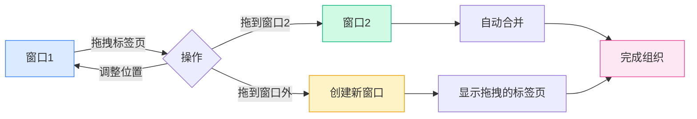

# 多窗口管理

## 概述

MetaDoc支持多窗口管理，允许您在不同的窗口中打开不同的文档。通过多窗口管理，您可以同时查看和编辑多个文档，提高工作效率。

## 多窗口支持

### 窗口类型

MetaDoc支持两种类型的窗口：

- **主窗口**：承载文档编辑、主页等主要功能，支持多标签页管理
- **辅助窗口**：设置、AI聊天、OCR等工具窗口，单实例窗口

### 窗口特点

主窗口的特点：

- **多标签页**：每个窗口有独立的标签页列表
- **独立状态**：每个窗口有独立的文档状态
- **拖拽支持**：支持标签页拖拽拆分和合并
- **窗口池**：预创建空闲窗口，实现快速显示

## 创建新窗口

### 拖拽创建

通过拖拽标签页可以创建新窗口：

1. **拖拽标签页**：将标签页拖出窗口边界
2. **创建窗口**：系统会自动创建新窗口
3. **显示内容**：新窗口会显示拖拽的标签页内容

标签页栏支持拖拽操作，可以将标签页拖出窗口创建新窗口：

<MainTabs mode="demo" />

**注意事项**：

- 单标签页窗口不能通过拖拽创建新窗口
- 拖拽时会自动从窗口池获取预加载窗口，实现快速显示

### 右键菜单创建

可以通过右键菜单创建新窗口：

1. **右键标签页**：右键点击要移动的标签页
2. **选择选项**：选择"在新窗口中打开"
3. **创建窗口**：系统会创建新窗口并移动标签页

### 窗口池机制

MetaDoc使用窗口池机制优化窗口创建：

- **预加载窗口**：系统预创建2个空闲窗口
- **快速显示**：使用预加载窗口可以瞬间显示（<100ms）
- **自动补充**：使用后自动补充新窗口到池中

## 窗口间标签页拖拽

### 拖拽合并

可以将标签页从一个窗口拖拽到另一个窗口，实现灵活的窗口组织：

**操作步骤**：

1. **拖拽标签页**：在源窗口中拖拽标签页
2. **拖到目标窗口**：将标签页拖到目标窗口的标签栏
3. **自动合并**：标签页会自动添加到目标窗口

### 拖拽位置

拖拽时可以指定插入位置：

- **自动定位**：根据鼠标位置自动确定插入位置
- **指定位置**：可以拖拽到特定位置插入
- **末尾插入**：拖拽到末尾会在末尾插入

### 单标签页窗口合并

如果源窗口只有一个标签页：

- **自动合并**：拖拽到其他窗口时会自动合并
- **窗口关闭**：合并后源窗口会自动关闭
- **避免空窗口**：防止出现空的窗口

## 窗口管理

### 窗口切换

可以使用系统快捷键切换窗口：

- **Alt+Tab**（Windows/Linux）：切换窗口
- **Cmd+Tab**（macOS）：切换窗口

### 窗口状态

每个窗口有独立的状态：

- **标签页列表**：每个窗口有独立的标签页列表
- **文档状态**：每个窗口有独立的文档状态
- **视图状态**：每个窗口有独立的视图状态

### 窗口关闭

关闭窗口的方式：

- **关闭按钮**：点击窗口的关闭按钮
- **快捷键**：使用系统快捷键关闭窗口
- **菜单选项**：通过菜单关闭窗口

**注意事项**：

- 关闭窗口前会提示保存未保存的文档
- 辅助窗口关闭时会隐藏而非真正关闭

## 窗口同步

### 状态同步

某些状态会在窗口间同步：

- **语言设置**：语言切换会同步到所有窗口
- **主题设置**：主题切换会同步到所有窗口
- **系统设置**：系统设置会同步到所有窗口

### 文件关联

文件关联功能：

- **防止重复**：同一文件不会在多个窗口中同时打开
- **窗口定位**：如果文件已在其他窗口打开，会提示并定位到该窗口
- **文件锁定**：文件转移时会临时锁定，防止冲突

## 最佳实践

1. **合理分屏**：使用多窗口实现分屏编辑，提高效率
2. **窗口组织**：将相关文档放在同一窗口，无关文档分开
3. **标签页管理**：合理使用标签页拖拽，组织窗口布局
4. **窗口切换**：熟练使用Alt+Tab快速切换窗口
5. **状态保存**：关闭窗口前确保重要文档已保存

## 注意事项

1. **窗口数量**：过多窗口可能影响性能，建议合理控制
2. **文件锁定**：文件转移时会临时锁定，避免冲突
3. **状态独立**：每个窗口的状态独立，不会相互影响
4. **窗口池**：窗口池机制会自动管理，无需手动干预
5. **辅助窗口**：辅助窗口是单实例的，关闭时会隐藏

## 相关文档

- [[core.multi-tab|多标签页管理]]
- [[core.file-operations|文件操作]]

<ViewMenuItemsDemo mode="demo" :items='["home", "outline"]' />

<ViewMenuItemsDemo mode="demo" :items='["chat", "agent"]' />

<MenuItemsDemo mode="demo" :items='[{"id": "file"}]' />

<MenuItemsDemo mode="demo" :items='[{"id": "edit"}]' />

<MenuItemsDemo mode="demo" :items='[{"id": "view"}]' />

<LeftMenu mode="demo" />
