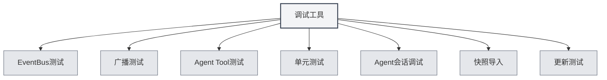

# 调试工具

## 概述

调试工具是MetaDoc提供的开发环境功能，用于测试和调试应用功能。这些工具仅在开发环境中可用，帮助开发者快速测试和调试代码。

<SettingDebugSection mode="demo" />

## 调试工具介绍

### 访问调试工具

调试工具仅在开发环境中可用：

1. **开发环境**：确保在开发环境中运行
2. **设置页面**：打开设置页面
3. **调试工具**：在设置页面中找到"调试工具"选项
4. **打开工具**：点击打开调试工具界面

您可以通过顶部菜单栏访问调试工具（仅在开发环境）：

<MenuItemsDemo mode="demo" :items='[{"id": "settings"}]' />

### 工具类型

调试工具包含以下功能模块：

- **EventBus测试**：测试EventBus事件
- **广播测试**：测试广播事件
- **Agent Tool测试**：测试Agent工具
- **单元测试**：运行单元测试
- **Agent会话调试**：调试Agent会话
- **快照导入**：导入文档快照
- **更新测试**：测试更新功能

<SettingDebugSection mode="demo" />

## EventBus测试

### 发送事件

可以发送EventBus事件进行测试：

1. **事件名称**：输入要发送的事件名称
2. **事件数据**：可选，输入JSON格式的事件数据
3. **发送事件**：点击"发送事件"按钮
4. **查看结果**：查看事件发送结果

<ConsoleTerminal mode="demo" consoleKey="debug" :history='[]' />

### 事件监听

可以监听EventBus事件：

- **事件列表**：显示所有已发送的事件
- **事件详情**：查看事件的详细信息
- **事件数据**：查看事件的数据内容

## 广播测试

### 发送广播

可以发送广播事件进行测试：

1. **目标窗口**：选择广播目标（all/home/ai-chat等）
2. **事件名称**：输入要广播的事件名称
3. **事件数据**：可选，输入JSON格式的事件数据
4. **发送广播**：点击"发送广播"按钮
5. **查看结果**：查看广播发送结果

<ConsoleTerminal mode="demo" consoleKey="debug" :history='[]' />

### 广播监听

可以监听广播事件：

- **广播列表**：显示所有已发送的广播
- **广播详情**：查看广播的详细信息
- **目标窗口**：查看广播的目标窗口

## Agent Tool测试

### 测试工具

可以测试Agent工具：

1. **选择工具**：选择要测试的Agent工具
2. **输入参数**：输入工具的测试参数（JSON格式）
3. **选择上下文**：选择测试的上下文Tab ID
4. **执行测试**：点击"执行测试"按钮
5. **查看结果**：查看测试结果

### 测试历史

可以查看测试历史：

- **历史列表**：显示所有测试历史
- **测试结果**：查看每次测试的结果
- **错误信息**：查看测试的错误信息

## 单元测试

### 单个测试

可以运行单个单元测试：

1. **选择模块**：选择要测试的模块
2. **选择测试**：选择要运行的测试函数
3. **编辑参数**：编辑测试函数的参数
4. **执行测试**：点击"执行测试"按钮
5. **查看结果**：查看测试结果

<ConsoleTerminal mode="demo" consoleKey="debug" :history='[]' />

### 批量测试

可以批量运行单元测试：

1. **选择模块**：选择一个或多个模块
2. **选择上下文**：选择测试的上下文Tab ID
3. **开始测试**：点击"开始批量测试"按钮
4. **查看进度**：查看测试进度
5. **查看结果**：查看所有测试结果

### 测试结果

测试结果包含：

- **测试状态**：显示测试是否通过
- **测试输出**：显示测试的输出信息
- **错误信息**：显示测试的错误信息（如果有）
- **执行时间**：显示测试的执行时间

## Agent会话调试

### 会话调试

可以调试Agent会话：

1. **选择会话**：选择要调试的Agent会话
2. **查看消息**：查看会话的消息历史
3. **发送消息**：发送测试消息
4. **查看响应**：查看Agent的响应

<ConsoleTerminal mode="demo" consoleKey="debug" :history='[]' />

### 调试信息

可以查看调试信息：

- **会话状态**：显示会话的当前状态
- **工具调用**：查看工具调用历史
- **错误信息**：查看错误信息

## 快照导入

### 导入快照

可以导入文档快照：

1. **选择快照**：选择要导入的快照文件
2. **导入快照**：点击"导入快照"按钮
3. **查看结果**：查看导入结果

<ConsoleTerminal mode="demo" consoleKey="debug" :history='[]' />

### 快照格式

快照文件格式：

- **JSON格式**：快照文件为JSON格式
- **文档内容**：包含文档的完整内容
- **文档状态**：包含文档的状态信息

## 更新测试

### 测试更新

可以测试更新功能：

1. **选择更新通道**：选择更新通道（release/dev）
2. **检查更新**：点击"检查更新"按钮
3. **查看结果**：查看更新检查结果

<SettingDebugSection mode="demo" />

## 最佳实践

1. **开发环境**：仅在开发环境中使用调试工具
2. **测试隔离**：测试时使用独立的测试数据
3. **错误处理**：注意处理测试中的错误
4. **结果记录**：记录重要的测试结果
5. **工具使用**：合理使用调试工具，提高开发效率

## 注意事项

1. **开发环境**：调试工具仅在开发环境中可用
2. **数据安全**：测试时注意数据安全，避免影响生产数据
3. **性能影响**：某些测试可能影响应用性能
4. **错误处理**：测试中的错误需要正确处理
5. **工具限制**：某些工具可能有使用限制

## 相关文档

- [[agent.session|Agent会话管理]]
- [[agent.tools|工具集管理]]
- [[settings.basic|基础设置]]
