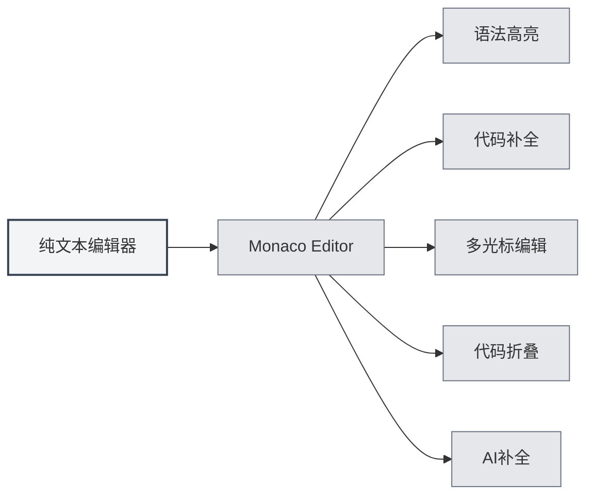
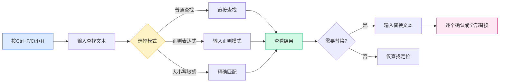

# 纯文本编辑器

## 概述

纯文本编辑器用于编辑纯文本文件和代码文件。MetaDoc的纯文本编辑器基于Monaco Editor，提供了专业的代码编辑体验，支持语法高亮、代码补全、AI补全等功能。

纯文本编辑器支持多种文件格式，包括代码文件（`.js`、`.py`、`.java`等）和配置文件（`.json`、`.yaml`、`.ini`等），根据文件扩展名自动识别语言并应用相应的语法高亮。

## Monaco编辑器功能

### 编辑器介绍

纯文本编辑器使用Monaco Editor，具有以下特点：

- **专业代码编辑**：提供类似Visual Studio Code的编辑体验
- **语法高亮**：根据文件类型自动应用语法高亮
- **代码补全**：支持智能代码补全
- **多光标编辑**：支持多光标同时编辑
- **代码折叠**：支持代码块折叠

### 支持的文件格式

纯文本编辑器支持以下文件格式：

**代码文件**：
- JavaScript/TypeScript: `.js`, `.jsx`, `.ts`, `.tsx`
- Python: `.py`
- Java: `.java`
- C/C++: `.c`, `.cpp`, `.h`, `.hpp`
- C#: `.cs`
- Go: `.go`
- Rust: `.rs`
- Swift: `.swift`
- Kotlin: `.kt`
- 其他: `.php`, `.rb`, `.scala`, `.dart`, `.lua`等

**配置文件**：
- JSON: `.json`
- YAML: `.yaml`, `.yml`
- XML: `.xml`
- TOML: `.toml`
- INI: `.ini`, `.conf`
- SQL: `.sql`

**脚本文件**：
- Shell: `.sh`, `.bash`, `.zsh`
- PowerShell: `.ps1`
- 其他: `.vim`, `.diff`, `.patch`, `.log`

### 自动语言识别

编辑器会根据文件扩展名自动识别语言：

- **文件扩展名**：根据文件扩展名选择对应的语言模式
- **语法高亮**：自动应用相应的语法高亮规则
- **代码补全**：启用对应语言的代码补全功能

如果文件没有扩展名或扩展名不被识别，编辑器会使用纯文本模式。

## 代码高亮

### 语法高亮

编辑器会根据文件类型自动应用语法高亮：

- **关键字高亮**：语言关键字使用不同颜色显示
- **字符串高亮**：字符串使用特定颜色显示
- **注释高亮**：注释使用灰色显示
- **函数高亮**：函数名使用特定颜色显示

语法高亮让代码结构更清晰，便于阅读和编辑。

### 主题同步

代码高亮主题会跟随编辑器主题：

- **浅色主题**：在浅色主题下使用浅色语法高亮
- **深色主题**：在深色主题下使用深色语法高亮
- **自动同步**：自动同步编辑器主题设置

## 行号显示

### 显示行号

行号显示在编辑器左侧，帮助您：

- **定位代码**：快速定位到特定行
- **引用代码**：方便在文档中引用特定代码行
- **调试代码**：快速定位错误位置

### 设置行号

行号显示可以在设置中配置：

1. 打开设置页面
2. 在"编辑器设置"部分找到"行号显示"
3. 切换开关启用或禁用行号

行号设置会影响所有Monaco编辑器（纯文本编辑器、LaTeX编辑器等）。

## 文件预览和统计信息

### 文件统计

编辑器会显示文件的统计信息：

- **字符数**：显示文件的总字符数
- **行数**：显示文件的总行数
- **单词数**：显示文件的总单词数（如果适用）

统计信息显示在状态栏或编辑器底部。

### 文件预览

打开文件时，编辑器会：

- **加载内容**：快速加载文件内容
- **应用高亮**：根据文件类型应用语法高亮
- **显示统计**：显示文件的统计信息

### 文件格式检测

编辑器会自动检测文件格式：

- **扩展名检测**：根据文件扩展名识别格式
- **内容检测**：如果扩展名不明确，尝试根据内容识别
- **手动选择**：可以手动选择文件格式

## AI补全功能

### AI自动补全

纯文本编辑器支持AI自动补全功能：

- **自动触发**：停止输入后自动触发补全
- **手动触发**：使用`Shift+Tab`手动触发补全
- **智能补全**：根据上下文生成补全建议

AI补全功能可以帮助您：

- **生成代码**：根据注释或上下文生成代码
- **补全函数**：补全函数定义或调用
- **生成注释**：生成代码注释

### 补全设置

AI补全的设置与Markdown编辑器相同：

- **启用/关闭**：可以在设置中启用或关闭
- **触发按键**：可以配置触发按键（Enter、Space、`;`、`,`）
- **补全模式**：可以选择完全生成或部分生成
- **最大Token数**：可以设置补全的最大Token数

详见[[ai.completion|AI自动补全]]。

## 编辑器功能

### 代码折叠

编辑器支持代码块折叠：

- **折叠代码块**：点击行号左侧的折叠图标
- **展开代码块**：点击折叠标记展开
- **快捷键**：`Ctrl+Shift+[`折叠，`Ctrl+Shift+]`展开

代码折叠让您能够专注于当前编辑的部分。

### 查找替换

编辑器支持强大的查找替换功能，帮助您在代码中快速定位和修改内容：

**基本操作**：
- **查找**：`Ctrl+F` 打开查找对话框，输入要查找的文本
- **替换**：`Ctrl+H` 打开查找替换对话框，输入查找内容和替换内容
- **逐个替换**：逐个确认后替换
- **全部替换**：一次性替换所有匹配项

**高级选项**：
- **正则表达式**：使用正则表达式进行复杂模式匹配
- **大小写匹配**：区分大小写查找
- **全字匹配**：只匹配完整的单词

**使用场景**：
- 批量修改变量名
- 查找特定函数调用
- 替换代码中的字符串
- 使用正则表达式进行复杂替换

查找替换面板界面如下：

<SearchReplaceMenu mode="demo" :position='{"top": 100, "left": 200}' :adapter='null' />

### 多光标编辑

编辑器支持多光标同时编辑：

- **添加光标**：`Alt+点击`在点击位置添加新光标
- **添加上方光标**：`Ctrl+Alt+↑`在上方添加光标
- **添加下方光标**：`Ctrl+Alt+↓`在下方添加光标
- **选中相同单词**：`Ctrl+D`选中下一个相同的单词

多光标编辑可以同时修改多个位置，提高编辑效率。

## 使用技巧

### 高效编辑

1. **使用快捷键**：熟练掌握常用快捷键，提高编辑效率
2. **使用代码折叠**：折叠不需要查看的代码块
3. **使用多光标**：使用多光标同时编辑多个位置

### 代码补全

1. **启用AI补全**：启用AI补全功能获得智能补全建议
2. **使用手动触发**：需要时使用`Shift+Tab`手动触发补全
3. **调整设置**：根据需求调整补全设置

### 文件管理

1. **识别格式**：确保文件扩展名正确，以便自动识别格式
2. **查看统计**：查看文件统计信息了解文件大小
3. **保存文件**：及时保存文件，避免丢失更改

## 常见问题

### Q: 语法高亮不正确？

A: 检查文件扩展名是否正确。如果扩展名不正确，编辑器可能无法识别文件类型。可以手动选择文件格式。

### Q: 代码补全不显示？

A: 确保AI补全功能已启用。某些文件类型可能不支持代码补全。

### Q: 如何切换文件格式？

A: 文件格式根据文件扩展名自动识别。如果需要更改，可以重命名文件或手动选择格式。

### Q: 行号不显示？

A: 检查设置中的"行号显示"选项是否启用。行号设置会影响所有Monaco编辑器。

### Q: 文件太大无法编辑？

A: 对于非常大的文件，编辑器可能会限制某些功能。建议使用专门的文本编辑器处理超大文件。

## 相关文档

- [[core.editor-basics|编辑器基础操作]]
- [[core.editor-settings|编辑器设置]]
- [[latex.editor|LaTeX编辑器使用指南]]
- [[ai.completion|AI自动补全]]
