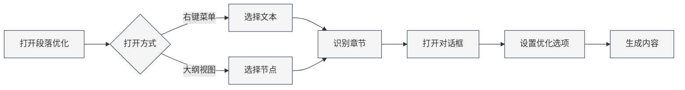

# 段落优化功能

## 概述

段落优化功能允许您使用AI优化文档中的特定段落或章节。您可以从右键菜单或大纲视图中打开段落优化功能，生成或优化段落内容。

## 打开段落优化

### 从右键菜单打开

在编辑器中可以右键打开段落优化：

1. **选择文本**：在编辑器中选中要优化的文本
2. **右键菜单**：右键点击选中的文本
3. **选择优化**：在右键菜单中选择"段落优化"或类似选项
4. **打开对话框**：段落优化对话框会打开

### 从大纲打开

在大纲视图中可以打开段落优化：

1. **选择节点**：在大纲树中选择要优化的节点
2. **右键菜单**：右键点击节点
3. **选择优化**：在右键菜单中选择"段落优化"或类似选项
4. **打开对话框**：段落优化对话框会打开

您可以通过侧边栏访问大纲视图：

<ViewMenuItemsDemo mode="demo" :items='["outline"]' />

<ViewMenuItemsDemo mode="demo" :items='["chat"]' />

<AIChat mode="demo" />

段落优化器界面如下：

<SectionOptimizer mode="demo" title="示例章节" :position='{"top": 100, "left": 200}' path="1" :tree='{"text": "示例章节", "children": []}' language="markdown" :adapter='null' />

### 自动识别章节

段落优化会自动识别当前章节：

- **光标位置**：根据光标位置识别当前章节
- **选中文本**：如果选中了文本，使用选中的文本
- **大纲节点**：如果从大纲打开，使用对应的大纲节点

## 优化选项

### 优化模式

可以选择不同的优化模式：

- **生成内容**：生成新的段落内容
- **优化内容**：优化现有段落内容
- **追加内容**：在现有内容后追加新内容
- **替换内容**：替换现有段落内容

### 上下文模式

可以选择上下文模式：

- **全文上下文**：使用整个文档作为上下文
- **章节上下文**：只使用当前章节作为上下文
- **无上下文**：不使用上下文信息

### 自定义提示

可以输入自定义提示：

- **优化目标**：描述优化目标
- **内容要求**：说明内容要求
- **风格要求**：指定写作风格

### 预设提示

可以使用预设提示：

- **扩展内容**：扩展段落内容
- **精简内容**：精简段落内容
- **改写内容**：改写段落内容
- **补充内容**：补充段落内容

## 生成内容

### 生成过程

生成内容的过程：

1. **分析章节**：分析当前章节的结构和内容
2. **构建提示**：根据选项构建优化提示
3. **调用AI**：调用AI生成优化内容
4. **显示结果**：在对话框中显示生成的内容

### 生成结果

生成的内容会显示在对话框中：

- **预览内容**：可以预览生成的内容
- **编辑内容**：可以编辑生成的内容
- **应用内容**：可以将内容应用到文档

### 生成选项

生成时可以设置选项：

- **流式输出**：实时显示生成过程
- **一次性生成**：等待生成完成后显示
- **取消生成**：可以随时取消生成过程

## 应用内容

### 应用方式

可以将生成的内容应用到文档：

- **替换**：替换原有段落内容
- **插入**：在指定位置插入内容
- **追加**：在段落末尾追加内容

### 应用位置

可以指定应用位置：

- **当前位置**：在当前光标位置应用
- **章节位置**：在章节开始位置应用
- **章节末尾**：在章节末尾应用

## 对话功能

### 继续对话

生成内容后可以继续对话：

1. **打开对话**：点击"继续对话"按钮
2. **进入对话**：进入AI对话界面
3. **继续优化**：可以继续优化或修改内容

### 对话上下文

对话会包含以下上下文：

- **原始内容**：原始段落内容
- **生成内容**：生成的内容
- **优化历史**：优化历史记录

## 最佳实践

1. **明确目标**：明确优化目标，使用清晰的提示
2. **选择上下文**：根据情况选择合适的上下文模式
3. **预览内容**：生成后预览内容，确保符合要求
4. **编辑调整**：生成后可以进一步编辑调整
5. **多次优化**：可以多次优化，逐步完善内容

## 注意事项

1. **章节识别**：确保正确识别章节，避免优化错误的内容
2. **上下文使用**：合理使用上下文，避免内容过长
3. **内容质量**：生成的内容需要人工审核和调整
4. **Token消耗**：优化功能会消耗Token，注意使用量
5. **保存文档**：应用内容后记得保存文档

## 相关文档

- [[outline.basics|大纲视图功能]]
- [[ai.chat|AI对话功能]]
- [[ai.completion|AI自动补全]]

<Outline mode="demo" />

<CompletionSettingsPanel mode="demo" />

<MenuItemsDemo mode="demo" :items='[{"id": "ai"}]' />

<ViewMenuItemsDemo mode="demo" :items='["chat"]' />
