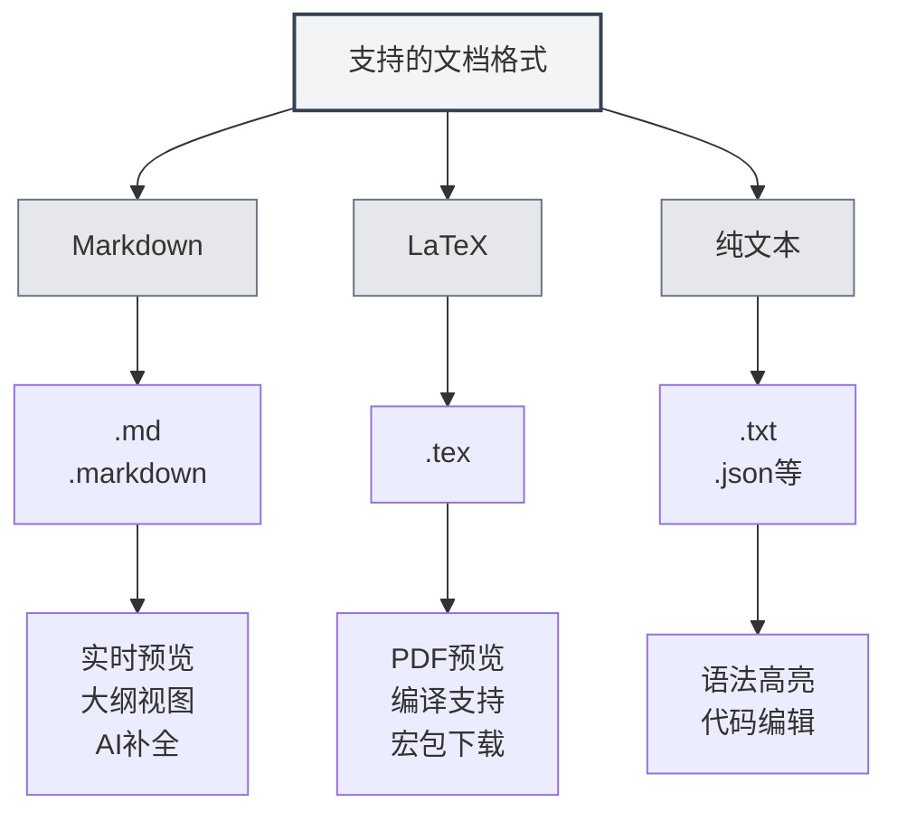

# 支持的文档格式

## 概述

MetaDoc支持多种文档格式，包括Markdown、LaTeX和纯文本格式。系统会自动检测文件格式，也支持手动选择格式。

<MenuItemsDemo mode="demo" :items='[{"id": "file"}]' />

<MenuItemsDemo mode="demo" :items='[{"id": "edit"}]' />

<MenuItemsDemo mode="demo" :items='[{"id": "view"}]' />

<ViewMenuItemsDemo mode="demo" :items='["home", "outline", "chat"]' />

<MainTabs mode="demo" />

<QuickStartPanel mode="demo" />

<QuickStartMarkdown mode="demo" />

<QuickStartLatex mode="demo" />

## 支持的格式

### Markdown格式

**文件扩展名**：`.md`、`.markdown`

**特点**：

- 支持标准Markdown语法
- 支持扩展语法（表格、代码块、数学公式等）
- 支持实时预览
- 支持大纲视图
- 支持AI补全

**使用场景**：

- 技术文档编写
- 博客文章创作
- 笔记记录
- 文档编写

### LaTeX格式

**文件扩展名**：`.tex`

**特点**：

- 专业的学术论文编写格式
- 支持数学公式、表格、图表
- 实时PDF预览
- 支持宏包自动下载
- 支持编译错误提示

**使用场景**：

- 学术论文编写
- 技术报告编写
- 书籍排版
- 复杂文档排版

### 纯文本格式

**文件扩展名**：`.txt`、`.json`等

**特点**：

- 简单的文本编辑
- 语法高亮支持
- 代码编辑功能
- 不支持预览和大纲

**使用场景**：

- 代码文件编辑
- 配置文件编辑
- 简单文本编辑
- 数据文件编辑

## 文件格式检测

### 自动检测

MetaDoc会自动检测文件格式：

1. **扩展名检测**：优先根据文件扩展名检测格式
   - `.md`、`.markdown` → Markdown格式
   - `.tex` → LaTeX格式
   - `.txt`、`.json`等 → 纯文本格式

2. **内容检测**：如果扩展名无法确定格式，会检测文件内容
   - LaTeX内容优先识别为LaTeX格式
   - 其他内容默认识别为Markdown格式

3. **默认格式**：如果无法检测，默认使用Markdown格式

### 检测优先级

格式检测遵循以下优先级：

1. **文件扩展名**：优先使用扩展名检测
2. **文件内容**：如果扩展名无法确定，检测内容
3. **默认格式**：无法检测时使用默认格式

### 检测规则

- **Markdown检测**：扩展名为`.md`或`.markdown`时识别为Markdown
- **LaTeX检测**：扩展名为`.tex`或内容包含LaTeX命令时识别为LaTeX
- **纯文本检测**：其他扩展名或无法确定时识别为纯文本

## 手动选择格式

### 打开文件时选择

打开文件时可以手动选择格式：

1. **打开文件对话框**：在打开文件对话框中
2. **格式选择**：选择文件格式（如果自动检测不正确）
3. **确认打开**：确认后以选择的格式打开

### 新建文件时选择

新建文件时可以选择格式：

1. **新建文档**：点击"新建文档"按钮
2. **选择格式**：在格式选择对话框中选择格式
3. **创建文档**：创建指定格式的文档

### 切换格式

可以切换已打开文档的格式：

1. **打开文档**：打开要切换格式的文档
2. **格式菜单**：在菜单中找到格式切换选项
3. **选择格式**：选择新的格式
4. **确认切换**：确认切换格式

**注意事项**：

- 切换格式可能会影响文档内容
- 某些格式特性可能无法转换
- 切换前建议备份文档

## 格式特性对比

### 功能支持

| 功能       | Markdown | LaTeX    | 纯文本 |
| ---------- | -------- | -------- | ------ |
| 实时预览   | ✅       | ✅ (PDF) | ❌     |
| 大纲视图   | ✅       | ✅       | ❌     |
| AI补全     | ✅       | ✅       | ✅     |
| 数学公式   | ✅       | ✅       | ❌     |
| 表格支持   | ✅       | ✅       | ❌     |
| 代码高亮   | ✅       | ✅       | ✅     |
| 元信息支持 | ✅       | ✅       | ❌     |

### 编辑器特性

| 特性       | Markdown | LaTeX | 纯文本 |
| ---------- | -------- | ----- | ------ |
| 语法高亮   | ✅       | ✅    | ✅     |
| 自动补全   | ✅       | ✅    | ✅     |
| 错误提示   | ✅       | ✅    | ❌     |
| 折叠功能   | ✅       | ✅    | ✅     |
| 多光标编辑 | ✅       | ✅    | ✅     |

## 格式转换

### 导出格式

可以将文档导出为其他格式：

- **Markdown → PDF**：导出为PDF文档
- **Markdown → HTML**：导出为HTML文档
- **Markdown → DOCX**：导出为Word文档
- **LaTeX → PDF**：编译为PDF文档
- **LaTeX → Markdown**：转换为Markdown格式

### 转换注意事项

格式转换时需要注意：

- **内容兼容性**：某些格式特性可能无法转换
- **样式丢失**：转换后可能丢失部分样式
- **内容调整**：转换后可能需要手动调整内容

## 最佳实践

1. **选择合适的格式**：根据文档类型选择合适的格式
2. **使用标准扩展名**：使用标准的文件扩展名，方便自动检测
3. **格式一致性**：同一项目使用统一的格式
4. **备份文档**：格式转换前备份原始文档
5. **测试转换**：转换后检查内容是否正确

## 注意事项

1. **格式检测**：自动检测可能不准确，可以手动选择
2. **格式切换**：切换格式可能影响文档内容
3. **兼容性**：不同格式的功能支持不同
4. **文件扩展名**：建议使用标准扩展名
5. **格式转换**：转换时可能丢失部分内容或样式

## 相关文档

- [[markdown.basics|Markdown语法]]
- [[latex.basics|LaTeX语法]]
- [[editor.plain-text|纯文本编辑器]]
- [[core.file-operations|文件操作]]
