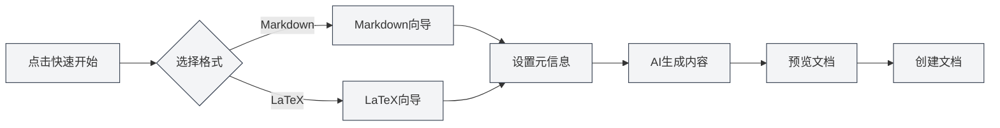

# 主页功能

## 概述

主页是MetaDoc的入口界面，提供快速开始、新建文档、打开文件等功能。主页设计简洁美观，帮助您快速开始使用MetaDoc。

## 快速开始

### 快速开始向导

点击"快速开始"按钮可以启动快速开始向导：

1. **选择格式**：选择文档格式（Markdown或LaTeX）
2. **设置元信息**：输入文档标题、作者等信息
3. **AI生成内容**：使用AI辅助生成文档内容
4. **预览文档**：预览生成的文档内容
5. **创建文档**：确认后创建文档

快速开始向导的格式选择界面如下：

<QuickStartPanel mode="demo" />

### Markdown快速开始

选择Markdown格式后：

- **模板选择**：可以选择Markdown模板
- **内容生成**：AI可以生成Markdown内容
- **快速编辑**：创建后立即开始编辑

选择Markdown后进入的向导界面：

<QuickStartMarkdown mode="demo" />

### LaTeX快速开始

选择LaTeX格式后：

- **文档类型**：可以选择文档类型（article、book等）
- **内容生成**：AI可以生成LaTeX内容
- **编译预览**：创建后可以编译预览PDF

选择LaTeX后进入的向导界面：

<QuickStartLatex mode="demo" />

## 新建文档

### 创建空白文档

点击"新建文档"按钮可以快速创建空白文档：

1. 点击"新建文档"按钮
2. 选择文档格式（Markdown/LaTeX/纯文本）
3. 文档会在新标签页中打开

**快捷键**：也可以使用 `Ctrl+N`（Windows/Linux）或 `Cmd+N`（macOS）快速创建。

## 打开文件

### 打开已有文件

点击"打开文件"按钮可以打开已有文件：

1. 点击"打开文件"按钮
2. 在文件选择对话框中选择文件
3. 文件会在新标签页中打开

**快捷键**：也可以使用 `Ctrl+O`（Windows/Linux）或 `Cmd+O`（macOS）快速打开。

### 支持的文件格式

- **Markdown** (.md)
- **LaTeX** (.tex)
- **纯文本** (.txt)
- **JSON** (.json)

## 用户手册

### 打开用户手册

点击"用户手册"按钮可以打开用户手册：

1. 点击"用户手册"按钮
2. 用户手册会在新标签页中打开
3. 可以浏览和学习各种功能

**快捷键**：也可以按 `F1` 键快速打开用户手册。

## 最近文档列表

### 查看最近文档

主页会显示最近打开的文档列表：

- **显示数量**：最多显示12个最近文档
- **文档卡片**：每个文档显示为一个卡片
- **快速打开**：点击卡片即可快速打开文档

### 最近文档操作

- **打开文档**：点击文档卡片打开文档
- **删除记录**：点击卡片上的删除按钮删除记录
- **右键菜单**：右键点击卡片可能有更多选项

### 最近文档管理

- **自动更新**：打开文档后会自动更新列表
- **记录保存**：最近文档记录会保存
- **列表排序**：按打开时间倒序排列

## 用户资料对话框

### 打开用户资料

主页可能会显示用户资料对话框：

- **首次使用**：首次使用时可能提示设置用户资料
- **资料设置**：可以设置用户画像和使用偏好
- **AI优化**：用户资料可以帮助AI更好地理解您的需求

### 用户资料内容

用户资料可能包括：

- **基本信息**：姓名、职业等
- **使用偏好**：编辑习惯、常用功能等
- **用户画像**：帮助AI理解您的使用场景

## 主页界面

### 界面布局

主页采用居中布局：

- **顶部**：MetaDoc标题和副标题
- **中间**：操作按钮区域
- **底部**：最近文档列表

### 视觉设计

主页采用简洁现代的设计：

- **动态背景**：动态背景动画效果
- **网格装饰**：极简网格装饰
- **卡片设计**：操作按钮采用卡片设计

## 最佳实践

1. **快速开始**：首次使用建议使用快速开始向导
2. **快捷键**：熟练使用快捷键提高效率
3. **最近文档**：利用最近文档列表快速访问常用文档
4. **用户资料**：设置用户资料以获得更好的AI体验
5. **用户手册**：遇到问题时查看用户手册

## 注意事项

1. **主页显示**：主页只在没有打开文档时显示
2. **快速开始**：快速开始向导可以随时关闭
3. **最近文档**：最近文档列表最多显示12个
4. **用户资料**：用户资料设置是可选的
5. **界面语言**：主页界面语言跟随系统语言设置

## 相关文档

- [[quick-start.guide|快速开始指南]]
- [[core.file-operations|文件操作]]
- [[user.profile|用户资料]]
- [[views.types|视图类型]]

<MenuItemsDemo mode="demo" :items='[{"id": "file"}]' />

<MenuItemsDemo mode="demo" :items='[{"id": "edit"}]' />

<MenuItemsDemo mode="demo" :items='[{"id": "view"}]' />

<ViewMenuItemsDemo mode="demo" :items='["home", "outline", "chat", "agent"]' />

<MainTabs mode="demo" />

<UserProfileView mode="demo" />
