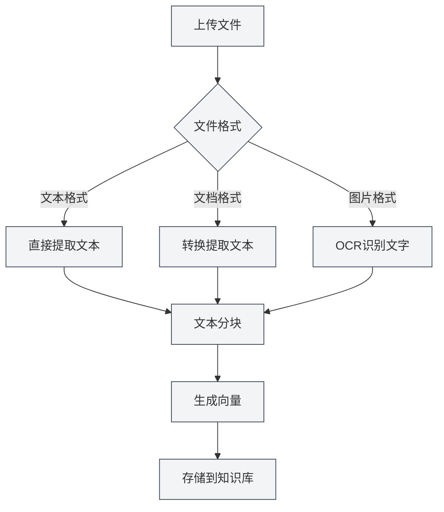

# 知识库配置

## 概述

知识库配置决定了如何将文档转换为向量嵌入，以及如何存储和检索这些向量。合理配置知识库可以提升检索效果和性能。

## Embedding模式

### 模式选择

MetaDoc支持两种Embedding模式：

- **外部API模式**：使用外部API服务生成向量嵌入
- **本地模型模式**：使用本地模型生成向量嵌入（当前暂不可用）

### 外部API模式

外部API模式使用SiliconFlow API服务生成向量嵌入：

**优点**：
- 无需本地计算资源
- 无需GPU支持
- 处理速度快
- 适合大多数用户

**缺点**：
- 需要网络连接
- 可能产生API调用费用
- 数据需要上传到外部服务

**适用场景**：
- 没有高性能GPU
- 需要快速处理文件
- 网络连接稳定

### 本地模型模式

本地模型模式使用本地安装的模型生成向量嵌入：

**优点**：
- 数据完全本地处理，保护隐私
- 无需网络连接
- 无API调用费用
- 可以离线使用

**缺点**：
- 需要GPU支持（推荐）
- 需要下载模型文件
- 处理速度可能较慢
- 占用本地存储空间

**适用场景**：
- 有高性能GPU
- 对数据隐私要求高
- 需要离线使用
- 文件处理量大

**注意事项**：当前版本中，本地模型模式暂不可用，未来版本会支持。

## Embedding模型选择

### 模型说明

不同的Embedding模型有不同的特点：

- **向量维度**：影响向量的表达能力
- **语言支持**：某些模型对中文支持更好
- **性能**：影响生成速度和检索效果

### 默认模型

MetaDoc默认使用 `netease-youdao/bce-embedding-base_v1` 模型：

- **向量维度**：768维
- **语言支持**：中文、英文
- **特点**：对中文理解能力强，适合中文文档

### 模型切换

如果需要切换Embedding模型：

1. 在知识库配置页面选择模型
2. 注意：切换模型后需要重建所有向量
3. 重建向量会使用新模型重新生成

**注意事项**：
- 不同模型的向量维度可能不同
- 切换模型后必须重建向量
- 新旧模型的向量不能混用

## 向量维度设置

### 理解向量维度

向量维度决定了向量表示的能力：

- **低维度（128-256）**：存储空间小，但表达能力有限
- **中等维度（512-768）**：平衡表达能力和存储空间，推荐
- **高维度（1024+）**：表达能力强，但占用更多存储空间

### 维度选择

MetaDoc默认使用768维向量：

- **表达能力**：足够表达文档的语义信息
- **存储空间**：占用空间适中
- **检索速度**：检索速度较快

**注意事项**：
- 向量维度由模型决定，通常不能手动修改
- 不同模型的向量维度可能不同
- 维度越高，存储和检索成本越高

## 支持的文件格式

### 文本格式

- **Markdown (.md)**：支持Markdown语法，保留格式信息
- **LaTeX (.tex)**：支持LaTeX语法，保留数学公式
- **纯文本 (.txt)**：纯文本内容，无格式

### 文档格式

- **PDF (.pdf)**：提取PDF中的文本内容
- **Word (.docx)**：提取Word文档中的文本和格式

### 图片格式

- **PNG (.png)**：通过OCR识别图片中的文字
- **JPG (.jpg, .jpeg)**：通过OCR识别图片中的文字
- **其他图片格式**：支持常见图片格式

### 文件处理说明

不同格式的文件处理方式不同：

## 文本分块策略

### 分块原理

文档会被分割成固定大小的文本块：

- **块大小**：默认500字符
- **重叠大小**：默认50字符
- **分块目的**：便于向量化和检索

### 分块参数

- **块大小**：影响检索粒度，较小的块提供更精确的匹配
- **重叠大小**：避免在块边界处丢失信息

**注意事项**：
- 分块参数由系统自动设置，通常不需要修改
- 不同大小的块会影响检索效果
- 重叠可以保证上下文连续性

## 向量存储

### 存储方式

MetaDoc使用SQLite数据库存储向量：

- **文件表**：存储文件元信息
- **数据块表**：存储文本块
- **向量表**：存储向量嵌入
- **索引表**：加速向量检索

### 存储优化

系统会自动优化存储：

- **索引优化**：创建索引加速检索
- **数据压缩**：压缩向量数据
- **定期清理**：清理无效数据

## 检索机制

### 向量搜索

使用ANN（近似最近邻）算法进行向量搜索：

- **相似度计算**：使用余弦相似度
- **检索速度**：快速检索相关文档
- **准确性**：平衡速度和准确性

### 混合检索

结合向量搜索和关键词匹配：

- **向量搜索**：基于语义相似度
- **关键词匹配**：基于文本匹配
- **综合评分**：结合两种方法的结果

## 配置建议

### 通用配置

- **Embedding模式**：使用外部API模式（默认）
- **模型选择**：使用默认模型（适合中文）
- **置信度阈值**：0.5（推荐）

### 高性能配置

- **Embedding模式**：本地模型模式（需要GPU）
- **向量维度**：768或更高
- **置信度阈值**：0.6-0.7

### 隐私优先配置

- **Embedding模式**：本地模型模式
- **数据存储**：完全本地存储
- **网络连接**：不需要网络

## 注意事项

1. **模型兼容性**：切换模型后必须重建向量
2. **存储空间**：向量数据会占用存储空间
3. **处理时间**：大文件处理需要时间
4. **网络要求**：API模式需要网络连接
5. **数据安全**：API模式数据会上传到外部服务

## 相关文档

- [[knowledge-base.management|知识库管理]]
- [[knowledge-base.usage|知识库使用]]
- [[settings.llm|LLM配置]]
- [[ai.chat|AI对话功能]]
