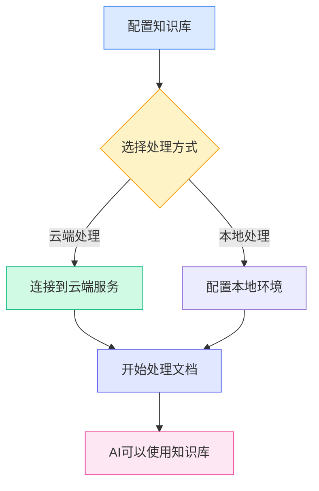
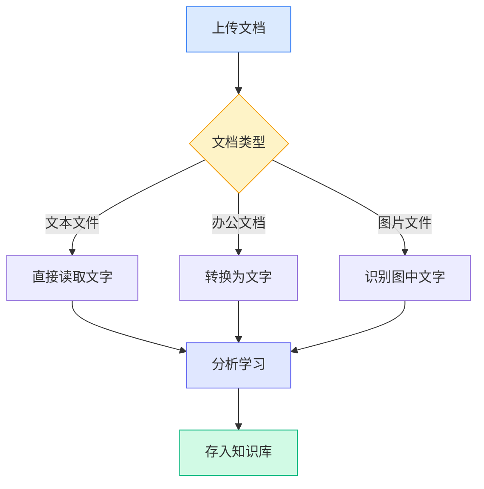

# 知识库配置

## 概述

知识库是MetaDoc的智能文档管理系统。通过将您的文档"学习"进知识库，AI就能理解和引用这些内容，为您提供更准确的回答和建议。

本指南将帮助您配置知识库，让它更好地为您服务。

## 启用知识库功能

在知识库设置页面，首先需要启用知识库功能：

1. 找到"启用知识库"开关
2. 将开关切换到"启用"状态
3. 配置知识库相关参数

您可以通过顶部菜单栏访问知识库管理：

<KnowledgeBase mode="demo" />

上图展示了知识库管理界面的主要功能区域：

- **左侧面板**：知识库列表和搜索功能
- **中间区域**：已添加的文档列表
- **右侧详情**：选中文档的详细信息和处理状态
- **底部工具栏**：添加文档、开始处理、删除等操作按钮

## 选择处理方式

### 两种方式简介

MetaDoc提供两种处理文档的方式：

**云端处理（推荐）**

- 将文档发送到云端服务进行分析
- 处理速度快，无需占用本地资源
- 需要网络连接

**本地处理（开发中）**

- 在您的电脑上直接处理文档
- 数据完全本地，保护隐私
- 需要较强的电脑配置

目前版本仅支持云端处理方式。您可以在设置中选择：

<MenuItemsDemo mode="demo" :items='[{"id": "settings"}]' />

### 云端处理的优势

对于大多数用户，我们推荐使用云端处理：

- **快速上手**：无需配置复杂的本地环境
- **节省时间**：处理大量文档时速度更快
- **节省资源**：不占用电脑内存和处理器
- **维护简单**：自动更新，无需手动管理

### 何时需要本地处理

如果您有以下需求，可以等待本地处理功能上线：

- 处理高度敏感的机密文档
- 经常在没有网络的环境下工作
- 拥有高性能的电脑配置（带独立显卡）
- 需要处理海量文档（超过10GB）

<SettingKnowledgeBaseSection mode="demo" />

## 理解知识库的工作原理

### 文档是如何被"学习"的

<RAGToolDisplay mode="demo" />

当您将文档添加到知识库时，MetaDoc会执行以下步骤：

1. **读取文档内容**

   - 从PDF、Word、图片等格式中提取文字
   - 保持文档的结构和格式信息

2. **理解文档含义**

   - 将文字转换为AI能理解的"语义表示"
   - 这就像给文档打上智能标签

3. **建立索引**

   - 创建快速查找的索引
   - 让AI能在瞬间找到相关内容

4. **存储知识**
   - 将处理结果保存在本地数据库
   - 随时可以调用

<KnowledgeBase mode="demo" />

## 支持的文档类型

### 可以直接处理的格式

MetaDoc知识库支持多种常见文档格式：

**文本类**

- Markdown文档（.md）—— 技术文档的首选格式
- LaTeX文档（.tex）—— 学术论文常用格式
- 纯文本文件（.txt）—— 简单的文本记录

**办公文档**

- PDF文件（.pdf）—— 最通用的文档格式
- Word文档（.docx）—— Microsoft Office格式

**图片类**

- PNG图片（.png）—— 截图、图表
- JPEG图片（.jpg, .jpeg）—— 照片、扫描件

### 不同文档的处理方式

不同类型的文档，MetaDoc会用不同的方式处理：

**文本文档**（Markdown、LaTeX、TXT）

- 直接读取文字内容
- 保留标题结构和格式
- 处理速度最快

**办公文档**（PDF、Word）

- 先转换为纯文本
- 提取标题、段落等结构
- 保留文档的逻辑层次

**图片文档**（PNG、JPG）

- 使用OCR技术识别图中的文字
- 适合处理扫描的纸质文档
- 处理时间相对较长

<RAGToolDisplay mode="demo" />

## 智能检索机制

### 知识库如何找到相关内容

当AI需要使用知识库时，MetaDoc采用智能检索策略：

**语义匹配**

- 不仅匹配关键词，还理解问题的含义
- 例如：搜索"如何安装"，也能找到"安装步骤"、"部署指南"等相关内容

**混合检索**

- 结合语义理解和关键词匹配
- 既保证准确性，又提高召回率
- 自动排序，最相关的内容优先展示

**快速响应**

- 使用高效的索引算法
- 毫秒级响应，不影响对话流畅度

<KnowledgeBase mode="demo" />

## 分块处理说明

### 为什么需要分块

为了更高效地检索，MetaDoc会将长文档分成小块：

**分块的好处**

- **精准定位**：可以找到文档中的具体段落
- **提高速度**：小块处理更快，检索更迅速
- **保持上下文**：相邻块之间有重叠，不会切断语义

**默认设置**

- 每块约500个字符（约250个汉字）
- 相邻块之间重叠50个字符
- 这种设置在准确性和效率之间取得平衡

### 分块示例

假设有一篇长文章：

原文：[开头段落...中间段落...结尾段落...]

分块后：

- 块1：开头段落 + 部分中间内容
- 块2：部分中间内容（重叠区域）+ 更多中间内容
- 块3：更多中间内容 + 结尾段落

这样即使问题只涉及"中间内容"，也能准确找到相关部分。

<SettingKnowledgeBaseSection mode="demo" />

## 配置建议

### 初次使用推荐设置

如果您是第一次使用知识库，建议采用以下设置：

- **处理方式**：云端处理（默认）
- **检索灵敏度**：中等（默认值）
  - 灵敏度太高：可能返回过多不相关内容
  - 灵敏度太低：可能遗漏一些相关内容
  - 中等设置：平衡两者

### 针对不同类型的文档

**技术文档/手册**

- 适合建立专门的知识库
- AI可以准确回答技术问题
- 支持代码片段的检索

**学术论文**

- 保留完整的引用信息
- 支持跨文档的知识关联
- 适合文献综述和研究

**日常笔记**

- 建立个人知识库
- 快速检索过往记录
- 支持创意写作时的参考

### 使用建议

**1. 定期维护**

- 删除过时或不再需要的文档
- 更新已有文档的新版本
- 保持知识库的整洁和准确

**2. 合理分类**

- 将相关主题的文档放在一起
- 为知识库设置清晰的命名
- 便于管理和使用

**3. 隐私考虑**

- 机密文档谨慎上传
- 了解数据的处理方式
- 选择适合的处理方式

<RAGToolDisplay mode="demo" />

## 注意事项

### 使用前须知

1. **处理时间**

   - 小文档（1-10页）：几秒钟
   - 中等文档（10-50页）：几十秒
   - 大文档（50页以上）：可能需要几分钟
   - 请耐心等待处理完成

2. **存储空间**

   - 知识库会占用一定的硬盘空间
   - 大致是原文档大小的2-3倍
   - 定期清理不用的文档可以释放空间

3. **网络要求**

   - 添加文档时需要网络连接
   - 检索时不需要网络（已存储本地）
   - 不稳定的网络可能影响处理速度

4. **文件格式**
   - 确保上传的文件格式正确
   - 损坏的文件可能无法处理
   - 加密的PDF需要先解密

### 常见问题

**Q: 知识库中的文档安全吗？**
A: 文档处理后的向量数据存储在本地。如使用云端处理，原始文档会发送到云端服务处理，处理完成后删除。建议不要上传高度敏感的内容。

**Q: 可以处理多大的文档？**
A: 单个文档建议不超过100MB。超大文档可以分割成多个小文档处理。

**Q: 处理后的文档还能修改吗？**
A: 知识库中的内容是原始文档的"快照"。如果文档有更新，需要重新添加到知识库。

**Q: 为什么有些内容检索不到？**
A: 可能原因：1) 文档尚未完成处理；2) 内容在图片中且OCR识别失败；3) 检索词和文档内容表达方式差异较大。

## 相关文档

- [[knowledge-base.management|知识库管理]] - 学习如何添加、删除、管理知识库中的文档
- [[knowledge-base.usage|知识库使用]] - 了解如何在AI对话中使用知识库
- [[ai.chat|AI对话功能]] - 探索AI对话的高级功能
