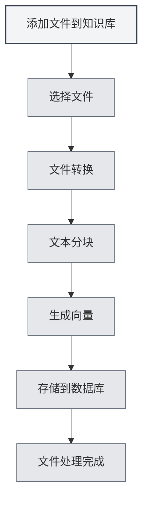

# 知识库使用

## 概述

知识库是MetaDoc的RAG（检索增强生成）系统，通过向量搜索为AI功能提供上下文信息。合理使用知识库可以显著提升AI回答的准确性和相关性。

## 知识库介绍

### 什么是知识库

知识库是一个文档存储和检索系统，它能够：

- **存储文档**：将文档转换为向量并存储
- **语义搜索**：基于语义相似度搜索相关内容
- **增强AI**：为AI对话提供上下文信息

### 工作原理

知识库使用向量嵌入技术：

1. **文档处理**：将文档分割成文本块
2. **向量化**：为每个文本块生成向量嵌入
3. **存储**：将向量存储到数据库中
4. **检索**：根据查询生成向量，搜索相似内容

## 添加文件到知识库

### 添加文件

1. 打开知识库管理页面
2. 点击"添加文件"按钮
3. 选择要添加的文件
4. 等待文件处理完成

### 支持的文件格式

知识库支持以下文件格式：

- **Markdown** (.md)：Markdown文档
- **LaTeX** (.tex)：LaTeX文档
- **PDF** (.pdf)：PDF文档
- **Word** (.docx)：Word文档
- **图片** (.png, .jpg等)：通过OCR识别文字
- **纯文本** (.txt)：纯文本文件

### 文件处理

添加文件后，系统会自动：

1. **转换文本**：将文件转换为文本内容
2. **文本分块**：将文本分割成固定大小的块
3. **生成向量**：为每个块生成向量嵌入
4. **存储数据**：将向量和文本存储到数据库

处理时间取决于文件大小，大文件可能需要较长时间。

## 知识库文件管理

### 文件列表

知识库管理页面显示所有已添加的文件：

- **文件名**：文件的名称
- **大小/块数**：文件大小和数据块数量
- **状态**：文件是否启用

### 文件操作

#### 启用/禁用文件

- **启用**：文件会被检索，用于AI功能
- **禁用**：文件不会被检索，但数据保留

#### 预览文件

点击文件可以预览文件内容：

- **查看内容**：在预览面板查看文件文本
- **打开编辑器**：在编辑器中打开文件

#### 重命名文件

1. 选择要重命名的文件
2. 点击文件名旁的编辑按钮
3. 输入新文件名
4. 确认重命名

#### 删除文件

1. 选择要删除的文件
2. 点击"删除"按钮
3. 确认删除操作

删除文件会删除所有相关的向量和数据块。

#### 下载文件

可以下载知识库中的文件：

1. 选择要下载的文件
2. 点击"下载"按钮
3. 选择保存位置

## 向量搜索

### 搜索原理

向量搜索使用ANN（近似最近邻）算法：

- **向量相似度**：计算查询向量与文档向量的相似度
- **余弦相似度**：使用余弦相似度衡量相似程度
- **排序结果**：按相似度排序返回结果

### 搜索方式

知识库支持两种搜索方式：

- **向量搜索**：基于语义相似度
- **混合检索**：结合向量搜索和关键词匹配

### 搜索测试

在知识库管理页面可以测试搜索功能：

1. 在搜索框中输入查询文本
2. 调整置信度阈值
3. 点击"搜索"按钮
4. 查看搜索结果

### 置信度阈值

置信度阈值控制搜索结果的筛选：

- **低阈值（0.1-0.3）**：返回更多结果，但可能包含不相关内容
- **中等阈值（0.4-0.6）**：平衡相关性和数量（推荐）
- **高阈值（0.7-0.9）**：只返回高度相关的结果

## 混合检索

### 检索机制

混合检索结合两种方法：

- **向量搜索**：基于语义相似度
- **关键词匹配**：基于文本匹配

### 评分机制

混合检索使用综合评分：

- **向量相似度**：语义相似度分数
- **关键词匹配**：文本匹配分数
- **综合评分**：结合两种分数的最终评分

### 优势

混合检索的优势：

- **准确性**：向量搜索提供语义理解
- **精确性**：关键词匹配提供精确匹配
- **平衡性**：综合两种方法的优势

## 搜索测试

### 测试搜索

在知识库管理页面可以测试搜索：

1. **输入查询**：在搜索框输入要查询的内容
2. **调整阈值**：使用滑块调整置信度阈值
3. **执行搜索**：点击"搜索"按钮或按Enter键
4. **查看结果**：在结果区域查看搜索结果

### 搜索结果

搜索结果会显示：

- **匹配文本**：与查询相关的文本片段
- **相似度**：文本与查询的相似度分数
- **来源文件**：文本来源的文件

### 结果排序

搜索结果按相似度排序：

- **最相关**：相似度最高的结果排在前面
- **相关性递减**：相似度递减排序

## 向量重建

### 重建向量

如果文件的向量数据出现问题，可以重建向量：

1. 选择要重建的文件
2. 点击"重建向量"按钮
3. 等待重建完成

### 重建全部向量

可以重建所有文件的向量：

1. 点击"重建全部向量"按钮
2. 确认操作
3. 等待所有文件重建完成

### 重建场景

需要重建向量的场景：

- **更换Embedding模型**：更换模型后需要重建
- **向量数据损坏**：向量数据出现问题时
- **更新向量表示**：需要更新向量表示时

## 清空知识库

### 清空操作

如果需要清空整个知识库：

1. 点击"清空知识库"按钮
2. 确认操作
3. 等待清空完成

### 清空影响

清空知识库会：

- 删除所有文件记录
- 删除所有数据块
- 删除所有向量
- 操作不可恢复

**注意事项**：
- 清空操作不可恢复，请谨慎操作
- 清空前建议先备份重要文件
- 清空后需要重新添加文件

## 在AI功能中使用

### AI对话

知识库会自动为AI对话提供上下文：

- **自动检索**：根据对话内容自动检索相关知识
- **上下文注入**：将检索结果注入到对话上下文
- **增强回答**：基于知识库内容生成更准确的回答

### AI补全

知识库可以增强AI补全功能：

- **上下文理解**：基于知识库内容理解上下文
- **内容生成**：生成与知识库内容相关的内容
- **准确性提升**：提高补全内容的准确性

### Agent工具

知识库可以作为Agent工具使用：

- **RAG工具**：在Agent工作流中使用RAG检索
- **上下文提供**：为Agent提供相关上下文信息
- **任务执行**：帮助Agent完成需要知识的任务

## 最佳实践

1. **文件组织**：按主题或项目组织文件
2. **定期更新**：文件内容更新后及时重建向量
3. **阈值调整**：根据使用效果调整置信度阈值
4. **文件清理**：定期删除不再需要的文件
5. **测试搜索**：定期测试搜索功能，确保效果良好

## 注意事项

1. **启用知识库**：使用知识库功能前需要先启用
2. **文件处理**：大文件处理需要时间，请耐心等待
3. **存储空间**：知识库会占用一定的存储空间
4. **网络连接**：使用API模式需要网络连接
5. **数据安全**：注意保护知识库中的敏感信息

## 相关文档

- [[knowledge-base.management|知识库管理]]
- [[knowledge-base.config|知识库配置]]
- [[settings.llm|LLM配置]]
- [[ai.chat|AI对话功能]]
