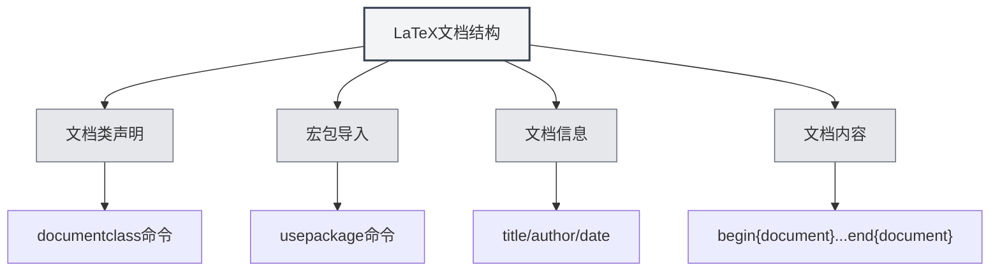

# LaTeX语法

## 概述

LaTeX是一种基于TeX的排版系统，广泛用于学术论文和科技文档的编写。MetaDoc提供了完整的LaTeX编辑、编译和预览支持。

<LaTeXEditorDemo mode="demo" />

<PdfPreviewPanel mode="demo" />

<LaTeXCompilerPanel mode="demo" />

<LaTeXConsole mode="demo" />

## 基本语法

### 文档结构

LaTeX文档的基本结构：

```latex
\documentclass{article}
\usepackage[utf8]{inputenc}

\title{文档标题}
\author{作者}
\date{\today}

\begin{document}
\maketitle

\section{章节标题}
内容...

\end{document}
```



### 数学公式

**行内公式**：

```latex
这是行内公式：$E = mc^2$
```

**块级公式**：

```latex
\begin{equation}
\int_{-\infty}^{\infty} e^{-x^2} dx = \sqrt{\pi}
\end{equation}
```

**多行公式**：

```latex
\begin{align}
x &= a + b \\
y &= c + d
\end{align}
```

### 表格

使用 `tabular` 环境：

```latex
\begin{tabular}{|c|c|c|}
\hline
列1 & 列2 & 列3 \\
\hline
数据1 & 数据2 & 数据3 \\
\hline
\end{tabular}
```

### 图片插入

使用 `figure` 环境：

```latex
\begin{figure}[h]
\centering
\includegraphics[width=0.8\textwidth]{image.png}
\caption{图片标题}
\label{fig:example}
\end{figure}
```

### 参考文献

使用 `BibTeX` 或 `natbib`：

```latex
\bibliographystyle{plain}
\bibliography{references}
```

## 编译和预览

LaTeX文档需要编译才能生成PDF。详见[[latex.compilation|LaTeX编译与预览]]。

编译完成后，可以在[[latex.pdf-preview|PDF预览功能]]中查看结果。

## 相关文档

- [[latex.editor|LaTeX编辑器使用指南]]
- [[latex.compilation|LaTeX编译与预览]]
- [[latex.pdf-preview|PDF预览功能]]
- [[latex.console|控制台输出]]
