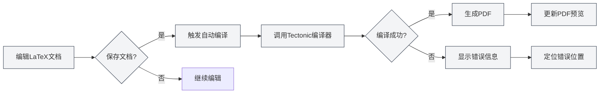
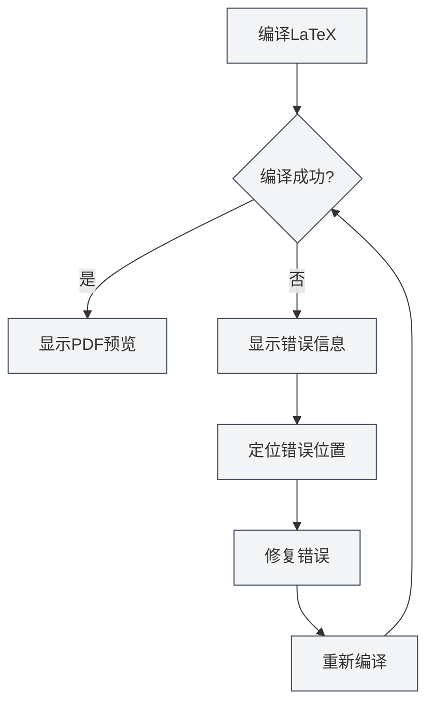

# LaTeX编译与预览

## 概述

LaTeX文档需要编译才能生成PDF。MetaDoc使用Tectonic编译器，支持自动编译、实时预览、错误定位等功能，让您能够高效地编写和调试LaTeX文档。

编译过程会自动下载所需的宏包，无需手动配置，大大简化了LaTeX的使用流程。

## 编译LaTeX文档

### 自动编译

MetaDoc支持自动编译功能：

- **保存时编译**：保存LaTeX文档时自动触发编译
- **手动编译**：点击工具栏的"编译"按钮手动触发编译
- **编译状态**：编译过程中会显示进度和状态

### 编译过程

编译过程包括以下步骤：

1. **准备编译环境**：检查Tectonic编译器是否可用
2. **下载宏包**：自动下载文档中使用的LaTeX宏包
3. **执行编译**：运行Tectonic编译器生成PDF
4. **处理输出**：处理编译日志和错误信息
5. **更新预览**：如果编译成功，更新PDF预览

### 编译选项

编译支持以下选项：

- **编译器**：使用Tectonic编译器（默认）
- **编译模式**：非交互模式，遇到错误时停止
- **输出目录**：PDF文件保存在文档同目录下

### 编译时间

编译时间取决于：

- **文档大小**：文档越大，编译时间越长
- **宏包数量**：使用的宏包越多，首次编译时间越长（需要下载）
- **图片数量**：包含的图片越多，编译时间越长

首次编译可能需要较长时间，因为需要下载宏包。后续编译会更快。

## PDF预览

### 自动更新

PDF预览会在编译成功后自动更新：

- **实时预览**：编译成功后立即显示PDF预览
- **自动刷新**：PDF内容变化时自动刷新预览
- **同步滚动**：支持PDF和代码的同步定位

### 预览功能

PDF预览面板提供以下功能：

- **页面导航**：上一页、下一页、跳转到指定页面
- **缩放控制**：放大、缩小、重置缩放
- **刷新预览**：手动刷新PDF预览
- **定位到代码**：从PDF位置定位到LaTeX代码

详见[[latex.pdf-preview|PDF预览功能]]。

## 控制台输出

### 编译日志

编译过程中的日志会显示在控制台输出面板中：

- **标准输出**：编译过程的正常输出
- **错误信息**：编译错误和警告信息
- **实时更新**：编译过程中实时更新日志

### 错误信息

编译错误会以不同颜色显示：

- **错误**：红色显示，表示编译失败
- **警告**：黄色显示，表示可能的问题
- **信息**：灰色显示，表示一般信息

### 错误定位

编译错误会显示：

- **错误位置**：显示错误发生的行号和列号
- **错误类型**：显示错误类型和描述
- **快速跳转**：点击错误信息可以跳转到对应代码位置

详见[[latex.console|控制台输出]]。

## 定位到PDF

### 从代码定位到PDF

在LaTeX编辑器中，您可以：

1. **选中代码**：选中LaTeX代码
2. **右键菜单**：右键选择"定位到PDF"
3. **跳转预览**：PDF预览会自动跳转到对应位置

### 从PDF定位到代码

在PDF预览中，您可以：

1. **点击PDF位置**：点击PDF中的某个位置
2. **自动跳转**：编辑器会自动跳转到对应的LaTeX代码位置

这个功能让您能够快速在PDF和代码之间切换，方便调试和编辑。

## 编译错误处理

### 常见错误类型

LaTeX编译可能遇到以下错误：

- **语法错误**：LaTeX语法不正确
- **宏包缺失**：使用了未安装的宏包（Tectonic会自动下载）
- **文件缺失**：引用的文件不存在
- **编码错误**：文件编码不正确

### 错误处理流程

### 调试技巧

1. **查看控制台**：仔细查看控制台输出的错误信息
2. **定位错误**：使用错误定位功能快速找到问题代码
3. **逐步修复**：从第一个错误开始，逐个修复
4. **检查语法**：确保LaTeX语法正确
5. **检查文件**：确保引用的文件存在且路径正确

## Tectonic编译器

### 编译器介绍

MetaDoc使用Tectonic编译器，具有以下特点：

- **无需安装TeX发行版**：Tectonic是独立的二进制文件
- **自动下载宏包**：编译时自动从CTAN下载所需宏包
- **快速编译**：相比传统TeX发行版，编译速度更快
- **跨平台支持**：Windows、macOS、Linux全平台支持

### 宏包管理

Tectonic会自动管理LaTeX宏包：

- **自动下载**：首次使用时自动下载
- **缓存管理**：下载的宏包会缓存，后续编译更快
- **版本管理**：自动管理宏包版本

您无需手动下载或配置任何宏包，只需在文档中使用`\usepackage{}`命令即可。

## 使用技巧

### 提高编译速度

1. **减少图片**：减少文档中的图片数量
2. **优化代码**：优化LaTeX代码结构
3. **使用缓存**：利用Tectonic的宏包缓存

### 调试编译错误

1. **查看完整日志**：查看控制台的完整编译日志
2. **检查语法**：仔细检查LaTeX语法
3. **逐步编译**：注释掉部分代码，逐步定位问题
4. **参考文档**：查阅LaTeX宏包的文档

### 优化编译流程

1. **保存时编译**：启用保存时自动编译
2. **使用预览**：使用PDF预览快速查看效果
3. **定位功能**：使用定位功能快速切换代码和PDF

## 常见问题

### Q: 编译失败怎么办？

A: 查看控制台输出的错误信息，根据错误提示修复代码。常见问题包括语法错误、文件缺失等。

### Q: 编译时间很长？

A: 首次编译需要下载宏包，时间较长是正常的。后续编译会更快。如果持续很慢，检查文档大小和图片数量。

### Q: 宏包下载失败？

A: 检查网络连接，确保可以访问CTAN。Tectonic会自动重试下载。

### Q: PDF预览不更新？

A: 点击"刷新"按钮手动刷新预览，或检查编译是否成功。

### Q: 如何查看编译日志？

A: 编译日志显示在控制台输出面板中，可以查看标准输出、错误信息和警告信息。

## 相关文档

- [[latex.editor|LaTeX编辑器使用指南]]
- [[latex.basics|LaTeX语法]]
- [[latex.pdf-preview|PDF预览功能]]
- [[latex.console|控制台输出]]
