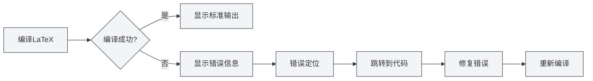

# 控制台输出

## 概述

控制台输出面板显示LaTeX编译过程中的日志信息，包括标准输出、错误信息、警告信息等。通过查看控制台输出，您可以了解编译过程、定位错误、调试问题。

控制台输出使用Monaco编辑器显示，支持语法高亮、错误定位、日志过滤等功能，让您能够高效地查看和分析编译日志。

## LaTeX编译输出

<LaTeXConsole mode="demo" />

### 标准输出

编译过程中的标准输出会显示在控制台中：

- **编译进度**：显示编译的各个阶段
- **宏包下载**：显示下载的宏包信息
- **编译信息**：显示编译过程的详细信息

标准输出以普通文本显示，帮助您了解编译过程。

控制台输出面板界面如下：

<ConsoleTerminal mode="demo" consoleKey="demo" :history='[{"content": "编译开始...", "type": "out"}, {"content": "警告：未定义的引用", "type": "warn"}, {"content": "编译完成", "type": "out"}]' />

### 输出格式

<ConsoleTerminal mode="demo" consoleKey="demo" :history='[{"content": "标准输出信息", "type": "out"}, {"content": "警告信息", "type": "warn"}, {"content": "错误信息", "type": "error"}]' />

控制台输出使用不同颜色区分不同类型的信息：

- **标准输出**：灰色文本，显示正常的编译信息
- **错误信息**：红色文本，显示编译错误
- **警告信息**：黄色文本，显示编译警告
- **调试信息**：深灰色文本，显示调试信息

## 错误信息显示

<LaTeXConsole mode="demo" />

### 错误格式

编译错误会以特定格式显示：

- **错误位置**：显示错误发生的文件名、行号和列号
- **错误类型**：显示错误类型（如语法错误、文件缺失等）
- **错误描述**：显示错误的详细描述

### 错误定位

控制台输出支持错误定位功能：

- **点击错误**：点击错误信息可以跳转到对应的代码位置
- **高亮显示**：错误对应的代码行会高亮显示
- **快速修复**：快速定位到错误位置，方便修复

### 常见错误类型

LaTeX编译可能遇到以下错误：

- **语法错误**：LaTeX语法不正确
- **命令未定义**：使用了未定义的LaTeX命令
- **环境未闭合**：环境没有正确闭合
- **文件缺失**：引用的文件不存在
- **宏包错误**：宏包加载失败或冲突

## 警告信息显示

<ConsoleTerminal mode="demo" consoleKey="demo" :history='[{"content": "警告: 未定义的引用", "type": "warn"}]' />

### 警告格式

编译警告会以特定格式显示：

- **警告位置**：显示警告发生的位置
- **警告类型**：显示警告类型
- **警告描述**：显示警告的详细描述

### 警告处理

警告信息通常不会阻止编译，但可能影响最终效果：

- **查看警告**：仔细查看警告信息，了解可能的问题
- **修复警告**：根据警告信息修复代码
- **忽略警告**：如果警告不影响效果，可以暂时忽略

## 日志过滤

<LaTeXConsole mode="demo" />

### 过滤功能

控制台输出支持日志过滤功能：

- **按类型过滤**：只显示错误、警告或标准输出
- **按关键词过滤**：过滤包含特定关键词的日志
- **按时间过滤**：过滤特定时间段的日志

### 过滤设置

日志过滤可以在控制台面板中配置：

1. 打开控制台输出面板
2. 使用过滤选项选择要显示的内容
3. 输入关键词进行搜索过滤

### 清除日志

清除控制台输出：

- **清除按钮**：点击控制台的"清除"按钮
- **快捷键**：`Ctrl+L`（如果配置了）

清除日志会删除所有已显示的日志信息。

## 日志操作

<ConsoleTerminal mode="demo" consoleKey="demo" :history='[{"content": "编译日志内容...", "type": "out"}]' />

### 复制日志

复制控制台输出到剪贴板：

- **复制按钮**：点击控制台的"复制"按钮
- **快捷键**：`Ctrl+C`（选中文本后）

复制日志可以保存到其他位置或分享给他人。

### 保存日志

保存控制台输出到文件：

- **保存按钮**：点击控制台的"保存日志"按钮
- **文件选择**：选择保存位置和文件名

保存的日志文件可以用于后续分析或问题报告。

### AI分析

控制台输出支持AI分析功能：

- **启用AI分析**：在控制台面板中启用AI分析开关
- **自动分析**：AI会自动分析错误信息并提供修复建议
- **查看建议**：查看AI提供的错误修复建议

AI分析功能可以帮助您快速理解和修复编译错误。

## 控制台设置

<LaTeXConsole mode="demo" />

### 显示选项

控制台输出支持以下显示选项：

- **行号显示**：显示日志行的行号
- **自动换行**：长行自动换行显示
- **字体大小**：调整日志显示的字体大小

### 主题设置

控制台输出会跟随编辑器主题：

- **浅色主题**：在浅色主题下使用浅色背景
- **深色主题**：在深色主题下使用深色背景
- **自动同步**：自动同步编辑器主题设置

## 使用技巧

<ConsoleTerminal mode="demo" consoleKey="demo" :history='[{"content": "定位到错误位置...", "type": "out"}]' />

### 快速定位错误

1. **查看错误信息**：仔细查看错误信息的格式和内容
2. **使用定位功能**：点击错误信息快速跳转到代码位置
3. **检查上下文**：查看错误位置的上下文代码

### 理解编译日志

1. **阅读标准输出**：了解编译过程的各个阶段
2. **关注错误信息**：重点关注错误信息，优先修复
3. **查看警告信息**：查看警告信息，了解可能的问题

### 调试技巧

1. **逐步编译**：注释掉部分代码，逐步定位问题
2. **查看完整日志**：查看完整的编译日志，了解编译过程
3. **使用AI分析**：启用AI分析功能，获取修复建议

## 常见问题

<LaTeXConsole mode="demo" />

### Q: 控制台输出不显示？

A: 确保控制台输出面板已打开。编译LaTeX文档时会自动打开控制台面板。

### Q: 如何快速找到错误？

A: 错误信息会以红色显示，点击错误信息可以快速跳转到代码位置。

### Q: 日志太多怎么办？

A: 使用过滤功能过滤不需要的日志，或使用清除功能清除旧日志。

### Q: 如何保存编译日志？

A: 点击控制台的"保存日志"按钮，选择保存位置即可保存日志文件。

### Q: AI分析不准确？

A: AI分析仅供参考，建议结合错误信息和代码上下文进行判断。可以手动修复或重新分析。

## 相关文档

- [[latex.compilation|LaTeX编译与预览]]
- [[latex.editor|LaTeX编辑器使用指南]]
- [[latex.pdf-preview|PDF预览功能]]

<PdfPreviewPanel mode="demo" pdfUrl="" />

<LaTeXCompilerPanel mode="demo" />

<LaTeXEditorDemo mode="demo" />
