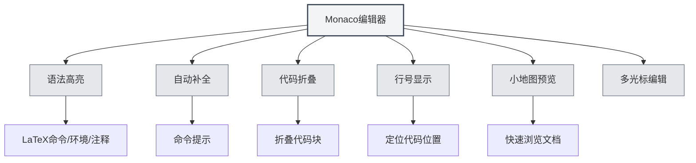

# LaTeX编辑器使用指南

## 概述

MetaDoc的LaTeX编辑器基于Monaco Editor，提供了专业的LaTeX代码编辑体验。编辑器支持语法高亮、自动补全、代码折叠等功能，帮助您高效编写LaTeX文档。

Monaco Editor是Visual Studio Code使用的编辑器核心，具有强大的代码编辑能力和丰富的功能特性。

## Monaco编辑器介绍

Monaco Editor为LaTeX编辑提供了以下特性：

- **语法高亮**：LaTeX命令、环境、注释等不同语法元素使用不同颜色显示
- **自动补全**：输入LaTeX命令时自动显示补全建议
- **代码折叠**：支持折叠代码块，方便浏览长文档
- **行号显示**：显示行号，方便定位代码位置
- **小地图预览**：右侧显示代码缩略图，快速浏览文档结构
- **多光标编辑**：支持多光标同时编辑

## 代码高亮和语法提示

### 语法高亮

LaTeX编辑器会自动识别并高亮显示：

- **命令**：`\documentclass`、`\usepackage` 等LaTeX命令
- **环境**：`\begin{document}`、`\end{document}` 等环境标记
- **注释**：以 `%` 开头的注释行
- **数学公式**：`$`、`$$` 包裹的数学公式区域
- **特殊字符**：`&`、`#`、`$` 等特殊字符

语法高亮让代码结构更清晰，便于阅读和编辑。

### 语法提示

编辑器会在以下情况显示语法提示：

- **输入命令**：输入 `\` 后自动显示可用的LaTeX命令
- **输入环境**：输入 `\begin{` 后显示可用的环境名称
- **输入包名**：输入 `\usepackage{` 后显示常用的包名

语法提示帮助您快速输入正确的LaTeX命令，减少输入错误。

## 行号显示

### 显示行号

行号显示在编辑器左侧，帮助您：

- **定位代码**：快速定位到特定行
- **查找错误**：编译错误会显示行号，方便定位问题
- **代码引用**：方便在文档中引用特定代码行

### 设置行号

行号显示可以在设置中配置：

1. 打开设置页面
2. 找到"行号显示"选项
3. 切换开关启用或禁用行号

行号设置会影响所有Monaco编辑器（LaTeX编辑器、纯文本编辑器等）。

## 小地图预览

### 小地图功能

小地图（Minimap）是编辑器右侧的代码缩略图：

- **快速浏览**：在小地图中可以看到整个文档的结构
- **快速定位**：点击小地图可以快速跳转到对应位置
- **结构预览**：通过颜色差异了解文档的不同部分

### 显示/隐藏小地图

小地图可以通过以下方式控制：

1. 在编辑器中右键
2. 查找"小地图"或"Minimap"选项
3. 切换显示状态

小地图特别适合编辑长文档，帮助您快速了解文档结构。

## 代码折叠

### 折叠功能

代码折叠允许您折叠代码块，隐藏不需要查看的部分：

- **折叠环境**：折叠 `\begin{...}...\end{...}` 环境块
- **折叠函数**：折叠自定义命令定义
- **折叠注释**：折叠大段注释

### 使用折叠

- **折叠**：点击行号左侧的折叠图标，或使用快捷键 `Ctrl+Shift+[`
- **展开**：点击折叠标记，或使用快捷键 `Ctrl+Shift+]`
- **折叠所有**：使用快捷键 `Ctrl+K Ctrl+0` 折叠所有代码块
- **展开所有**：使用快捷键 `Ctrl+K Ctrl+J` 展开所有代码块

代码折叠让您专注于当前编辑的部分，提高编辑效率。

## 自动补全

### 补全触发

编辑器会在以下情况自动显示补全建议：

- **输入命令**：输入 `\` 后显示LaTeX命令列表
- **输入环境**：输入 `\begin{` 后显示环境名称
- **输入包名**：输入 `\usepackage{` 后显示常用包名
- **其他字符**：输入其他字符后也可能显示相关建议

### 接受补全

- **Enter键**：接受当前选中的补全建议
- **Tab键**：接受当前选中的补全建议
- **方向键**：在补全列表中上下移动选择
- **Esc键**：取消补全建议

### 补全设置

补全功能可以在编辑器设置中配置：

- **快速建议**：在其他字符后自动显示补全建议
- **触发字符**：在特定字符（如 `\`）后自动显示补全
- **接受字符**：在输入提交字符时自动接受补全

## 编辑功能

### 多光标编辑

Monaco编辑器支持多光标同时编辑：

- **Alt+点击**：在点击位置添加新光标
- **Ctrl+Alt+上/下箭头**：在上方/下方添加光标
- **Ctrl+D**：选中下一个相同的单词并添加光标
- **Ctrl+Shift+L**：选中所有相同的单词并添加光标

多光标编辑可以同时修改多个位置，提高编辑效率。

### 列选择

支持列选择模式：

- **Alt+Shift+拖拽**：选择矩形区域
- **Alt+Shift+方向键**：扩展列选择

列选择适合编辑表格或对齐的代码。

### 代码格式化

编辑器支持基本的代码格式化：

- **自动缩进**：根据代码结构自动缩进
- **自动换行**：长行自动换行显示
- **缩进方式**：支持不同的缩进方式（空格、Tab）

## 查找替换

### 查找功能

- **快捷键**：`Ctrl+F` 打开查找对话框
- **高亮显示**：查找结果会在文档中高亮显示
- **循环查找**：到达文档末尾后自动从头开始

### 替换功能

- **快捷键**：`Ctrl+H` 打开查找替换对话框
- **单个替换**：逐个替换匹配的文本
- **全部替换**：一次性替换所有匹配的文本

查找替换菜单界面如下：

<SearchReplaceMenu mode="demo" :position='{"top": 100, "left": 200}' :adapter='null' />

### 高级选项

查找替换支持以下选项：

- **区分大小写**：只匹配大小写完全相同的文本
- **全字匹配**：只匹配完整的单词
- **正则表达式**：使用正则表达式进行模式匹配

## 快捷键参考

### 编辑快捷键

| 操作 | Windows/Linux | macOS   |
| ---- | ------------- | ------- |
| 撤销 | `Ctrl+Z`      | `Cmd+Z` |
| 重做 | `Ctrl+Y`      | `Cmd+Y` |
| 复制 | `Ctrl+C`      | `Cmd+C` |
| 粘贴 | `Ctrl+V`      | `Cmd+V` |
| 全选 | `Ctrl+A`      | `Cmd+A` |
| 查找 | `Ctrl+F`      | `Cmd+F` |
| 替换 | `Ctrl+H`      | `Cmd+H` |

### 代码折叠快捷键

| 操作     | Windows/Linux   | macOS          |
| -------- | --------------- | -------------- |
| 折叠     | `Ctrl+Shift+[`  | `Cmd+Option+[` |
| 展开     | `Ctrl+Shift+]`  | `Cmd+Option+]` |
| 折叠所有 | `Ctrl+K Ctrl+0` | `Cmd+K Cmd+0`  |
| 展开所有 | `Ctrl+K Ctrl+J` | `Cmd+K Cmd+J`  |

### 多光标快捷键

| 操作               | Windows/Linux  | macOS          |
| ------------------ | -------------- | -------------- |
| 添加光标           | `Alt+点击`     | `Option+点击`  |
| 添加上方光标       | `Ctrl+Alt+↑`   | `Cmd+Option+↑` |
| 添加下方光标       | `Ctrl+Alt+↓`   | `Cmd+Option+↓` |
| 选中下一个相同单词 | `Ctrl+D`       | `Cmd+D`        |
| 选中所有相同单词   | `Ctrl+Shift+L` | `Cmd+Shift+L`  |

## 使用技巧

### 快速输入

1. **命令补全**：输入 `\` 后使用方向键选择命令，按Enter接受
2. **环境补全**：输入 `\begin{` 后选择环境名称，编辑器会自动补全 `\end{...}`
3. **包名补全**：输入 `\usepackage{` 后选择包名，快速添加宏包

### 代码组织

1. **使用折叠**：折叠不需要查看的代码块，保持编辑区域整洁
2. **使用注释**：添加注释说明代码功能，方便后续维护
3. **合理缩进**：保持代码缩进一致，提高可读性

### 错误定位

1. **查看行号**：编译错误会显示行号，在编辑器中快速定位
2. **使用查找**：使用查找功能快速定位特定命令或文本
3. **使用小地图**：在小地图中快速浏览文档结构

## 常见问题

### Q: 自动补全不显示？

A: 检查编辑器设置中的"快速建议"选项是否启用。输入 `\` 后应该会自动显示补全建议。

### Q: 如何折叠代码？

A: 点击行号左侧的折叠图标，或使用快捷键 `Ctrl+Shift+[`。折叠的环境块会在行号左侧显示折叠标记。

### Q: 小地图不显示？

A: 检查编辑器设置中的"小地图"选项是否启用。小地图显示在编辑器右侧。

### Q: 如何快速跳转到特定行？

A: 使用快捷键 `Ctrl+G`（Windows/Linux）或 `Cmd+G`（macOS）打开"转到行"对话框，输入行号即可跳转。

### Q: 代码格式化不正确？

A: Monaco编辑器会根据LaTeX语法自动缩进。如果缩进不正确，可以手动调整或使用Tab键。

## 相关文档

- [[latex.basics|LaTeX语法]]
- [[latex.compilation|LaTeX编译与预览]]
- [[latex.pdf-preview|PDF预览功能]]
- [[latex.console|控制台输出]]
- [[core.editor-basics|编辑器基础操作]]
- [[core.editor-settings|编辑器设置]]
