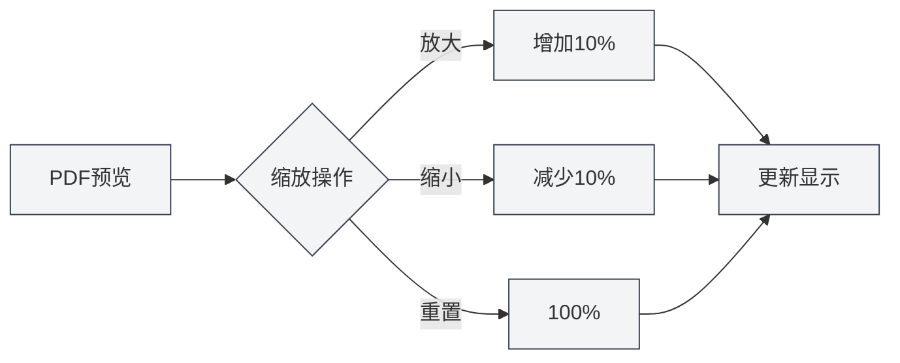

# PDF预览功能

## 概述

PDF预览功能允许您在编辑LaTeX文档时实时查看编译后的PDF效果。预览面板提供了丰富的交互功能，包括缩放、翻页、定位等，让您能够高效地编辑和调试LaTeX文档。

PDF预览会在LaTeX编译成功后自动显示，支持与代码编辑器的双向定位，方便您在PDF和代码之间快速切换。

<PdfPreviewPanel mode="demo" pdfUrl="" />

## PDF预览介绍

### 预览面板

PDF预览面板显示在LaTeX编辑器的右侧或下方，包含：

- **PDF内容区域**：显示PDF页面内容
- **工具栏**：提供缩放、翻页、刷新等操作按钮
- **页面信息**：显示当前页码和总页数

PDF预览面板界面如下：

<PdfPreviewPanel mode="demo" pdfUrl="" />

<LaTeXCompilerPanel mode="demo" />

### 自动显示

PDF预览会在以下情况自动显示：

- **编译成功**：LaTeX编译成功后自动显示PDF预览
- **打开文档**：打开已有PDF的LaTeX文档时自动显示预览
- **手动打开**：点击工具栏的"预览"按钮手动打开预览

<PdfPreviewPanel mode="demo" pdfUrl="" />

## PDF缩放

### 放大PDF

放大PDF预览：

- **工具栏按钮**：点击工具栏的"放大"按钮（+图标）
- **鼠标滚轮**：按住`Ctrl`键并滚动鼠标滚轮向上
- **快捷键**：`Ctrl+=`（如果配置了）

每次放大增加10%的缩放比例。

<LaTeXEditorDemo mode="demo" />

### 缩小PDF

缩小PDF预览：

- **工具栏按钮**：点击工具栏的"缩小"按钮（-图标）
- **鼠标滚轮**：按住`Ctrl`键并滚动鼠标滚轮向下
- **快捷键**：`Ctrl+-`（如果配置了）

每次缩小减少10%的缩放比例。

### 重置缩放

重置PDF缩放到100%：

- **工具栏按钮**：点击工具栏的"重置缩放"按钮
- **快捷键**：`Ctrl+0`（如果配置了）

### 缩放范围

PDF缩放支持的范围：

- **最小值**：20%（0.2倍）
- **最大值**：500%（5倍）
- **默认值**：100%（1倍）

缩放比例会自动限制在有效范围内。

<PdfPreviewPanel mode="demo" pdfUrl="" />

## PDF刷新

### 手动刷新

手动刷新PDF预览：

- **工具栏按钮**：点击工具栏的"刷新"按钮
- **快捷键**：`F5`（如果配置了）

刷新会重新加载PDF文件，显示最新的编译结果。

### 自动刷新

PDF预览会在以下情况自动刷新：

- **编译成功**：LaTeX编译成功后自动刷新预览
- **PDF文件更新**：检测到PDF文件更新时自动刷新

### 刷新时机

建议在以下情况刷新PDF：

- **修改代码后**：修改LaTeX代码并重新编译后
- **预览异常**：PDF预览显示异常或内容不正确时
- **长时间编辑**：长时间编辑后需要查看最新效果时

<LaTeXEditorDemo mode="demo" />

## PDF定位到代码

### 从PDF定位到代码

在PDF预览中点击某个位置，编辑器会自动跳转到对应的LaTeX代码位置：

1. **点击PDF位置**：在PDF预览中点击要查看的位置
2. **自动跳转**：编辑器自动跳转到对应的LaTeX代码
3. **高亮显示**：对应的代码行会高亮显示

这个功能让您能够快速从PDF效果定位到源代码，方便调试和修改。

<PdfPreviewPanel mode="demo" pdfUrl="" />

### 从代码定位到PDF

在LaTeX编辑器中，您可以：

1. **选中代码**：选中要查看的LaTeX代码
2. **右键菜单**：右键选择"定位到PDF"
3. **跳转预览**：PDF预览自动跳转到对应位置

### 双向定位

PDF和代码之间的双向定位功能：

- **PDF → 代码**：点击PDF位置跳转到代码
- **代码 → PDF**：选中代码跳转到PDF位置
- **同步滚动**：支持PDF和代码的同步滚动

<ConsoleTerminal mode="demo" consoleKey="demo" :history='[{"content": "PDF页面导航...", "type": "out"}]' />

## PDF页面导航

### 翻页操作

PDF预览支持以下翻页操作：

- **上一页**：点击工具栏的"上一页"按钮，或使用方向键
- **下一页**：点击工具栏的"下一页"按钮，或使用方向键
- **跳转到页面**：在页码输入框中输入页码并回车

### 页面信息

PDF预览显示以下页面信息：

- **当前页码**：显示当前查看的页码
- **总页数**：显示PDF的总页数
- **页码输入框**：可以直接输入页码跳转

### 多页显示

PDF预览支持多页显示模式：

- **单页模式**：一次显示一页
- **多页模式**：一次显示多页（在主页预览中）

多页模式适合快速浏览整个文档。

<PdfPreviewPanel mode="demo" pdfUrl="" />

## PDF保存

### 保存PDF

保存当前PDF文件：

- **工具栏按钮**：点击工具栏的"保存"按钮
- **菜单**：点击"文件" → "保存PDF"
- **快捷键**：`Ctrl+S`（如果PDF是当前活动文档）

保存PDF会将PDF文件保存到文档同目录下。

### 打开PDF目录

打开PDF文件所在的目录：

- **工具栏按钮**：点击工具栏的"打开目录"按钮
- **菜单**：点击"文件" → "打开PDF目录"

打开目录后，您可以在文件管理器中查看和管理PDF文件。

<LaTeXEditorDemo mode="demo" />

## PDF交互模式

### 指针模式

指针模式是默认的交互模式：

- **选择文本**：可以选中PDF中的文本
- **复制文本**：可以复制选中的文本
- **点击定位**：点击PDF位置可以定位到代码

### 手型模式

手型模式用于拖拽PDF：

- **拖拽PDF**：按住鼠标左键拖拽PDF内容
- **移动视图**：移动PDF视图位置
- **适合大PDF**：适合查看大尺寸的PDF

切换模式：

- **工具栏按钮**：点击工具栏的模式切换按钮
- **快捷键**：`H`键切换手型模式

## 使用技巧

### 高效预览

1. **使用缩放**：根据内容调整合适的缩放比例
2. **使用定位**：使用定位功能快速切换代码和PDF
3. **使用刷新**：修改代码后及时刷新查看效果

### 调试技巧

1. **定位错误**：从PDF定位到代码，快速找到问题位置
2. **对比效果**：对比PDF效果和代码，检查格式是否正确
3. **多页浏览**：使用多页模式快速浏览整个文档

### 性能优化

1. **合理缩放**：不要使用过大的缩放比例
2. **关闭预览**：不需要时关闭预览面板节省资源
3. **刷新策略**：根据需要选择自动或手动刷新

## 常见问题

### Q: PDF预览不显示？

A: 确保LaTeX文档已成功编译。如果编译失败，PDF预览不会显示。检查控制台输出的错误信息。

### Q: PDF预览不更新？

A: 点击"刷新"按钮手动刷新预览，或重新编译LaTeX文档。确保PDF文件已成功生成。

### Q: 如何从PDF定位到代码？

A: 在PDF预览中点击要查看的位置，编辑器会自动跳转到对应的LaTeX代码。

### Q: 如何从代码定位到PDF？

A: 选中LaTeX代码，右键选择"定位到PDF"，PDF预览会自动跳转到对应位置。

### Q: PDF缩放不生效？

A: 确保PDF预览面板已加载完成。如果问题持续，尝试刷新PDF预览。

## 相关文档

- [[latex.compilation|LaTeX编译与预览]]
- [[latex.editor|LaTeX编辑器使用指南]]
- [[latex.console|控制台输出]]

<LaTeXCompilerPanel mode="demo" />

<LaTeXEditorDemo mode="demo" />

<ConsoleTerminal mode="demo" consoleKey="demo" :history='[{"content": "编译日志...", "type": "out"}]' />
