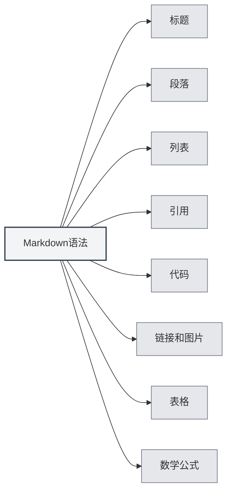

# Markdown语法

## 概述

Markdown是一种轻量级标记语言，允许您使用易读易写的纯文本格式编写文档。MetaDoc提供了完整的Markdown编辑和预览支持。

<ViewMenuItemsDemo mode="demo" :items='["outline", "preview"]' />

## 基本语法

### 标题

使用 `#` 符号创建标题，`#` 的数量表示标题级别：

```markdown
# 一级标题

## 二级标题

### 三级标题
```



### 段落

段落之间使用空行分隔。

### 列表

**无序列表**使用 `-`、`*` 或 `+`：

```markdown
- 项目1
- 项目2
- 项目3
```

**有序列表**使用数字：

```markdown
1. 第一项
2. 第二项
3. 第三项
```

### 引用

使用 `>` 创建引用：

```markdown
> 这是一段引用文字
```

### 代码

**行内代码**使用反引号：

```markdown
使用 `console.log()` 输出内容
```

**代码块**使用三个反引号：

````markdown
```javascript
function hello() {
  console.log('Hello, World!')
}
```
````

### 链接和图片

**链接**：

```markdown
[链接文本](https://example.com)
```

**图片**：

```markdown

```

### 表格

```markdown
| 列1   | 列2   | 列3   |
| ----- | ----- | ----- |
| 数据1 | 数据2 | 数据3 |
```

## 数学公式

### 行内公式

使用 `$` 包裹：

```markdown
这是行内公式：$E = mc^2$
```

### 块级公式

使用 `$$` 包裹：

```markdown
$$
\int_{-\infty}^{\infty} e^{-x^2} dx = \sqrt{\pi}
$$
```

## 高级功能

### LaTeX公式转换

MetaDoc支持将Markdown中的数学公式转换为LaTeX格式。详见[[latex.basics|LaTeX语法]]。

### 图表支持

MetaDoc支持多种图表格式：

- [[charts.mermaid|Mermaid图表]]
- [[charts.plantuml|PlantUML图表]]
- [[charts.echarts|ECharts图表]]

## 相关文档

- [[markdown.editor|Markdown编辑器使用指南]]
- [[markdown.advanced|Markdown高级功能]]
- [[markdown.features|Markdown编辑器功能]]
- [[core.editor-basics|编辑器基础操作]]

<LaTeXEditorDemo mode="demo" />

<Outline mode="demo" />

<ViewMenuItemsDemo mode="demo" :items='["outline"]' />

<MenuItemsDemo mode="demo" :items='[{"id": "file", "items": ["new", "open", "save"]}]' />

<TitleMenu mode="demo" title="Markdown文档示例" path="1" :tree='{}' />

<ViewMenuItemsDemo mode="demo" :items='["editor", "preview"]' />
