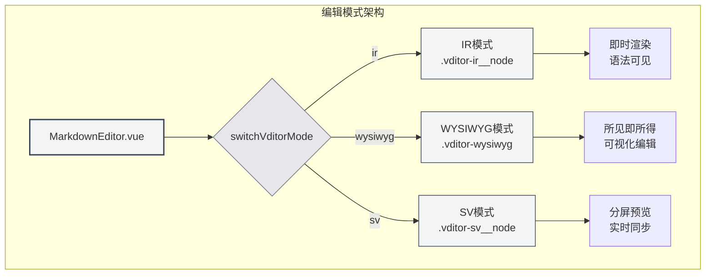
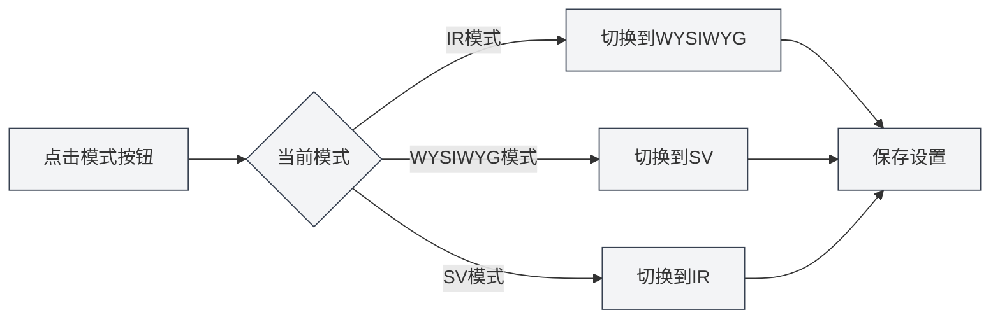
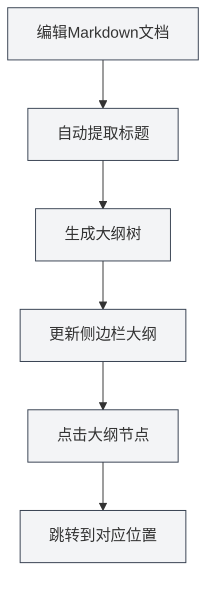
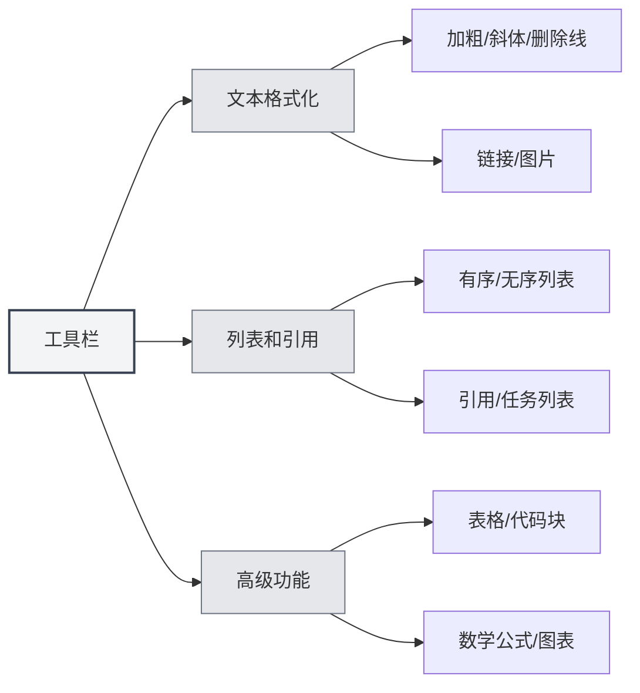

# Markdown编辑器使用指南

## 概述

MetaDoc的Markdown编辑器基于Vditor构建，通过 `editor/vditor-adapter.ts` 适配器实现统一的编辑接口。编辑器提供了强大的Markdown编辑和预览功能，支持三种编辑模式，实时预览，以及丰富的格式化工具，让您能够高效地编写和编辑Markdown文档。

**技术实现**：
- **适配器模式**：`VditorTextEditorAdapter` 实现 `TextEditorAdapter` 接口（定义于 `text-editor-types.ts`）
- **视图组件**：`views/MarkdownEditor.vue` (1400+行代码)
- **编辑模式**：IR（即时渲染）、WYSIWYG（所见即所得）、SV（分屏预览）
- **大纲同步**：基于防抖机制（200ms）自动同步文档大纲

## Vditor编辑器架构

### 整体架构

```
MarkdownEditor.vue (视图层)
    ↓
VditorTextEditorAdapter (适配器层)
    ↓
Vditor Editor (编辑器核心)
    ↓
DOM操作 + Markdown渲染
```

**核心文件**：
- `src/renderer/src/editor/vditor-adapter.ts` - Vditor适配器实现 (1472行)
- `src/renderer/src/editor/text-editor-types.ts` - 统一接口定义 (243行)
- `src/renderer/src/views/MarkdownEditor.vue` - Markdown编辑器视图 (1400+行)

### Vditor编辑器特点

Vditor是一款所见即所得的Markdown编辑器，具有以下特点：

- **多模式支持**：提供IR、WYSIWYG、SV三种编辑模式
- **实时预览**：编辑时实时显示渲染效果
- **语法高亮**：代码块支持语法高亮
- **数学公式**：支持LaTeX数学公式渲染
- **工具栏**：提供丰富的格式化工具
- **AI补全**：集成AI自动补全功能（基于 `AISuggestionGhost.vue`）
- **大纲同步**：自动提取文档大纲结构

## 编辑模式切换

Vditor提供三种编辑模式，通过 `switchVditorMode()` 函数实现模式切换。每种模式适合不同的使用场景：



### 三种模式的DOM结构差异

根据代码实现（`MarkdownEditor.vue` 第1261-1293行），三种模式在DOM结构上有明显差异：

| 模式 | DOM选择器 | 特点 |
|------|-----------|------|
| **IR模式** | `.vditor-ir__node` | 包裹标题元素，语法标记可见 |
| **WYSIWYG模式** | `.vditor-wysiwyg .vditor-reset` | 直接操作H1-H6标签 |
| **SV模式** | `.vditor-sv__node` | 源码和预览分屏显示 |

### IR模式（即时渲染）

IR模式是默认的编辑模式，特点：

- **即时渲染**：输入Markdown语法后立即显示渲染效果
- **语法可见**：可以看到Markdown语法标记
- **编辑友好**：适合熟悉Markdown语法的用户
- **性能优秀**：渲染速度快，适合编辑长文档

**适用场景**：
- 熟悉Markdown语法的用户
- 需要看到语法标记的场景
- 编辑长文档

### WYSIWYG模式（所见即所得）

WYSIWYG模式提供类似Word的编辑体验：

- **可视化编辑**：直接编辑渲染后的内容
- **无需语法**：不需要输入Markdown语法标记
- **直观操作**：通过工具栏按钮进行格式化
- **易于上手**：适合不熟悉Markdown语法的用户

**适用场景**：
- 不熟悉Markdown语法的用户
- 需要可视化编辑的场景
- 快速格式化文档

### SV模式（分屏预览）

SV模式同时显示编辑区和预览区：

- **分屏显示**：左侧编辑区，右侧预览区
- **实时同步**：编辑时预览区实时更新
- **对比查看**：可以同时看到源码和效果
- **适合校对**：方便检查格式是否正确

**适用场景**：
- 需要同时查看源码和预览效果
- 校对和检查文档格式
- 学习Markdown语法

### 切换编辑模式

切换编辑模式的方法：

1. **工具栏按钮**：点击工具栏中的模式切换按钮
2. **循环切换**：点击模式按钮会在三种模式间循环切换
3. **设置保存**：切换后的模式会自动保存，下次打开文档时恢复



## 实时预览功能

### 预览模式

Markdown编辑器支持实时预览：

- **自动预览**：编辑时自动更新预览
- **预览区域**：在预览模式下显示渲染后的内容
- **同步滚动**：预览区域与编辑区域同步滚动（如果支持）

### 预览内容

预览功能支持：

- **文本格式化**：标题、段落、列表、引用等
- **代码高亮**：代码块语法高亮显示
- **数学公式**：LaTeX数学公式渲染
- **表格**：表格格式化显示
- **图片**：图片显示和缩放
- **链接**：链接可点击跳转

## 大纲同步

### 自动提取大纲

编辑器通过 `syncOutlineFromMarkdown()` 函数自动从文档中提取大纲结构。该功能基于防抖机制（200ms延迟）实现性能优化：

**实现代码**（`MarkdownEditor.vue` 第285-298行）：
```typescript
const syncOutlineFromMarkdown = debounce(() => {
  const outline = extractOutlineTreeFromMarkdown(currentMarkdown.value)
  currentOutline.value = outline
}, 200)
```

**功能特点**：
- **标题识别**：自动识别H1-H6级别的标题
- **大纲树**：生成文档的大纲树结构
- **实时更新**：编辑时自动更新大纲（200ms防抖）
- **提取函数**：`extractOutlineTreeFromMarkdown()` 解析Markdown源码生成树形结构

### 大纲导航

大纲视图提供以下功能：

- **快速跳转**：点击大纲节点跳转到对应位置
- **结构预览**：查看文档的整体结构
- **层级显示**：显示标题的层级关系

您可以通过侧边栏访问大纲视图：

<ViewMenuItemsDemo mode="demo" :items='["editor", "outline"]' />



大纲功能详见[[outline.basics|大纲视图功能]]。

您可以通过侧边栏访问大纲视图，侧边栏包含编辑器、大纲等视图切换选项：

<ViewMenuItemsDemo mode="demo" :items='["editor", "outline"]' />

## 工具栏功能

Markdown编辑器提供丰富的工具栏按钮，位于编辑器顶部：



### 文本格式化

- **加粗**：`Ctrl+B` 或点击工具栏按钮
- **斜体**：`Ctrl+I` 或点击工具栏按钮
- **删除线**：点击工具栏按钮
- **代码**：行内代码格式化
- **链接**：`Ctrl+K` 插入链接
- **图片**：插入图片

### 列表和引用

- **无序列表**：插入无序列表
- **有序列表**：插入有序列表
- **引用**：插入引用块
- **任务列表**：插入任务列表

### 高级功能

- **表格**：插入表格
- **代码块**：插入代码块
- **数学公式**：插入数学公式
- **图表**：插入Mermaid、PlantUML等图表

## 快捷键

### 格式化快捷键

| 操作 | 快捷键 |
|------|--------|
| 加粗 | `Ctrl+B` |
| 斜体 | `Ctrl+I` |
| 插入链接 | `Ctrl+K` |
| 插入代码 | `Ctrl+Shift+K` |

### 编辑快捷键

| 操作 | 快捷键 |
|------|--------|
| 撤销 | `Ctrl+Z` |
| 重做 | `Ctrl+Y` |
| 复制 | `Ctrl+C` |
| 粘贴 | `Ctrl+V` |
| 全选 | `Ctrl+A` |
| 查找 | `Ctrl+F` |

## 使用技巧

### 快速输入

1. **标题**：输入 `#` 后按空格，自动创建标题
2. **列表**：输入 `-` 或 `*` 后按空格，自动创建列表
3. **代码块**：输入三个反引号 `` ``` `` 后按回车
4. **表格**：使用工具栏按钮快速插入表格

### 格式化技巧

1. **选中文本格式化**：选中文本后点击工具栏按钮或使用快捷键
2. **批量格式化**：使用查找替换功能批量修改格式
3. **代码高亮**：代码块后指定语言名称，如 ````javascript`

### 预览技巧

1. **切换预览**：使用模式切换查看预览效果
2. **检查格式**：在SV模式下对比源码和预览效果
3. **数学公式**：使用 `$` 和 `$$` 插入行内和块级公式

## 常见问题

### Q: 如何插入图片？

A: 点击工具栏的图片按钮，或使用Markdown语法 ``。支持上传图片到服务器或保存到本地。

### Q: 如何插入表格？

A: 点击工具栏的表格按钮，或使用Markdown表格语法。编辑器会自动格式化表格。

### Q: 数学公式不显示？

A: 确保使用正确的语法：行内公式使用 `$公式$`，块级公式使用 `$$公式$$`。

### Q: 如何切换编辑模式？

A: 点击工具栏中的模式切换按钮，会在IR、WYSIWYG、SV三种模式间循环切换。

### Q: 大纲不更新？

A: 大纲会自动更新，如果未更新，尝试切换编辑模式或刷新文档。

## 相关文档

- [[markdown.basics|Markdown语法]]
- [[markdown.features|Markdown编辑器功能]]
- [[core.editor-basics|编辑器基础操作]]
- [[core.editor-settings|编辑器设置]]
- [[outline.basics|大纲视图功能]]
