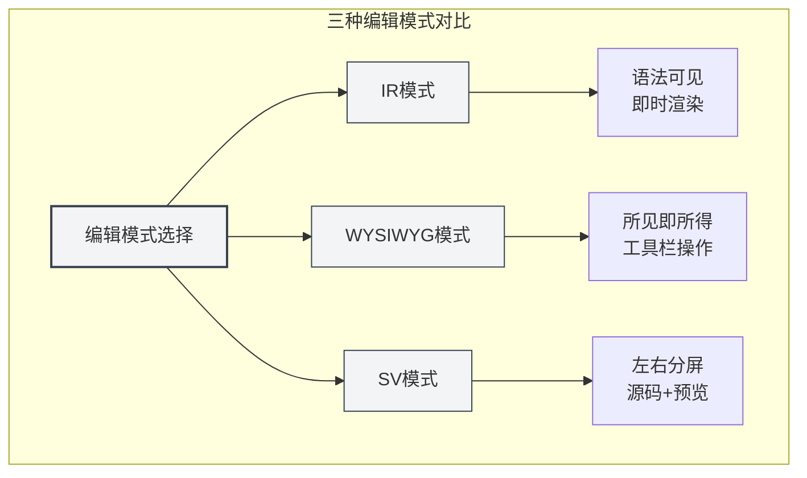
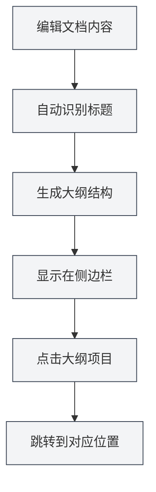

# Markdown编辑器使用指南

## 概述

MetaDoc 的 Markdown 编辑器为您提供了一个专业而优雅的写作环境。它不仅仅是一个文本输入框，而是一个深度优化的创作空间——支持三种灵活的编辑模式、实时的内容预览、以及丰富的排版工具，让您可以专注于内容本身，而不必为格式操心。

无论您是在撰写技术博客、整理学习笔记，还是编写项目文档，这个编辑器都能满足您的需求。特别是它深度集成的 AI 能力，能够在您写作时提供智能补全和建议，让创作变得更加流畅。

## 三种编辑模式

MetaDoc 理解不同用户有不同的编辑习惯，因此提供了三种编辑模式供您选择：

### IR 模式（即时渲染）

这是默认的编辑模式，也是大多数 Markdown 用户的首选。在这个模式下：

- **即时反馈**：您输入 Markdown 语法的同时，内容会立即显示为格式化后的样子
- **语法可见**：Markdown 标记符号（如 `#`、` **`）依然可见，方便您精确控制格式
- **编辑流畅**：渲染速度快，即使编辑长文档也不会感到卡顿
- **学习友好**：对于正在学习 Markdown 语法的用户，可以即时看到语法和效果的对应关系

**适用场景**：

- 熟悉 Markdown 语法的用户
- 需要精确控制文档格式的场景
- 编辑较长的技术文档或博客文章

### WYSIWYG 模式（所见即所得）

如果您更习惯类似 Word 的编辑体验，这个模式会让您感到亲切：

- **直接编辑**：您看到的就是最终效果，直接点击即可编辑
- **无需记忆语法**：通过工具栏按钮完成加粗、标题、列表等操作
- **直观操作**：选中文本后点击按钮即可应用格式
- **降低门槛**：不熟悉 Markdown 语法的用户也能快速上手

**适用场景**：

- 初次接触 Markdown 的用户
- 需要快速排版、不关注底层语法的场景
- 更习惯可视化编辑的用户

### SV 模式（分屏预览）

这个模式将编辑区域一分为二：

- **左右对照**：左侧显示 Markdown 源码，右侧显示渲染效果
- **实时同步**：在左侧编辑时，右侧会即时更新预览
- **学习利器**：可以同时看到语法和最终效果，加深对 Markdown 的理解
- **精确校对**：方便检查复杂格式（如表格、嵌套列表）是否正确

**适用场景**：

- 学习 Markdown 语法的用户
- 需要同时查看源码和效果进行校对
- 编辑包含复杂格式的文档



### 如何切换模式

切换编辑模式非常简单：

1. **工具栏按钮**：在编辑器顶部的工具栏中，找到模式切换按钮
2. **循环切换**：点击按钮会在三种模式间循环切换
3. **记忆偏好**：系统会记住您最后使用的模式，下次打开文档时自动恢复


## 实时预览

MetaDoc 的实时预览功能让写作成为一种享受：

- **自动渲染**：您在左侧输入内容，右侧（或下方）立即显示渲染效果
- **完整支持**：从基础的标题、列表，到复杂的数学公式、图表，都能正确渲染
- **代码高亮**：代码块会根据语言类型自动进行语法高亮，让代码更易读
- **数学公式**：支持 LaTeX 语法的数学公式，无论是行内公式 `$E=mc^2$` 还是独立公式块，都能完美显示
- **图片自适应**：插入的图片会自动适应编辑器宽度，点击可以放大查看

## 大纲同步

在长文档中导航从未如此简单：

- **自动提取**：编辑器会自动识别文档中的标题，生成层级分明的大纲
- **实时更新**：当您添加、修改或删除标题时，大纲会同步更新
- **一键跳转**：点击大纲中的任意标题，编辑器会立即跳转到对应位置
- **结构预览**：通过大纲可以快速了解整篇文档的结构框架

您可以通过侧边栏访问大纲视图：

<ViewMenuItemsDemo mode="demo" :items='["editor", "outline"]' />



大纲功能的详细介绍请查看[[outline.basics|大纲视图功能]]。

## 工具栏功能

编辑器顶部的工具栏汇集了最常用的排版功能：


### 文本格式化

- **加粗**（`Ctrl+B`）：让重点内容更醒目
- **斜体**（`Ctrl+I`）：用于强调或表示特殊含义
- **删除线**：表示废弃或修改的内容
- **行内代码**：标记代码片段或技术术语
- **链接**（`Ctrl+K`）：插入可点击的超链接
- **图片**：插入本地图片或网络图片

### 列表与引用

- **无序列表**：用项目符号列举内容
- **有序列表**：用数字编号列举内容
- **引用块**：引用他人的观点或重要提示
- **任务列表**：带复选框的待办事项列表

### 高级元素

- **表格**：创建结构化的数据表格，支持对齐和嵌套
- **代码块**：插入多行代码，支持数十种编程语言的语法高亮
- **数学公式**：使用 LaTeX 语法插入数学公式
- **图表**：插入 Mermaid、PlantUML、ECharts 等图表

## 快捷键

熟练使用快捷键可以大幅提升写作效率：

### 格式化快捷键

| 操作     | Windows/Linux  | macOS         |
| -------- | -------------- | ------------- |
| 加粗     | `Ctrl+B`       | `Cmd+B`       |
| 斜体     | `Ctrl+I`       | `Cmd+I`       |
| 插入链接 | `Ctrl+K`       | `Cmd+K`       |
| 插入代码 | `Ctrl+Shift+K` | `Cmd+Shift+K` |

### 编辑快捷键

| 操作 | Windows/Linux | macOS         |
| ---- | ------------- | ------------- |
| 撤销 | `Ctrl+Z`      | `Cmd+Z`       |
| 重做 | `Ctrl+Y`      | `Cmd+Shift+Z` |
| 全选 | `Ctrl+A`      | `Cmd+A`       |
| 查找 | `Ctrl+F`      | `Cmd+F`       |

## 使用技巧

### 快速输入

1. **快速创建标题**：输入 `#` 后按空格，自动转为标题格式
2. **快速创建列表**：输入 `-` 或 `*` 后按空格，自动转为列表项
3. **快速插入代码块**：输入三个反引号 ` ``` ` 后按回车
4. **快速插入分隔线**：输入三个减号 `---` 后按回车

### 格式化技巧

1. **选中文本后格式化**：先选中文本，再点击工具栏按钮或使用快捷键
2. **批量替换**：使用查找替换功能（`Ctrl+H`）批量修改格式
3. **代码高亮**：在代码块的第一行指定语言，如 ````python`

### 预览技巧

1. **模式切换预览**：在 SV 模式下可以同时看到源码和效果
2. **数学公式预览**：输入 `$` 包裹公式，实时查看渲染效果
3. **图表实时渲染**：Mermaid 图表会在编辑完成后自动渲染

## 常见问题

### Q: 如何插入图片？

A: 有三种方式：

1. 点击工具栏的图片按钮
2. 使用快捷键 `Ctrl+Shift+I`
3. 直接粘贴剪贴板中的图片

图片可以保存在本地文档目录，也可以上传到图床。

### Q: 如何创建表格？

A: 推荐使用工具栏的表格按钮，可视化创建表格。也可以手动输入 Markdown 表格语法：

```markdown
| 列1  | 列2  | 列3  |
| ---- | ---- | ---- |
| 内容 | 内容 | 内容 |
```

### Q: 数学公式不显示怎么办？

A: 检查语法是否正确：

- 行内公式：用单个 `$` 包裹，如 `$E=mc^2$`
- 独立公式：用两个 `$$` 包裹，独占一行

### Q: 如何查看文档大纲？

A: 点击侧边栏的"大纲"图标，或按快捷键切换到大纲视图。文档中的标题会自动提取为大纲。

### Q: 编辑模式切换后内容会丢失吗？

A: 不会。三种模式共享同一个文档内容，切换模式只是改变了显示和编辑方式，内容完全保留。

## 相关文档

- [[markdown.basics|Markdown语法]] - 学习 Markdown 基础语法
- [[markdown.features|Markdown编辑器功能]] - 了解更多高级功能
- [[core.editor-basics|编辑器基础操作]] - 通用编辑技巧
- [[core.editor-settings|编辑器设置]] - 个性化配置
- [[outline.basics|大纲视图功能]] - 深度了解大纲功能
