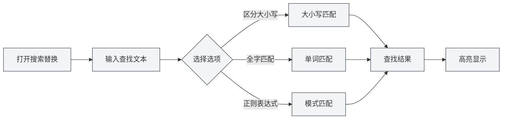
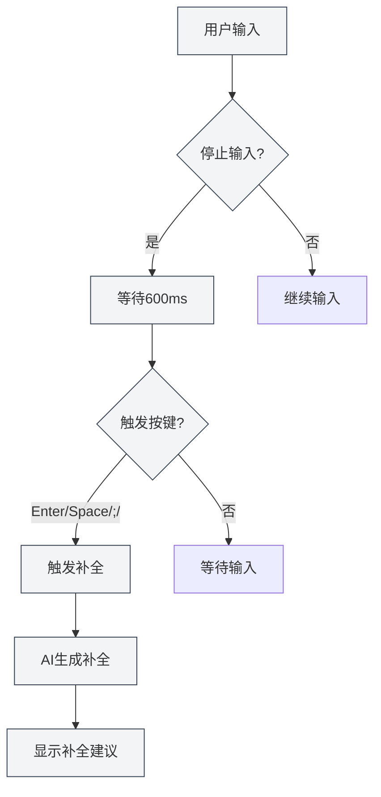

# Markdown编辑器功能

## 概述

Markdown编辑器提供了丰富的功能，包括搜索替换、右键菜单、AI自动补全、知识库集成等。这些功能能显著提高您的编辑效率和文档质量。

本文档介绍Markdown编辑器的各项功能及其使用方法。

## 搜索替换

### 打开搜索替换

有多种方式可以打开搜索替换功能：

- **快捷键**：`Ctrl+F` 打开查找，`Ctrl+H` 打开查找替换
- **菜单**：点击"编辑" → "查找" 或 "查找替换"
- **工具栏**：点击工具栏中的搜索图标

您可以通过顶部菜单栏的文件菜单访问文件操作，通过编辑菜单访问编辑功能：

<MenuItemsDemo mode="demo" :items='[{"id": "file", "items": ["new", "open", "save"]}]' />

### 查找功能

查找功能支持以下选项：

- **区分大小写**：只匹配大小写完全相同的文本
- **全字匹配**：只匹配完整的单词（不匹配单词的一部分）
- **正则表达式**：使用正则表达式进行模式匹配
- **保留大小写**：替换时保留原文本的大小写格式

搜索替换菜单界面如下：

<SearchReplaceMenu mode="demo" :position='{"top": 100, "left": 200}' :adapter='null' />

### 替换功能

替换功能支持：

- **单个替换**：逐个替换匹配的文本
- **全部替换**：一次性替换所有匹配的文本
- **替换预览**：在替换前预览替换结果

### 匹配列表

搜索替换面板会显示匹配列表：

- **显示位置**：显示每个匹配项的行号和列号
- **上下文预览**：显示匹配项的上下文内容
- **快速跳转**：点击匹配项可以快速跳转到对应位置

### 使用技巧

1. **正则表达式**：使用正则表达式可以实现复杂的查找替换模式
2. **批量替换**：使用"全部替换"可以快速批量修改文档
3. **保留格式**：使用"保留大小写"选项可以保持原文本的大小写格式

## 右键菜单

### 基本编辑操作

右键菜单提供以下基本编辑操作：

- **剪切**：`Ctrl+X` 或右键选择"剪切"
- **复制**：`Ctrl+C` 或右键选择"复制"
- **粘贴**：`Ctrl+V` 或右键选择"粘贴"
- **全选**：`Ctrl+A` 或右键选择"全选"

### AI功能

右键菜单提供以下AI功能：

- **AI分析**：分析当前文档内容，打开AI对话窗口
- **段落优化**：优化当前段落的内容
- **插入图表**：使用AI生成图表代码并插入文档

### 功能开关

右键菜单可以快速开关以下功能：

- **AI自动补全**：启用/关闭AI自动补全功能
- **知识库集成**：启用/关闭知识库集成功能

### 手动触发补全

右键菜单提供"手动触发补全"选项：

- **快捷键**：`Shift+Tab`
- **右键菜单**：右键选择"手动触发补全"

手动触发补全会立即启动AI补全，无需等待自动触发。

## AI自动补全

### 启用/关闭

AI自动补全功能可以在以下位置启用或关闭：

- **右键菜单**：右键选择"启用/关闭AI自动补全"
- **设置页面**：在设置中配置AI自动补全选项

### 自动触发

AI自动补全会在以下情况自动触发：

- **输入停止**：停止输入600ms后自动触发
- **触发按键**：输入特定按键后触发（Enter、Space、`;`、`,`）

### 手动触发

手动触发补全的方式：

- **快捷键**：`Shift+Tab`
- **右键菜单**：右键选择"手动触发补全"

手动触发会立即启动补全，跳过自动触发的延迟。

### 补全模式

AI自动补全支持两种模式：

- **完全生成**：生成完整的补全内容
- **部分生成**：只生成部分内容（根据设置）

补全模式可以在设置中配置。

### 触发按键设置

补全触发按键可以在设置中配置：

- **Enter**：回车键触发
- **Space**：空格键触发
- **;**：分号触发
- **,**：逗号触发

可以同时启用多个触发按键。

### 补全最大Token数

补全最大Token数可以在设置中配置：

- **最小值**：20 Token
- **最大值**：无限制（设置为0表示无限制）
- **默认值**：50 Token

Token数越大，补全的内容越多，但生成时间也会更长。

### 接受补全

补全建议显示后，可以：

- **Tab键**：接受补全建议
- **Esc键**：取消补全建议
- **继续输入**：取消补全并继续输入

<TitleMenu mode="demo" title="Markdown编辑器示例" :position='{"top": 100, "left": 200}' path="1" :tree='{}' />

<SectionOptimizer mode="demo" title="段落优化示例" :position='{"top": 100, "left": 200}' path="1" :tree='{}' language="markdown" :adapter='null' />

<MainTabs mode="demo" />

<AIChat mode="demo" />

<KnowledgeBase mode="demo" />

<ProofreadView mode="demo" />

<QuickStartMarkdown mode="demo" />

<MenuItemsDemo mode="demo" :items='[{"id": "settings"}]' />

<ViewMenuItemsDemo mode="demo" :items='["editor", "outline", "agent"]' />

## 知识库集成

### 启用/关闭

知识库集成功能可以在以下位置启用或关闭：

- **右键菜单**：右键选择"启用/关闭知识库"
- **设置页面**：在设置中配置知识库选项

### 上下文检索

启用知识库集成后，AI功能会自动检索知识库中的相关内容：

- **AI补全**：补全时会参考知识库中的相关内容
- **AI分析**：分析文档时会使用知识库中的知识
- **段落优化**：优化段落时会参考知识库中的内容

### 检索原理

知识库检索使用向量搜索技术：

- **语义匹配**：根据语义相似度匹配相关内容
- **关键词匹配**：同时使用关键词匹配提高准确性
- **混合检索**：结合向量搜索和关键词匹配

### 置信度阈值

知识库检索支持设置置信度阈值：

- **阈值范围**：0.0 - 1.0
- **默认值**：0.5
- **作用**：只返回相似度高于阈值的内容

置信度阈值可以在设置中配置，详见[[knowledge-base.config|知识库配置]]。

## 功能组合使用

### 搜索替换 + AI补全

结合使用搜索替换和AI补全：

1. 使用搜索替换查找需要修改的内容
2. 使用AI补全生成新的内容
3. 使用替换功能批量更新

### 右键菜单 + 知识库

结合使用右键菜单和知识库：

1. 启用知识库集成
2. 使用右键菜单的AI功能
3. AI功能会自动使用知识库中的内容

### AI分析 + 段落优化

结合使用AI分析和段落优化：

1. 使用AI分析了解文档内容
2. 使用段落优化改进特定段落
3. 根据AI分析的建议进行优化

<GraphWindow mode="demo" />

<OcrWindow mode="demo" />

<DataAnalysisWindow mode="demo" />

## 使用技巧

### 提高补全质量

1. **启用知识库**：启用知识库集成可以提高补全质量
2. **调整Token数**：根据需求调整补全最大Token数
3. **手动触发**：需要时使用手动触发获得更好的补全效果

### 高效搜索替换

1. **使用正则表达式**：复杂模式使用正则表达式
2. **预览替换**：替换前预览替换结果
3. **批量操作**：使用"全部替换"快速批量修改

### 知识库使用

1. **添加相关文档**：将相关文档添加到知识库
2. **调整置信度**：根据需求调整置信度阈值
3. **定期更新**：定期更新知识库内容

## 常见问题

### Q: AI补全不显示？

A: 检查AI自动补全是否启用，确保LLM配置正确。尝试手动触发补全（`Shift+Tab`）。

### Q: 搜索替换找不到内容？

A: 检查是否启用了"区分大小写"或"全字匹配"选项。如果使用正则表达式，检查表达式是否正确。

### Q: 知识库集成不生效？

A: 检查知识库是否启用，确保知识库中有相关文档。调整置信度阈值可能有助于检索到更多内容。

### Q: 如何关闭AI补全？

A: 右键菜单选择"关闭AI自动补全"，或在设置中关闭AI自动补全选项。

### Q: 补全内容不准确？

A: 尝试启用知识库集成，调整补全最大Token数，或使用手动触发获得更好的效果。

## 相关文档

- [[markdown.editor|Markdown编辑器使用指南]]
- [[markdown.basics|Markdown语法]]
- [[ai.completion|AI自动补全]]
- [[knowledge-base.usage|知识库使用]]
- [[core.editor-basics|编辑器基础操作]]
