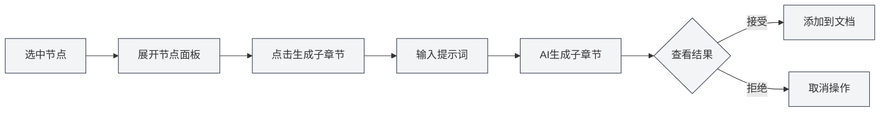
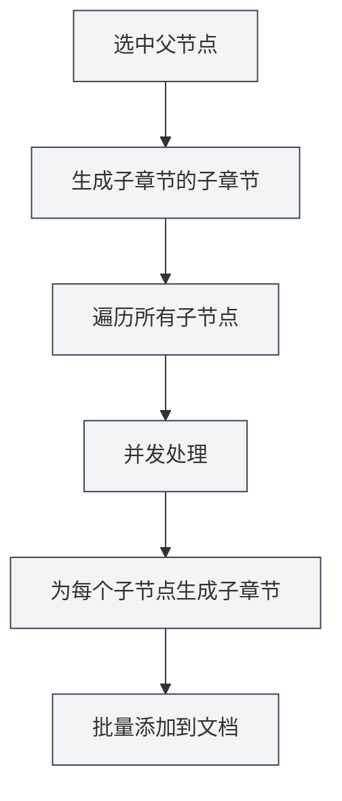

# 大纲AI功能

## 概述

大纲AI功能利用AI技术帮助您快速生成和优化文档结构。通过AI功能，您可以生成子章节、生成章节内容、优化大纲结构等，大大提高文档创作效率。

大纲AI功能支持多种操作模式，包括单个节点操作和批量操作，让您能够灵活地使用AI辅助文档创作。

## 生成子章节

### 为节点生成子章节

为指定节点生成子章节：

1. **选中节点**：在大纲视图中选中要生成子章节的节点
2. **展开节点**：点击节点展开详细面板
3. **生成子章节**：点击"生成子章节"按钮
4. **输入提示**：可选输入提示词指导AI生成
5. **等待生成**：AI会根据节点标题和内容生成子章节
6. **确认接受**：查看生成结果，确认后接受

生成的子章节会自动添加到文档中，并更新大纲结构。

### 生成原理

AI生成子章节时会考虑：

- **节点标题**：根据节点标题理解章节主题
- **文档结构**：考虑文档的整体结构
- **用户提示**：根据用户提示词调整生成内容
- **格式要求**：根据文档格式（Markdown/LaTeX）生成正确的标题格式

### 使用技巧

1. **提供明确提示**：输入清晰的提示词，指导AI生成符合需求的子章节
2. **参考现有结构**：AI会参考文档的现有结构，保持风格一致
3. **多次生成**：如果不满意，可以多次生成选择最佳结果

## 生成章节内容

### 为节点生成内容

为指定节点生成正文内容：

1. **选中节点**：在大纲视图中选中要生成内容的节点
2. **展开节点**：点击节点展开详细面板
3. **生成内容**：点击"生成内容"按钮
4. **输入提示**：可选输入提示词指导AI生成
5. **设置字数**：可选设置目标字数
6. **等待生成**：AI会根据节点标题和文档结构生成内容
7. **确认接受**：查看生成结果，确认后接受

生成的内容会自动添加到文档中对应章节。

### 内容生成模式

内容生成支持以下模式：

- **完全生成**：生成完整的章节内容
- **部分生成**：只生成部分内容（根据设置）
- **追加内容**：在现有内容基础上追加新内容

### 字数控制

生成内容时可以设置目标字数：

- **设置字数**：在生成对话框中输入目标字数
- **AI调整**：AI会根据字数要求调整生成内容的详细程度
- **灵活控制**：可以根据章节重要性设置不同的字数

## 生成子章节的子章节

### 批量生成子章节

为指定节点的所有子节点批量生成子章节：

1. **选中节点**：选中要批量操作的节点
2. **展开节点**：点击节点展开详细面板
3. **生成子章节的子章节**：点击"生成子章节的子章节"按钮
4. **输入提示**：输入提示词指导AI生成
5. **等待生成**：AI会并发处理所有子节点，为每个子节点生成子章节
6. **确认接受**：查看生成结果，确认后接受

这个功能使用并发处理机制，可以快速为多个章节批量生成子章节。

### 并发处理优势

批量生成使用并发处理机制：

- **高效处理**：同时处理多个节点，速度提升数十倍
- **自动同步**：生成完成后自动同步到文档
- **进度显示**：显示每个节点的生成进度

### 使用场景

适合以下场景：

- **大规模生成**：需要为多个章节生成子章节时
- **批量操作**：一键为所有章节生成子章节
- **结构化生成**：按照大纲结构批量生成内容

## 生成子章节内容

### 批量生成内容

为指定节点的所有子节点批量生成内容：

1. **选中节点**：选中要批量操作的节点
2. **展开节点**：点击节点展开详细面板
3. **生成子章节内容**：点击"生成子章节内容"按钮
4. **输入提示**：输入提示词指导AI生成
5. **设置字数**：可选设置目标字数
6. **等待生成**：AI会并发处理所有子节点，为每个子节点生成内容
7. **确认接受**：查看生成结果，确认后接受

这个功能可以快速为整个文档的所有章节生成内容。

### 递归生成

生成子章节内容会递归处理：

- **遍历所有子节点**：递归遍历所有子节点
- **生成内容**：为每个子节点生成内容
- **保持结构**：保持文档的层级结构

### 进度跟踪

批量生成时会显示进度：

- **节点进度**：显示当前处理的节点
- **总体进度**：显示总体生成进度
- **实时更新**：实时更新生成内容

## 大纲优化

### 优化功能

大纲优化功能可以帮助您：

- **结构调整**：优化文档的结构和层级
- **标题优化**：优化标题的命名和格式
- **结构重组**：重新组织文档结构

### 优化操作

大纲优化支持以下操作：

- **移动节点**：移动节点到新位置
- **删除节点**：删除不需要的节点
- **调整层级**：调整节点的层级关系
- **合并节点**：合并相似的节点

### 使用优化

1. **分析结构**：AI会分析当前文档结构
2. **提供建议**：提供优化建议
3. **应用优化**：确认后应用优化结果

## AI功能配置

### 温度设置

AI生成时可以设置温度参数：

- **温度范围**：0.0 - 1.0
- **默认值**：根据配置
- **作用**：控制AI生成的创造性（温度越高越有创造性）

### 提示词设置

可以为每个操作设置提示词：

- **通用提示**：设置通用的提示词
- **操作提示**：为每个操作设置特定的提示词
- **字数要求**：在提示词中包含字数要求

### 格式识别

AI会自动识别文档格式：

- **Markdown格式**：生成Markdown格式的标题和内容
- **LaTeX格式**：生成LaTeX格式的标题和内容
- **自动适配**：根据文档格式自动调整生成内容

## 使用技巧

### 高效生成

1. **使用批量操作**：需要生成大量内容时，使用批量操作提高效率
2. **提供清晰提示**：输入清晰的提示词，获得更好的生成结果
3. **分步生成**：先生成结构，再生成内容，逐步完善文档

### 质量控制

1. **检查生成结果**：生成后仔细检查结果，确保符合要求
2. **多次生成**：如果不满意，可以多次生成选择最佳结果
3. **手动调整**：生成后可以手动调整和完善内容

### 结构规划

1. **先规划结构**：使用AI生成子章节规划文档结构
2. **再生成内容**：结构确定后再生成具体内容
3. **逐步完善**：逐步完善文档，不要一次性生成所有内容

## 常见问题

### Q: AI生成的内容不准确？

A: AI生成的内容仅供参考，建议生成后检查并调整。可以提供更详细的提示词获得更好的结果。

### Q: 批量生成很慢？

A: 批量生成使用并发处理，速度已经很快。如果仍然很慢，可能是网络问题或AI服务响应慢。

### Q: 如何取消生成？

A: 生成过程中可以点击"取消"按钮取消操作。已生成的内容不会丢失。

### Q: 生成的内容格式不正确？

A: AI会自动识别文档格式。如果格式不正确，检查文档格式设置，或手动调整生成的内容。

### Q: 可以修改生成的内容吗？

A: 可以。生成的内容可以随时编辑和修改。生成只是辅助创作，最终内容由您决定。

## 相关文档

- [[outline.basics|大纲视图功能]]
- [[ai.llm-config|LLM配置]]
- [[markdown.editor|Markdown编辑器使用指南]]
- [[latex.editor|LaTeX编辑器使用指南]]
