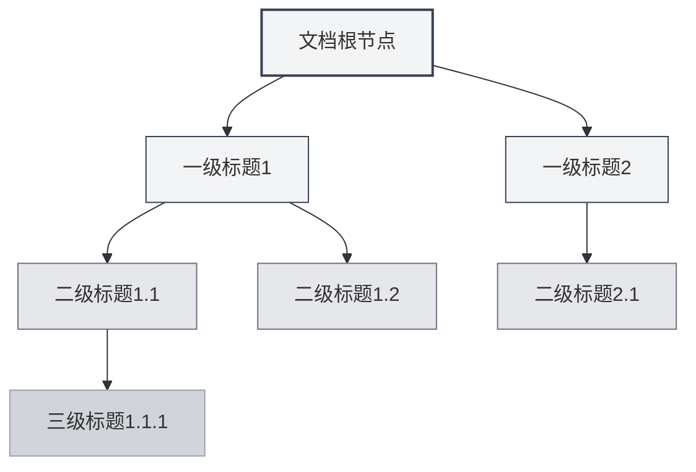
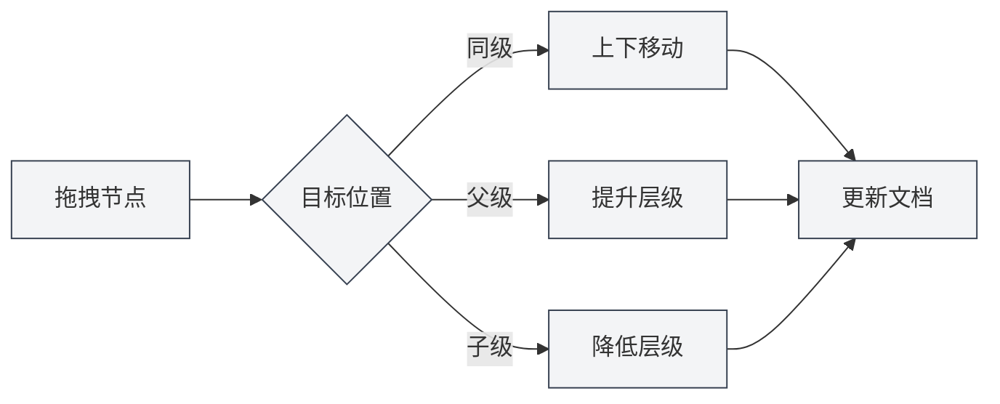

# 大纲视图功能

## 概述

大纲视图以树形结构显示文档的标题层次，帮助您快速浏览和编辑文档结构。通过大纲视图，您可以快速跳转到文档的任意位置，编辑文档结构，使用AI功能生成内容。

MetaDoc的大纲视图支持自动提取、手动编辑、拖拽排序、AI生成等功能，让您能够高效地组织和管理文档结构。

## 大纲视图介绍

### 视图位置

大纲视图通常显示在编辑器左侧或右侧的侧边栏中：

- **侧边栏**：大纲视图作为侧边栏的一部分显示
- **独立面板**：可以独立显示或隐藏大纲视图
- **宽度调整**：可以调整大纲视图的宽度

您可以通过侧边栏访问大纲视图，侧边栏提供编辑器、大纲等视图切换：

<ViewMenuItemsDemo mode="demo" :items='["editor", "outline"]' />

### 大纲结构

大纲视图以树形结构显示文档的标题层次：

- **根节点**：文档的根节点（通常不显示）
- **一级标题**：文档的一级标题（H1）
- **二级标题**：文档的二级标题（H2）
- **多级嵌套**：支持多级标题的嵌套显示

### 自动提取

大纲视图会自动从文档中提取标题结构：

- **Markdown文档**：从Markdown标题（`#`、`##`等）提取
- **LaTeX文档**：从LaTeX章节命令（`\section`、`\subsection`等）提取
- **实时更新**：编辑文档时自动更新大纲结构

## 大纲节点操作

### 添加子节点

在大纲中添加新的子节点：

1. **选中节点**：点击要添加子节点的节点
2. **添加按钮**：点击节点旁的"添加子节点"按钮（+图标）
3. **输入标题**：输入新节点的标题
4. **确认创建**：确认后创建新节点

新节点会添加到文档的对应位置，并自动更新文档内容。

### 编辑节点

编辑大纲节点的标题：

1. **选中节点**：点击要编辑的节点
2. **编辑按钮**：点击节点旁的"编辑"按钮
3. **修改标题**：修改节点标题
4. **确认保存**：确认后保存更改

编辑节点标题会自动更新文档中对应的标题。

### 删除节点

删除大纲节点：

1. **选中节点**：点击要删除的节点
2. **删除按钮**：点击节点旁的"删除"按钮
3. **确认删除**：确认后删除节点

删除节点会同时删除文档中对应的标题和内容（如果配置了）。

### 移动节点

移动大纲节点的位置：

- **上下移动**：使用"上移"和"下移"按钮改变节点顺序
- **左右移动**：使用"左移"和"右移"按钮改变节点层级
- **拖拽移动**：直接拖拽节点到目标位置

移动节点会自动更新文档结构。

## 大纲节点拖拽

### 拖拽操作

大纲视图支持拖拽操作来重新组织文档结构：

1. **按住鼠标**：在节点上按住鼠标左键
2. **拖拽节点**：拖动节点到目标位置
3. **释放鼠标**：释放鼠标完成移动

拖拽时会有视觉反馈，显示节点的目标位置。

### 拖拽模式

拖拽支持以下模式：

- **上下移动**：在同一层级内上下移动节点
- **左右移动**：改变节点的层级（提升或降低）
- **跨层级移动**：将节点移动到其他层级

### 拖拽限制

拖拽操作有以下限制：

- **根节点**：根节点不能拖拽
- **自包含**：不能将节点拖拽到自己的子节点中（避免循环）
- **层级限制**：某些操作可能受到层级限制

## 大纲展开/折叠

### 展开节点

展开节点查看子节点：

- **点击节点**：点击节点标题展开或折叠
- **展开图标**：点击节点前的展开图标
- **展开全部**：使用"展开全部"功能展开所有节点

### 折叠节点

折叠节点隐藏子节点：

- **点击节点**：再次点击已展开的节点折叠
- **折叠图标**：点击节点前的折叠图标
- **折叠全部**：使用"折叠全部"功能折叠所有节点

### 展开状态

大纲的展开状态会保存：

- **自动保存**：展开状态会自动保存
- **恢复状态**：下次打开文档时恢复展开状态
- **独立状态**：每个文档的展开状态独立保存

## 大纲宽度调整

### 调整宽度

大纲视图的宽度可以调整：

1. **拖拽边界**：将鼠标移到大纲视图的边界
2. **按住拖拽**：按住鼠标左键拖拽调整宽度
3. **释放鼠标**：释放鼠标完成调整

### 宽度限制

大纲宽度有以下限制：

- **最小宽度**：不能小于最小宽度（通常为150px）
- **最大宽度**：不能大于最大宽度（通常为屏幕宽度的50%）
- **自动适应**：宽度会根据内容自动调整

## 快速跳转

### 点击跳转

点击大纲节点可以快速跳转到文档的对应位置：

- **点击节点**：点击节点标题跳转到对应位置
- **高亮显示**：跳转后对应的标题会高亮显示
- **滚动定位**：编辑器会自动滚动到对应位置

### 同步滚动

大纲视图支持与编辑器的同步滚动：

- **编辑时同步**：编辑文档时，大纲会自动高亮当前编辑位置
- **滚动时同步**：滚动编辑器时，大纲会自动高亮可见的标题
- **双向同步**：大纲和编辑器双向同步

## 节点信息显示

### 节点标题

大纲节点显示以下信息：

- **标题文本**：显示标题的文本内容
- **标题层级**：通过缩进显示标题的层级
- **节点状态**：显示节点的状态（展开/折叠）

### 节点操作

每个节点提供以下操作按钮：

- **添加子节点**：在当前节点下添加子节点
- **编辑**：编辑节点标题
- **删除**：删除节点
- **移动**：上下左右移动节点

操作按钮在鼠标悬停或选中节点时显示。

## 使用技巧

### 组织文档结构

1. **使用大纲规划**：先在大纲中规划文档结构，再填充内容
2. **调整层级**：使用拖拽快速调整标题层级
3. **批量操作**：使用大纲视图批量管理多个标题

### 快速导航

1. **使用跳转**：点击大纲节点快速跳转到文档位置
2. **使用搜索**：在大纲中搜索标题快速定位
3. **使用折叠**：折叠不需要查看的部分，专注于当前内容

### 编辑效率

1. **拖拽排序**：使用拖拽快速调整文档结构
2. **批量编辑**：在大纲中批量编辑多个标题
3. **结构预览**：使用大纲预览整个文档结构

## 常见问题

### Q: 大纲不更新？

A: 大纲会自动更新。如果未更新，尝试切换视图或刷新文档。确保文档中有正确的标题格式。

### Q: 如何快速添加多个标题？

A: 使用"添加子节点"功能快速添加标题，或直接在编辑器中输入标题，大纲会自动更新。

### Q: 拖拽节点失败？

A: 检查是否将节点拖拽到自己的子节点中（会导致循环）。确保目标位置有效。

### Q: 大纲显示不正确？

A: 检查文档中的标题格式是否正确。Markdown使用`#`，LaTeX使用`\section`等命令。

### Q: 如何重置大纲？

A: 大纲会自动从文档中提取。如果需要重置，可以重新打开文档或手动编辑文档结构。

## 相关文档

- [[outline.ai-features|大纲AI功能]]
- [[markdown.editor|Markdown编辑器使用指南]]
- [[latex.editor|LaTeX编辑器使用指南]]
- [[core.editor-basics|编辑器基础操作]]
