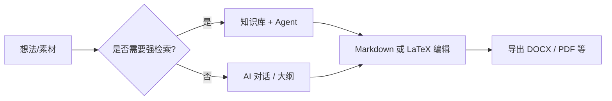

# 🚀 MetaDoc 最佳实践手册

MetaDoc 不是一个只有固定流程的软件。

相反，它更像一个**工具组合平台**：
你可以用不同的方式完成同一件事，比如写文章、做图表、翻译内容等等。

👉 这意味着：

* 同一个任务，**往往有多条路径可以完成**
* 不同路径在**速度、成本、效果**上各有差异
* 选对方法，比“会不会用功能”更重要

这份手册的目标不是介绍功能，而是帮你回答一个更实际的问题：

> 👉 **在不同场景下，我应该用哪种方式最合适？**

---

## 🧭 如何阅读本手册


| 标记       | 含义                             |
| ---------- | -------------------------------- |
| ⭐⭐⭐⭐⭐ | 推荐优先使用（大多数情况都适合） |
| ⭐⭐⭐⭐   | 稳定可靠，稍微多一步操作         |
| ⭐⭐⭐     | 特定场景更适合                   |
| ⚠️       | 有一定风险或需要注意             |
| 💰         | 会消耗更多 Token / 成本更高      |

---

主窗口标签页示意：

<MainTabs mode="demo" />

---

# 📝 一、写作：从想法到成稿

在 MetaDoc 中，写一篇文章通常有三种常见路径。你不需要全部掌握，只需要根据自己的目标选一条。

---

## ⭐⭐⭐⭐⭐ 路径 1（最推荐）

### AI 起草 → Markdown 修改 → 导出成品

**链路**：
[[ai.chat|AI 对话]] → Markdown 编辑 → [[core.export|导出功能]]

**适合你如果：**

* 想快速开始写作
* 需要反复修改内容
* 最终要交 Word / PDF / LaTeX 文档

---

**为什么这是最推荐的方式**

* Markdown 很简单，**不用花精力在排版上**
* 可以专注写内容，后面再处理格式
* 导出后可以在 Word 或 LaTeX 中做最后调整

👉 可以理解为：
先把内容写好，再把格式整理好

---

**注意**

* AI 写的内容需要自己检查（尤其是事实和引用）
* 导出后建议简单检查一下排版

---

AI 对话界面示意：

<AIChat mode="demo" />

---

## ⭐⭐⭐⭐ 路径 2

### 用知识库辅助写作（尤其是涉及到专业知识）

**链路**：
[[knowledge-base.usage|知识库]] → [[agent.introduction|Agent]] → 编辑器整理

---

**适合你如果：**

* 写的是有依据要求的内容（论文、综述、报告）
* 手上已经有 PDF、文档、资料

---

**优点**

* 可以基于已有资料生成内容
* 更容易保证内容“有来源”

---

**需要注意**

* ⚠️ 效果依赖上传的资料质量
* 💰 多轮对话会消耗更多 Token

---

👉 简单理解：

> 如果你需要“写得有根据”，就用这条路径

---

知识库界面示意：

<KnowledgeBase mode="demo" />

---

## ⭐⭐⭐ 路径 3

### Agent 直接生成 LaTeX 工程

**链路**：
Agent → LaTeX 项目 → 编译 PDF

---

**适合你如果：**

* 需要写标准论文
* 已经确定使用 LaTeX
* 时间比较紧

---

### ⚠️ 使用前建议了解

* 💰 会比普通对话消耗更多 Token
* 生成的工程可能需要自己调整
* 不太适合要求严格或敏感内容

---

Agent 界面示意：

<AgentView mode="demo" />

---

**提示词模板（可直接使用）**

```text
你是 LaTeX 技术编辑。请为主题「（在此填写论文/报告题目）」生成一套可在当前工作区直接编译的 LaTeX 工程。

要求：
1) 使用 article 或我指定的文档类；主文件名为 main.tex，其余章节拆分为多个 .tex 并用 \input 组织。
2) 目录结构清晰：figures/、sections/、bib/；给出示例占位图与参考文献条目。
3) 数学公式、定理环境、交叉引用、图表与参考文献用标准宏包（如 amsmath、graphicx、biblatex 或 natbib）；注明需安装的宏包。
4) 每一步给出编译命令建议（如 latexmk -pdf 或 xelatex 流程）；若需 Unicode 中文，说明用 XeLaTeX 或 LuaLaTeX。
5) 不要省略文件内容；保证工程自洽、路径正确。若信息不足，先列出假设再生成。
```

---

# 📊 二、图表与可视化

做图表时，最重要的不是“功能在哪”，而是：

> 👉 你是想更快，还是想更精细？

---


| 路径 | 做法 | 推荐 | 适合 |
| ---- | ---- | ---- | ---- |
| A | 用 AI 对话或 Agent 生成 Mermaid / PlantUML / ECharts 等代码，粘贴进 Markdown | ⭐⭐⭐⭐ | 改图快、和正文放在一起 |
| B | 用图表窗口（见 [[charts.introduction|图表功能]]） | ⭐⭐⭐⭐ | 更习惯图形界面时 |
| C | 选中文字 → 右键插入图表 | ⭐⭐⭐⭐⭐ | 与当前段落绑定最紧 |

相关入口：[[ai.chat|AI 对话]]、[[agent.introduction|Agent]]。

---

**简单建议**

* 日常写作 → 用右键（最快）
* 复杂图 → 用图表工具
* 想尝试不同方案 → 用 AI 生成

---

图表工具示意：

<GraphWindow mode="demo" />

---

# 🌐 三、翻译

翻译场景其实很简单，可以用一句话总结：

> 👉 内容越短，用的方法越简单

---


| 路径     | 推荐       | 适合        |
| -------- | ---------- | ----------- |
| 右键翻译 | ⭐⭐⭐⭐⭐ | 单句 / 段落 |
| AI 对话  | ⭐⭐⭐⭐   | 多段文本    |
| Agent    | ⭐⭐⭐⭐   | 长文档      |

---

👉 建议：

* 短内容 → 右键
* 长内容 → AI 或 Agent

---

可拖拽分割条示意：

<ResizableDivider mode="demo" />

---

# ✨ 四、段落优化

很多人会把整篇文章丢给 AI 优化，其实这样往往更慢、更贵。

更好的方式是：

---


| 路径            | 推荐       | 原因           |
| --------------- | ---------- | -------------- |
| 右键优化        | ⭐⭐⭐⭐⭐ | 更快、更省     |
| 大纲树优化      | ⭐⭐⭐⭐   | 适合整理结构   |
| AI 对话 / Agent | ⭐⭐⭐⭐   | 适合大范围调整 |

---

👉 核心思路：

> **把文章分成小段处理，会更高效**

---

大纲视图示意：

<Outline mode="demo" />

---

# 🎯 五、按场景选择

如果你不确定怎么用，可以直接看这一部分。

---

## 🎒 课堂笔记

**推荐方式**

* ⭐⭐⭐⭐⭐ Markdown 快速记录 → 课后用 AI 扩写
* ⭐⭐⭐⭐ 上传课件 → 生成复习提纲

👉 思路：先记下来，再整理

---

## 🧪 实验报告

**推荐方式**

* ⭐⭐⭐⭐⭐ Markdown 写作 → 导出 DOCX
* ⭐⭐⭐⭐ 用知识库辅助写分析部分

⚠️ 注意：数据必须自己确认

---

## 🛠️ 技术文档

**推荐方式**

* ⭐⭐⭐⭐⭐ Markdown + 右键优化
* ⭐⭐⭐⭐ 用 Agent 对齐旧文档

👉 重点是清晰和规范

---

## 💬 问答 / 博客

**推荐方式**

* ⭐⭐⭐⭐⭐ 先生成提纲 → 再写正文
* ⭐⭐⭐⭐ 用大纲控制结构

👉 关键是结构，而不是字数

---

## 📱 公众号 / 内容创作

**推荐方式**

* ⭐⭐⭐⭐⭐ 写完 Markdown → 导出 → 平台排版
* ⭐⭐⭐⭐ AI 生成标题和摘要

⚠️ 不建议一次性让 AI 写完整文章（成本高、风格不稳定）

---

# 🔁 流程总览



---

# 📚 延伸阅读

* [[quick-start.guide|快速开始指南]]
* [[core.export|导出功能]]
* [[features.paragraph-optimization|段落优化功能]]
* [[charts.introduction|图表功能介绍]]