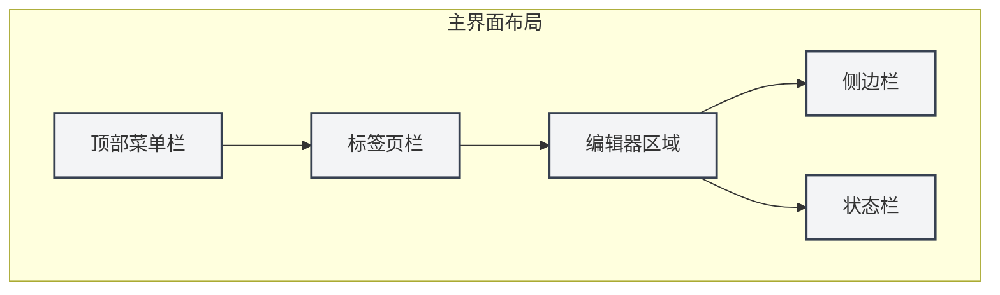
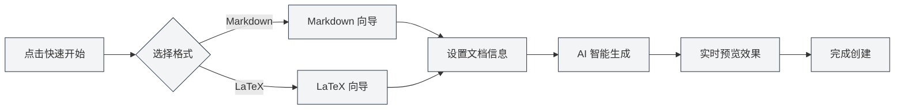

# 快速开始指南

## 概述

欢迎使用 MetaDoc！这是一款为知识工作者设计的智能文档处理工具。无论您是在撰写技术博客、整理学习笔记，还是准备学术论文，MetaDoc 都能为您提供专业而优雅的编辑体验。

MetaDoc 深度整合了人工智能能力，支持 Markdown 和 LaTeX 两种主流文档格式。它不仅仅是一个文本编辑器，更是您的智能写作助手——内置的 AI 对话、自动补全、智能校对等功能，让文档创作变得更加高效和愉悦。

## 首次使用

### 启动应用

启动 MetaDoc 后，您首先看到的是主页。这是一个精心设计的起点，让您可以快速开始工作：

- **快速开始**：智能向导会引导您选择文档格式并创建新文档
- **新建文档**：直接创建空白文档，选择您需要的格式
- **打开文件**：浏览并打开已有的文档
- **用户手册**：随时查阅详细的使用指南

### 界面介绍

MetaDoc 的界面设计遵循现代编辑器的布局理念，清晰而直观：

1. **顶部菜单栏**
   
   位于窗口最上方，汇集了文件、编辑、视图等核心功能。无论您需要新建文档、查找替换文本，还是切换视图模式，都可以在这里找到入口。菜单栏支持自定义，您可以根据使用习惯调整菜单项的显示与排序。

2. **标签页栏**
   
   位于菜单栏下方，显示当前打开的所有文档。每个文档对应一个标签页，点击即可切换。标签页支持拖拽排序，也可以固定常用文档，避免误关闭。当标签页较多时，还可以跨窗口组织文档。

3. **编辑器区域**
   
   这是您的主要工作区。MetaDoc 针对不同类型的文档提供了专门的编辑环境：
   - **Markdown 编辑器**：所见即所得的编辑体验，支持实时预览、数学公式、图表等丰富功能
   - **LaTeX 编辑器**：专业的学术写作环境，支持代码高亮、智能提示、编译预览等功能
   
4. **侧边栏**
   
   位于编辑器左侧，是您的文档导航中心。您可以在这里：
   - 切换编辑器、大纲、Agent 等不同视图
   - 查看文档结构大纲
   - 管理知识库和引用素材
   
5. **状态栏**
   
   位于窗口底部，实时显示当前文档的状态信息，包括字数统计、保存状态、语言设置等，让您对工作进度一目了然。

下方为对应的真实界面控件展示，便于您对照操作：

**顶部菜单栏**

位于窗口最上方，包含文件、编辑、视图等主菜单，提供应用级操作入口。您可以通过菜单栏执行新建、打开、保存文档，以及访问各种编辑和视图功能。

<MenuItemsDemo mode="demo" :items='[{"id": "file", "items": ["new", "open", "save"]}, {"id": "edit", "items": ["undo", "redo", "find"]}, {"id": "view", "items": ["editor", "outline"]}]' />

**标签页栏**

位于菜单栏下方，显示当前打开的所有文档标签。您可以通过点击标签切换文档，拖拽标签调整顺序，或右键点击标签进行更多操作（如关闭、固定、移动到新窗口等）。

<MainTabs mode="demo" />

**侧边栏**

位于编辑器左侧，提供多种辅助功能面板的入口。您可以通过侧边栏在编辑器视图、大纲视图、Agent视图等之间快速切换，提高文档编辑效率。

<ViewMenuItemsDemo mode="demo" :items='["editor", "outline", "home"]' />

## 快速创建文档

### 方式一：使用快速开始向导

MetaDoc 的快速开始向导是一个贴心的设计。它不只是简单地创建空白文档，而是像一位经验丰富的助手，引导您完成文档创建的每一个步骤：

1. 在主页点击"快速开始"按钮
2. 根据您的需求选择文档格式：
   - **Markdown**：如果您要撰写博客、技术文档、会议记录或任何日常文本内容，这是最轻便的选择。Markdown 的语法简单直观，同时又能满足丰富的排版需求。
   - **LaTeX**：如果您正在准备学术论文、学位论文或需要精确排版的科技文档，LaTeX 是学术界公认的标准。MetaDoc 让复杂的 LaTeX 编译变得简单易懂。
3. 向导会根据您的选择，提供相应的模板和 AI 辅助功能

#### 格式选择界面

向导的第一步是选择文档格式。MetaDoc 会根据您的使用场景，智能推荐合适的选项：

<QuickStartPanel mode="demo" />

#### Markdown 快速开始

选择 Markdown 后，向导会提供：
- **智能标题建议**：AI 会根据您的初步输入，建议合适的文档标题
- **结构化大纲**：自动生成文档框架，帮助您组织思路
- **实时预览**：边写边看，即时了解文档的最终呈现效果

<QuickStartMarkdown mode="demo" />

#### LaTeX 快速开始

选择 LaTeX 后，向导会提供：
- **专业模板**：针对不同学术场景优化的模板（论文、报告、演示文稿等）
- **结构指导**：自动生成标准的 LaTeX 文档结构
- **智能补全**：AI 辅助生成 LaTeX 代码，降低学习门槛

<QuickStartLatex mode="demo" />

#### 向导的核心价值

快速开始向导的精髓在于**降低门槛，提升效率**：

- **对新手友好**：不需要记忆复杂的语法，向导会引导您一步步完成
- **对专家高效**：AI 辅助功能可以快速生成文档框架，节省重复劳动
- **上下文感知**：如果您已经有一些想法，可以直接告诉 AI，它会帮您扩展成完整的文档结构

#### 向导工作流程

### 方式二：直接新建文档

如果您已经熟悉 MetaDoc，可以直接创建空白文档开始工作：

1. 点击主页的"新建文档"按钮，或按快捷键 `Ctrl+N`
2. 选择文档格式（Markdown / LaTeX / 纯文本）
3. 文档会立即在编辑器中打开，您可以开始创作

这种方式适合有经验的用户，或是有明确写作计划的场景。

### 方式三：打开现有文件

继续您之前的工作也很简单：

1. 点击主页的"打开文件"按钮，或按 `Ctrl+O`
2. 在文件浏览器中找到您的文档
3. 选中的文件会在新标签页中打开，您可以无缝继续编辑

MetaDoc 支持自动记忆您最近打开的文档，方便您快速回到工作状态。

## 基本操作

### 编辑文档

MetaDoc 的编辑体验经过精心设计，让您的注意力集中在内容本身：

- **流畅输入**：无论是快速记录灵感还是细致打磨文字，编辑器都能跟得上您的思路
- **智能格式化**：Markdown 编辑器支持所见即所得，LaTeX 编辑器提供语法高亮和智能提示
- **丰富元素**：轻松插入图片、表格、代码块、数学公式等元素，让文档更加生动专业
- **实时预览**：Markdown 文档可以边写边看，即时了解最终效果

### 保存文档

MetaDoc 提供多种保存方式，确保您的工作不会丢失：

- **即时保存**：`Ctrl+S` 快速保存当前文档，这是最常用的操作
- **另存为新文档**：`Ctrl+Shift+S` 当您需要将当前文档另存为副本时使用
- **批量保存**：`Ctrl+K S` 一次性保存所有打开的文档，适合整理工作收尾

此外，您还可以在设置中启用自动保存功能，让 MetaDoc 定期自动保存您的文档。

### 切换视图

MetaDoc 提供多种视图模式，满足不同工作阶段的需求：

- **编辑器视图**：文档编辑的主要工作区，提供完整的编辑功能
- **大纲视图**：以树形结构展示文档标题层级，适合快速导航和结构调整
- **PDF 预览**：LaTeX 文档编译后的预览，方便检查最终排版效果

通过侧边栏或快捷键，您可以快速在不同视图间切换。

## 获取帮助

MetaDoc 内置了详细的用户手册，随时为您解答疑问：

1. 按 `F1` 键或点击主页的"用户手册"按钮
2. 手册按主题分类，从基础操作到高级功能一应俱全
3. 使用搜索功能可以快速定位到您需要的内容

手册涵盖的内容包括：
- 编辑器的详细使用指南
- 文件和项目管理技巧
- AI 功能的深度教程
- Agent 框架的工作原理
- 个性化设置选项

## 探索更多

完成快速开始只是第一步。MetaDoc 还有许多强大功能等待您去探索：

1. **掌握编辑技巧**：了解[[core.editor-basics|编辑器基础操作]]，提升写作效率
2. **精通文件管理**：学习[[core.file-operations|文件操作]]的最佳实践
3. **深入编辑器功能**：
   - Markdown 用户：查看[[markdown.editor|Markdown 编辑器使用指南]]
   - LaTeX 用户：查看[[latex.editor|LaTeX 编辑器使用指南]]
4. **体验 AI 能力**：尝试[[ai.chat|AI 对话]]和[[ai.completion|AI 自动补全]]功能

MetaDoc 的设计理念是**让技术隐形，让创作自由**。希望这款工具能成为您知识工作的得力助手。

## 相关文档

- [[core.file-operations|文件操作]]
- [[core.editor-basics|编辑器基础操作]]
- [[markdown.editor|Markdown 编辑器使用指南]]
- [[latex.editor|LaTeX 编辑器使用指南]]
- [[settings.basic|基础设置]]
