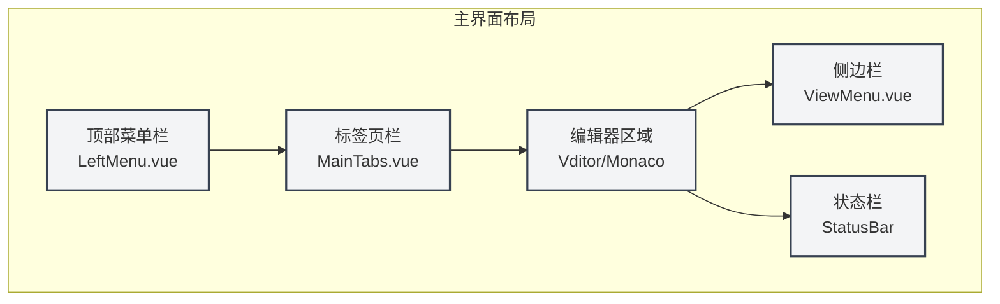
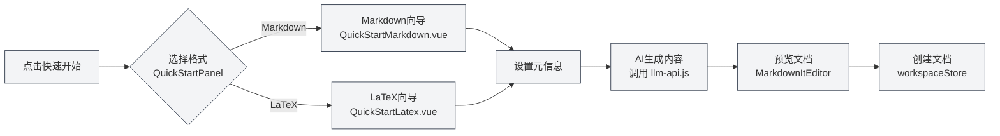

# 快速开始指南

## 概述

欢迎使用MetaDoc！本指南将帮助您快速了解MetaDoc的基本功能，让您在几分钟内开始创建和编辑文档。

MetaDoc是一款基于LLM Agent的智能文档处理软件，面向学生与IT从业者。它支持Markdown和LaTeX两种主流文档格式，集成了AI助手、知识库、Agent框架等强大功能，帮助您高效完成文档创作任务。

## 首次使用

### 启动应用

启动MetaDoc后，您将看到主页界面。主页基于Vue 3和Electron构建，提供了直观的功能入口：

- **快速开始**：选择文档格式（Markdown或LaTeX），快速创建新文档
- **新建文档**：创建空白文档
- **打开文件**：打开已有的文档文件
- **用户手册**：查看完整的使用文档

### 界面介绍

MetaDoc的主界面采用现代化的三栏式布局，包含以下区域：

1. **顶部菜单栏**（LeftMenu组件）：提供文件操作、编辑、视图等菜单选项
   - 基于`components/LeftMenu.vue`实现
   - 支持折叠/展开，可自定义菜单项显示
   
2. **标签页栏**（MainTabs组件）：显示当前打开的文档标签
   - 基于`components/MainTabs.vue`实现
   - 支持多文档同时编辑、标签页拖拽、跨窗口移动
   
3. **编辑器区域**：文档编辑的主要工作区
   - Markdown编辑器基于Vditor（`editor/vditor-adapter.ts`）
   - LaTeX编辑器基于Monaco Editor（`editor/monaco-adapter.ts`）
   
4. **侧边栏**（ViewMenu组件）：包含大纲视图、工作目录等辅助功能
   - 基于`components/ViewMenu.vue`实现
   - 支持编辑器视图、大纲视图、Agent视图等切换
   
5. **状态栏**：显示文档统计信息、保存状态等

下方为对应的真实界面控件展示，便于您对照操作：

**顶部菜单栏**

位于窗口最上方，包含文件、编辑、视图等主菜单，提供应用级操作入口。您可以通过菜单栏执行新建、打开、保存文档，以及访问各种编辑和视图功能。

<MenuItemsDemo mode="demo" :items='[{"id": "file", "items": ["new", "open", "save"]}, {"id": "edit", "items": ["undo", "redo", "find"]}, {"id": "view", "items": ["editor", "outline"]}]' />

**标签页栏**

位于菜单栏下方，显示当前打开的所有文档标签。您可以通过点击标签切换文档，拖拽标签调整顺序，或右键点击标签进行更多操作（如关闭、固定、移动到新窗口等）。

<MainTabs mode="demo" />

**侧边栏**

位于编辑器左侧，提供多种辅助功能面板的入口。您可以通过侧边栏在编辑器视图、大纲视图、Agent视图等之间快速切换，提高文档编辑效率。

<ViewMenuItemsDemo mode="demo" :items='["editor", "outline", "home"]' />

## 快速创建文档

### 方式一：使用快速开始向导

快速开始向导是MetaDoc的特色功能，基于 `components/home/QuickStartPanel.vue` 组件实现，提供了可视化的文档创建流程：

1. 在主页点击"快速开始"按钮
2. 选择文档格式：
   - **Markdown**（对应组件：`QuickStartMarkdown.vue`）：适合日常笔记、博客、技术文档等
   - **LaTeX**（对应组件：`QuickStartLatex.vue`）：适合学术论文、科技文档等
3. 根据向导提示完成文档创建

#### 快速开始向导的格式选择界面

<QuickStartPanel mode="demo" />

**QuickStartPanel 组件说明**：
- 基于 `components/home/QuickStartPanel.vue` 实现
- Props：`mode: 'normal' | 'demo'` - 运行模式
- 内部状态管理使用 Vue 3 Composition API
- 支持三种 stage：`'format'`（格式选择）、`'markdown'`（Markdown向导）、`'latex'`（LaTeX向导）

#### 选择 Markdown 后进入的向导界面

<QuickStartMarkdown mode="demo" />

**QuickStartMarkdown 组件说明**：
- 基于 `components/home/QuickStartMarkdown.vue` 实现
- 功能：
  - 支持设置文档元信息（标题、作者、描述）
  - 基于当前文档内容生成AI建议
  - 实时预览生成的Markdown内容
  - 集成 AI 服务 (`utils/llm-api.js`) 生成文档

#### 选择 LaTeX 后进入的向导界面

<QuickStartLatex mode="demo" />

**QuickStartLatex 组件说明**：
- 基于 `components/home/QuickStartLatex.vue` 实现
- 功能：
  - 支持 LaTeX 模板选择
  - 支持文档类型设置（论文、报告等）
  - AI 辅助生成 LaTeX 文档结构
  - 实时预览生成的 LaTeX 代码

#### 快速开始向导流程

#### 快速开始向导的核心功能

**AI辅助生成文档内容**：
- 基于 `utils/llm-api.js` 调用LLM服务
- 使用 `utils/prompts.ts` 中的提示词模板
- 支持多语言生成（根据用户设置）

**设置文档元信息**：
- 标题、作者、描述、关键词
- 元信息保存模式：侧边文件(.meta.json)、嵌入文档、不保存
- 基于 `stores/document.ts` 管理元信息状态

**预览生成的文档内容**：
- Markdown预览使用 `components/MarkdownItEditor.vue`
- 支持实时渲染、代码高亮、数学公式
- 基于 `vditor` 和 `markdown-it` 实现

### 方式二：直接新建文档

1. 点击主页的"新建文档"按钮，或使用快捷键 `Ctrl+N`
2. 选择文档格式（Markdown/LaTeX/纯文本）
3. 开始编辑

### 方式三：打开现有文件

1. 点击主页的"打开文件"按钮，或使用快捷键 `Ctrl+O`
2. 在文件选择对话框中选择要打开的文件
3. 文件将在新的标签页中打开

## 基本操作

### 编辑文档

创建或打开文档后，您可以在编辑器中：

- **输入文本**：直接输入内容
- **格式化文本**：使用工具栏按钮或快捷键进行格式化
- **插入元素**：插入图片、链接、表格、代码块等
- **实时预览**：Markdown编辑器支持实时预览功能

### 保存文档

- **保存**：使用快捷键 `Ctrl+S` 保存当前文档
- **另存为**：使用快捷键 `Ctrl+Shift+S` 将文档保存为新文件
- **保存全部**：使用快捷键 `Ctrl+K S` 保存所有打开的文档

### 切换视图

MetaDoc支持多种视图模式：

- **编辑器视图**：文档编辑的主要视图
- **大纲视图**：查看和编辑文档结构
- **PDF预览**：LaTeX文档编译后的PDF预览（仅LaTeX文档）

## 打开用户手册

如果您需要了解更多功能的使用方法，可以：

1. 点击主页的"用户手册"按钮，或按 `F1` 快捷键
2. 在用户手册中浏览不同主题的文档
3. 使用搜索功能快速找到需要的内容

用户手册包含：
- 详细的编辑器使用指南
- 文件操作说明
- AI功能使用教程
- Agent框架文档
- 系统设置说明

## 下一步

完成快速开始后，建议您：

1. **学习编辑器基础**：了解[[core.editor-basics|编辑器基础操作]]
2. **掌握文件操作**：学习[[core.file-operations|文件管理]]功能
3. **选择编辑器类型**：
   - 如果使用Markdown，查看[[markdown.editor|Markdown编辑器使用指南]]
   - 如果使用LaTeX，查看[[latex.editor|LaTeX编辑器使用指南]]
4. **探索AI功能**：了解[[ai.chat|AI对话]]和[[ai.completion|AI自动补全]]功能

## 相关文档

- [[core.file-operations|文件操作]]
- [[core.editor-basics|编辑器基础操作]]
- [[markdown.editor|Markdown编辑器使用指南]]
- [[latex.editor|LaTeX编辑器使用指南]]
- [[settings.basic|基础设置]]
