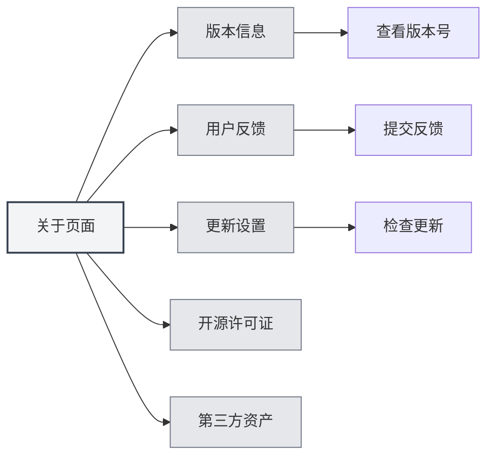
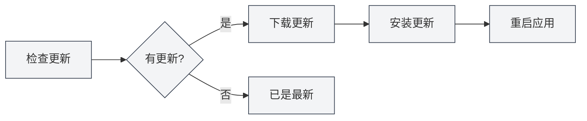

# 关于信息

## 概述

关于页面提供了MetaDoc的版本信息、更新设置、开源许可证和第三方资产信息。您可以通过此页面了解应用信息、检查更新、提交反馈等。

## 版本信息

### 查看版本

在关于页面，您可以查看以下信息：

- **应用名称**：MetaDoc
- **版本号**：当前安装的版本号
- **发布日期**：当前版本的发布日期
- **构建环境**：开发版本或发布版本

您可以通过顶部菜单栏访问关于页面：

<MenuItemsDemo mode="demo" :items='[{"id": "settings", "items": ["about"]}]' />



### 版本格式

版本号使用语义化版本格式：

```
主版本号.次版本号.修订号
```

例如：`0.12.1`

### 构建环境

- **开发版本**：开发环境构建的版本，可能包含调试信息
- **发布版本**：正式发布的版本，经过测试和优化

<SettingAboutSection mode="demo" />

## 用户反馈

### 提交反馈

您可以通过以下方式提交反馈：

1. 在关于页面，点击"用户反馈"按钮
2. 在反馈页面填写反馈内容
3. 提交反馈

### 反馈内容

反馈时可以包含以下信息：

- **问题描述**：详细描述遇到的问题
- **复现步骤**：说明如何复现问题
- **期望行为**：说明期望的行为
- **实际行为**：说明实际发生的行为
- **环境信息**：操作系统、版本号等

### 反馈建议

- **详细描述**：尽可能详细地描述问题
- **提供截图**：如有必要，提供截图或录屏
- **版本信息**：包含版本号和构建环境信息
- **复现步骤**：提供清晰的复现步骤

<UserFeedbackView mode="demo" />

## 官方QQ群

### 加入QQ群

MetaDoc官方QQ群：**1079841705**

加入QQ群可以：

- 获取最新资讯和更新通知
- 与其他用户交流使用经验
- 获得技术支持
- 参与功能讨论

### 群内资源

QQ群提供以下资源：

- **使用教程**：群文件中的使用教程
- **问题解答**：群内成员互相帮助
- **更新通知**：第一时间获取更新信息
- **功能建议**：参与功能讨论和建议

## 更新设置

### 自动检查更新

启用"自动检查更新"后，MetaDoc会在启动时自动检查是否有新版本：

- **启用**：启动时自动检查更新
- **禁用**：不自动检查更新

### 更新渠道

可以选择更新渠道：

- **正式版**：使用正式发布的版本（推荐）
- **开发版**：使用开发版本（可能不稳定）

<MainTabs mode="demo" />

### 手动检查更新

您可以随时手动检查更新：

1. 在关于页面的"更新设置"标签页
2. 点击"检查更新"按钮
3. 等待检查完成

### 更新状态

检查更新后会显示以下状态：

- **有更新可用**：显示新版本信息，可以下载更新
- **已是最新版本**：当前版本是最新的
- **检查失败**：显示错误信息

### 下载和安装更新

如果有更新可用：

1. **下载更新**：点击"下载更新"按钮
2. **等待下载**：查看下载进度
3. **安装更新**：下载完成后，点击"安装并重启"按钮
4. **自动重启**：应用会自动重启并安装更新



<QuickStartPanel mode="demo" />

## 开源许可证

### 查看许可证

在关于页面的"开源许可证"标签页，可以查看：

- **开源许可证**：MetaDoc使用的开源许可证
- **许可证内容**：完整的许可证文本

### 许可证信息

MetaDoc遵循开源许可证，您可以：

- 查看许可证内容
- 了解使用条款
- 了解权利和义务

## 第三方资产

### 查看第三方资产

在关于页面的"第三方资产"标签页，可以查看：

- **第三方库**：MetaDoc使用的第三方开源库
- **资产信息**：第三方资产的许可证和来源信息

### 资产列表

第三方资产列表包含：

- **库名称**：第三方库的名称
- **版本**：使用的版本号
- **许可证**：库的许可证类型
- **来源**：库的来源链接

## 最佳实践

1. **定期更新**：建议启用自动检查更新，及时获取新版本
2. **反馈问题**：遇到问题时及时提交反馈
3. **加入QQ群**：加入官方QQ群获取支持和资讯
4. **查看许可证**：了解开源许可证的使用条款
5. **关注更新**：关注更新通知，了解新功能和修复

## 注意事项

1. **更新备份**：更新前建议备份重要数据
2. **网络连接**：检查更新需要网络连接
3. **版本兼容**：更新后可能需要重新配置某些设置
4. **反馈信息**：提交反馈时注意保护隐私信息
5. **许可证遵守**：使用MetaDoc时请遵守开源许可证

<ResizableDivider mode="demo" />

## 相关文档

- [[settings.basic|基础设置]]
- [[settings.logging|日志配置]]
- [[quick-start.guide|快速开始指南]]

<SettingAboutSection mode="demo" />

<UserFeedbackView mode="demo" />

<MenuItemsDemo mode="demo" :items='[{"id": "settings", "items": ["about"]}]' />

<MainTabs mode="demo" />
