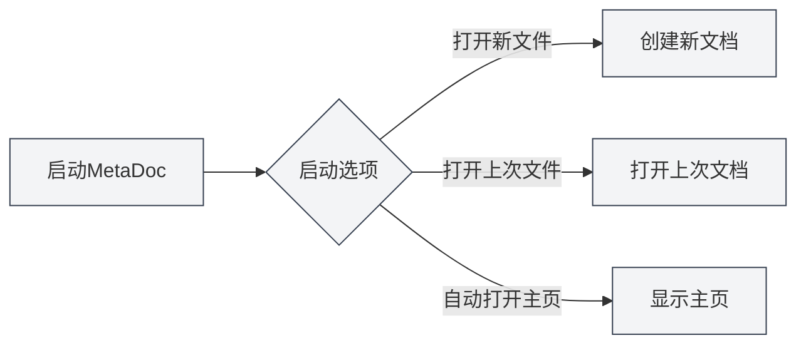
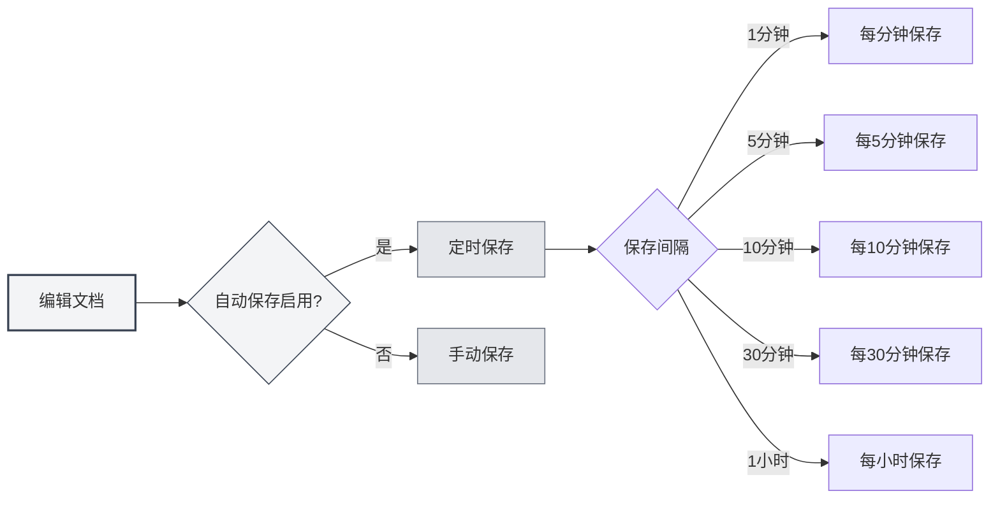
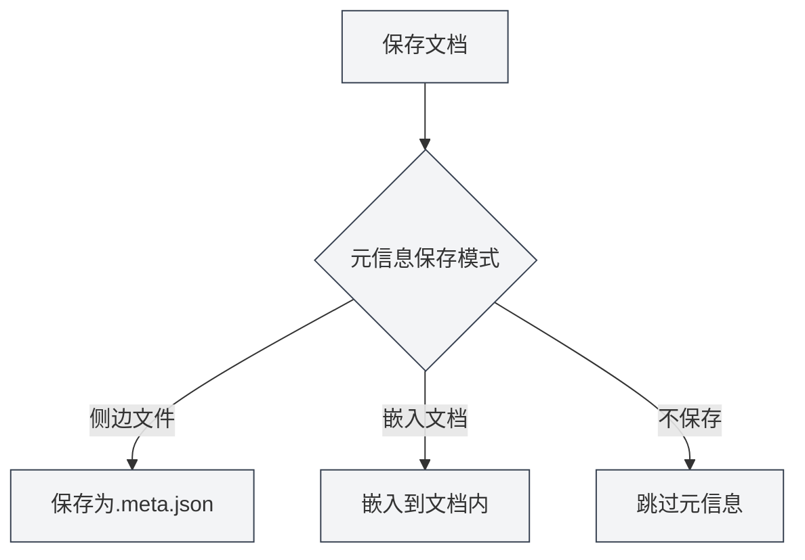

# 基础设置

## 概述

基础设置是MetaDoc的核心配置选项，涵盖了应用的启动行为、自动保存、文档统计、元信息管理等重要功能。合理配置这些选项能够提升您的使用体验和工作效率。

## 启动选项

### 设置启动行为

启动选项决定了MetaDoc启动时的默认行为：

- **打开新文件**：每次启动时创建一个新的空白文档
- **打开上次编辑的文件**：启动时自动打开上次关闭时正在编辑的文档

您可以根据使用习惯选择合适的启动选项。如果您经常需要从上次的工作继续，建议选择"打开上次编辑的文件"。

您可以通过顶部菜单栏访问设置：

<MenuItemsDemo mode="demo" :items='[{"id": "settings"}]' />

### 基础设置界面

下图展示了基础设置页面的完整界面：

<SettingBasicSection mode="demo" />

基础设置界面包含以下主要配置区域：

- **启动选项**：设置应用启动时的默认行为（打开新文件/上次编辑的文件）
- **自动保存**：配置自动保存的时间间隔，防止数据丢失
- **元数据保存**：选择元数据的存储方式（文档内/独立文件）
- **引用目录**：管理文档引用的外部文件存储位置
- **其他选项**：代码块处理、图片嵌入、数学公式等高级设置

### 启动时自动打开主页

启用此选项后，MetaDoc启动时会自动打开主页标签页。主页提供了快速开始、最近文档列表等功能，方便您快速访问常用功能。

## 自动保存

<SettingBasicSection mode="demo" />

### 配置自动保存

自动保存功能可以防止因意外情况（如程序崩溃、断电等）导致的内容丢失。MetaDoc支持以下自动保存间隔：

- **关闭**：不自动保存，需要手动保存
- **1分钟**：每分钟自动保存一次
- **5分钟**：每5分钟自动保存一次
- **10分钟**：每10分钟自动保存一次
- **30分钟**：每30分钟自动保存一次
- **1小时**：每小时自动保存一次

### 使用建议

- **频繁编辑**：建议设置较短的自动保存间隔（1-5分钟），确保内容及时保存
- **长时间写作**：可以设置较长的间隔（10-30分钟），减少磁盘写入频率
- **重要文档**：建议启用自动保存，并配合手动保存（`Ctrl+S`）确保数据安全

自动保存会在后台静默进行，不会打断您的编辑工作。

## 文档统计设置

<SettingBasicSection mode="demo" />

### 排除代码块统计

启用此选项后，在统计文档字数、词频等信息时，会排除代码块中的内容。这对于技术文档特别有用，因为代码块中的内容通常不应该计入文档的文本统计。

**使用场景**：

- 技术文档中包含大量代码示例
- 需要准确统计文档的实际文本内容
- 避免代码影响词频分析结果

## 图片处理设置

<SettingBasicSection mode="demo" />

### 解析嵌入图片（OCR功能）

启用此选项后，MetaDoc会对文档中嵌入的图片进行OCR（光学字符识别）处理，提取图片中的文字内容。这对于处理包含图片的文档（如PDF、Word文档）特别有用。

**功能说明**：

- 上传的DOCX、PPTX、PDF文件中的图片会被OCR处理
- 直接上传的图片文件仍会进行OCR处理（不受此选项影响）
- OCR结果可用于知识库检索和AI辅助功能

**注意事项**：

- OCR处理需要一定的计算资源，可能会影响文档加载速度
- 如果不需要提取图片中的文字，可以关闭此功能以提升性能

### 数学公式行内数字

启用此选项后，数学公式中的数字会以行内模式显示，而不是块级模式。这可以让公式更好地融入文本流，适合在段落中插入简单的数学表达式。

## 元信息保存模式

<SettingBasicSection mode="demo" />

### 设置保存方式

文档元信息（标题、作者、描述、关键词等）可以以三种方式保存：

- **侧边文件**：将元信息保存在文档同目录下的独立文件中（`.meta.json`）
  - 优点：不影响原文档内容，便于版本控制
  - 缺点：需要同时管理两个文件
- **嵌入文档**：将元信息嵌入到文档文件内部
  - 优点：单文件管理，便于分享
  - 缺点：某些格式可能不支持嵌入
- **不保存**：不保存元信息
  - 适用场景：临时文档或不需要元信息的文档

### 选择建议

- **技术文档**：推荐使用"侧边文件"模式，便于Git等版本控制系统管理
- **个人笔记**：可以使用"嵌入文档"模式，保持单文件整洁
- **临时文档**：可以选择"不保存"模式

## 引用文件目录管理

<SettingBasicSection mode="demo" />

### 查看目录信息

引用文件目录用于存储文档中引用的外部文件（如图片、附件等）。在基础设置页面，您可以：

- **查看目录大小**：显示引用文件目录占用的磁盘空间
- **刷新**：更新目录大小信息
- **打开目录**：在文件管理器中打开引用文件目录
- **清空目录**：删除目录中的所有文件（操作不可恢复）

### 使用场景

引用文件目录通常用于：

- 存储文档中插入的图片
- 保存文档附件
- 管理文档相关的资源文件

**注意事项**：

- 清空目录操作不可恢复，请谨慎操作
- 清空前建议先备份重要文件
- 目录大小会随着文档中引用的文件增加而增长

## 注意事项

1. **启动选项**：更改启动选项后，下次启动应用时才会生效
2. **自动保存**：自动保存不会覆盖您的手动保存操作，两者可以配合使用
3. **元信息模式**：更改元信息保存模式后，新保存的文档会使用新模式，已有文档不受影响
4. **引用目录**：清空引用目录前，请确保没有文档正在使用这些文件

## 相关文档

- [[core.file-operations|文件操作]]
- [[core.document-metadata|文档元信息]]
- [[settings.theme|主题设置]]
- [[settings.image|图片设置]]

<MenuItemsDemo mode="demo" :items='[{"id": "settings", "items": ["basic"]}]' />
