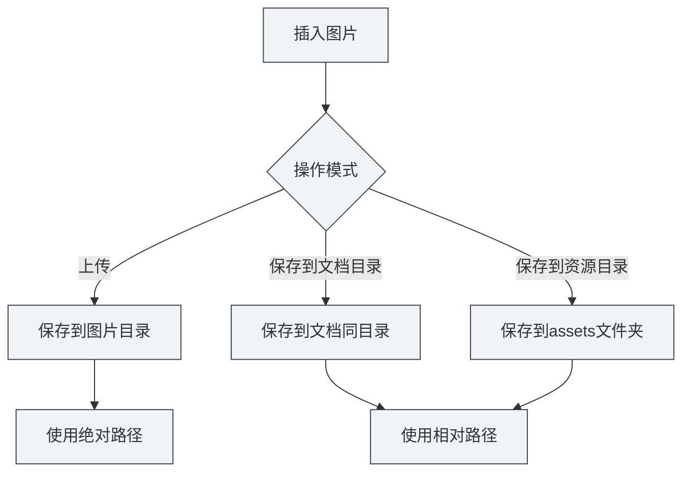

# 图片上传配置

## 概述

图片上传配置决定了在文档中插入图片时的处理方式。MetaDoc支持多种图片处理模式，您可以根据需求选择合适的配置。

## 插入图片操作

### 操作模式

插入图片时，可以选择以下操作模式：

- **上传**：将图片上传到指定的图片目录
- **保存到文档目录**：将图片保存到文档所在的目录
- **保存到资源目录**：将图片保存到文档目录下的`assets`文件夹

您可以通过顶部菜单栏访问图片设置：

<MenuItemsDemo mode="demo" :items='[{"id": "settings"}]' />

<MenuItemsDemo mode="demo" :items='[{"id": "file"}]' />

<MenuItemsDemo mode="demo" :items='[{"id": "edit"}]' />

### 图片设置界面

下图展示了图片设置页面的完整界面：

<SettingImageSection mode="demo" />

图片设置界面包含以下主要配置区域：

- **图片上传服务**：选择本地存储或第三方图床
- **本地存储路径**：设置图片保存的本地目录
- **网络图片处理**：配置是否保留原URL、是否自动转存等选项

### 上传模式

上传模式会将图片保存到配置的本地图片目录：

- **优点**：集中管理所有图片，便于备份和迁移
- **缺点**：图片与文档分离，移动文档时需要同时移动图片
- **适用场景**：多文档共享图片、图片资源集中管理

<DialogDemo mode="demo" dialogType="image-upload" />

### 保存到文档目录

将图片保存到文档所在的目录：

- **优点**：图片与文档在同一目录，便于管理
- **缺点**：每个文档目录都有图片，可能重复
- **适用场景**：单文档项目、文档需要独立打包

<DialogDemo mode="demo" dialogType="file-save" />

### 保存到资源目录

将图片保存到文档目录下的`assets`文件夹：

- **优点**：图片统一存放在`assets`文件夹，结构清晰
- **缺点**：需要创建`assets`文件夹
- **适用场景**：需要清晰的文件结构、文档需要导出分享

<DialogDemo mode="demo" dialogType="folder-select" />

## 保留网络图片URL

### 功能说明

启用"保留网络图片URL"后，插入网络图片时不会下载图片，而是直接使用原始URL：

- **启用**：保留网络图片的原始URL，不下载到本地
- **禁用**：下载网络图片到本地，使用本地路径

### 使用场景

- **启用场景**：

  - 图片资源较大，不需要本地备份
  - 图片会定期更新，需要实时显示最新版本
  - 节省本地存储空间

- **禁用场景**：
  - 需要离线访问图片
  - 需要备份图片资源
  - 网络图片可能失效

### 注意事项

- 保留网络URL时，需要网络连接才能显示图片
- 如果网络图片失效，文档中的图片将无法显示
- 建议重要图片禁用此选项，确保图片可用性

## 自动转义图片URL

### 功能说明

启用"自动转义图片URL"后，插入图片时会自动转义URL中的特殊字符：

- **启用**：自动转义URL中的特殊字符（如空格、中文字符等）
- **禁用**：保持URL原样，不进行转义

### 转义规则

系统会自动转义以下字符：

- **空格**：转换为`%20`
- **中文字符**：进行URL编码
- **特殊字符**：转义为URL安全格式

### 使用建议

- **启用**：推荐启用，确保URL在各种环境下都能正确解析
- **禁用**：仅在确定URL格式正确且不需要转义时禁用

## 路径格式

### 绝对路径

使用上传模式时，图片使用绝对路径：

- **格式**：`/path/to/image.png`
- **优点**：路径明确，不受文档位置影响
- **缺点**：移动文档或图片后路径失效

### 相对路径

使用保存到文档目录或资源目录时，图片使用相对路径：

- **格式**：`./image.png` 或 `./assets/image.png`
- **优点**：文档和图片可以一起移动
- **缺点**：文档位置改变后需要调整路径

## 配置生效

### 生效时机

图片上传配置的更改会在以下情况生效：

- **新插入的图片**：立即使用新配置
- **已打开的文档**：需要重新打开文档才能生效
- **已保存的文档**：已保存的文档不受影响

### 重新打开文件

某些配置更改需要重新打开文件才能生效：

1. 修改图片上传配置
2. 关闭当前文档
3. 重新打开文档
4. 新配置生效

## 最佳实践

1. **统一管理**：使用上传模式集中管理图片
2. **文档独立**：需要文档独立时，使用保存到文档目录
3. **结构清晰**：使用资源目录模式保持文件结构清晰
4. **网络图片**：重要图片建议禁用保留URL选项
5. **路径转义**：建议启用自动转义，确保兼容性

## 注意事项

1. **配置生效**：某些配置需要重新打开文件才能生效
2. **路径格式**：注意绝对路径和相对路径的区别
3. **网络图片**：保留网络URL时，需要网络连接
4. **图片备份**：重要图片建议禁用保留URL，确保备份
5. **存储空间**：上传模式会占用本地存储空间

## 相关文档

- [[settings.image-upload|上传服务设置]]
- [[settings.basic|基础设置]]
- [[core.file-operations|文件操作]]

<SettingImageSection mode="demo" />

<MenuItemsDemo mode="demo" :items='[{"id": "insert"}]' />
