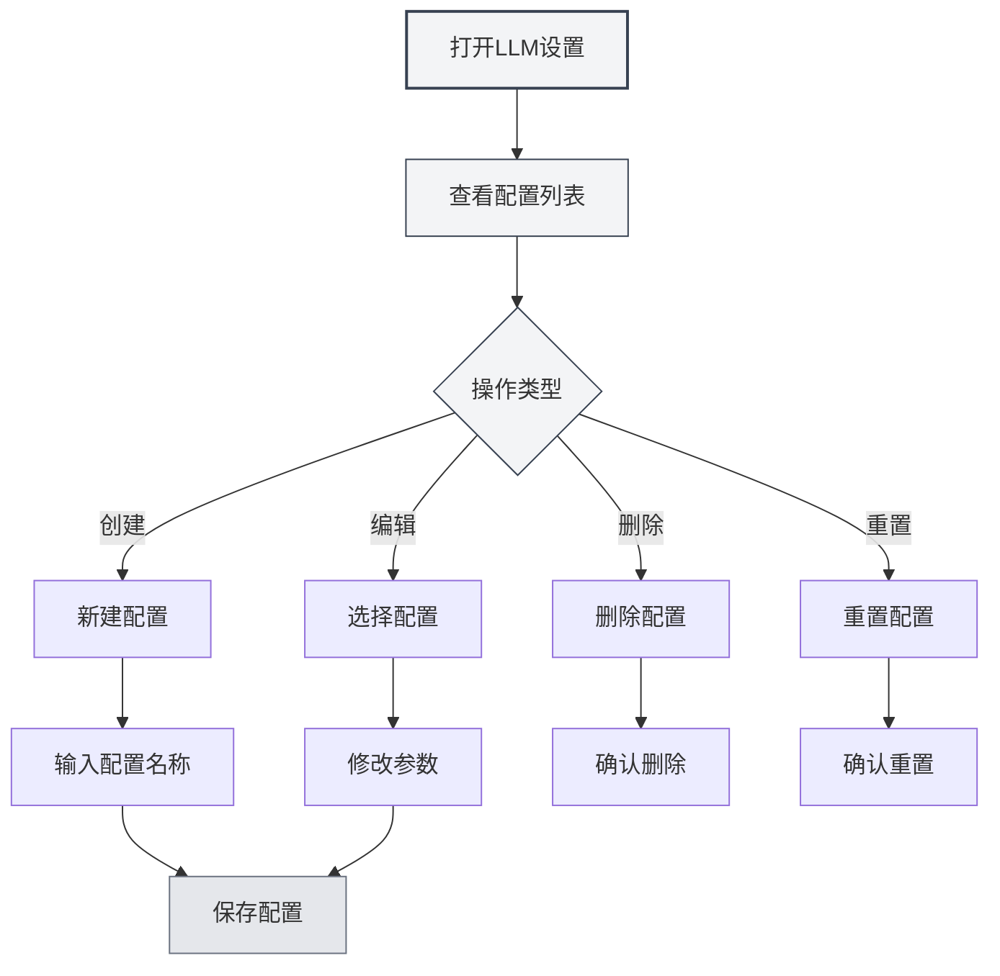

# LLM配置管理

## 概述

LLM配置管理允许您创建、编辑、删除和管理多个LLM配置。通过配置管理，您可以为不同的使用场景设置不同的LLM服务，灵活切换以满足各种需求。

## 创建配置

### 创建新配置

1. 在LLM设置页面，点击左侧配置列表上方的"新建配置"按钮（+图标）
2. 在弹出的对话框中输入配置名称
3. 系统会基于当前设置创建新配置
4. 创建成功后，会自动切换到新配置

您可以通过顶部菜单栏访问LLM设置：

<MenuItemsDemo mode="demo" :items='[{"id": "settings"}]' />

**注意事项**：
- 配置名称不能为空
- 配置名称应该具有描述性，便于识别
- 新建的配置会继承当前的所有设置
- 手动配置类型（manual）不支持创建新配置



### 从当前设置创建

创建新配置时，系统会：
- 复制当前选中的LLM类型
- 复制当前的所有配置参数（API URL、API Key、模型等）
- 创建新的配置ID
- 将新配置添加到配置列表

您可以基于现有配置创建新配置，然后修改参数，这样可以快速创建相似的配置。

## 编辑配置

### 修改配置参数

1. 在配置列表中选择要编辑的配置
2. 在右侧表单中修改各项参数
3. 修改后，系统会标记为"未保存更改"
4. 点击"保存更改"按钮保存修改

### 配置参数说明

不同LLM类型的配置参数不同：

- **MetaDoc API**：模型选择
- **Ollama**：API URL、模型选择、最大Token数
- **OpenAI兼容**：API URL、API Key、模型选择、后缀配置
- **OpenAI官方**：API Key、模型选择
- **DeepSeek**：API Key、模型选择
- **Gemini**：API Key、模型选择

### 实时预览

修改配置参数时，系统会实时检测更改：
- 有未保存更改时会显示警告标签
- 可以随时点击"放弃更改"恢复原状
- 保存后更改立即生效

## 删除配置

### 删除配置

1. 点击配置项右侧的"更多"按钮（三个点图标）
2. 选择"删除配置"
3. 确认删除操作

**限制条件**：
- 至少需要保留一个配置，不能删除最后一个配置
- 默认配置（isDefault）不能删除，只能重置
- 删除操作不可恢复，请谨慎操作

### 删除确认

删除配置前，系统会要求您确认：
- 确认删除后，配置将被永久删除
- 如果删除的是当前使用的配置，系统会自动切换到其他配置
- 删除后无法恢复，请确保不再需要该配置

## 重置配置

### 重置默认配置

对于默认配置（如"Ollama (默认)"），您可以将其重置为初始值：

1. 点击配置项右侧的"更多"按钮
2. 选择"重置配置"
3. 确认重置操作

重置后，配置会恢复到创建时的默认值，所有自定义修改将被清除。

**适用场景**：
- 配置被意外修改，需要恢复默认值
- 测试配置后需要重置
- 清理不需要的自定义设置

## 导出配置

### 导出单个配置

1. 点击配置项右侧的"更多"按钮
2. 选择"导出配置"
3. 系统会生成JSON格式的配置文件
4. 保存文件到本地

导出的配置文件包含：
- 配置ID和名称
- LLM类型
- 所有配置参数
- 创建和更新时间

### 导出所有配置

1. 点击配置列表上方的"导出所有配置"按钮（下载图标）
2. 系统会导出所有配置到一个JSON文件
3. 保存文件到本地

导出所有配置可以用于：
- 备份所有配置
- 迁移到其他设备
- 分享配置给其他用户

## 导入配置

### 导入配置

1. 点击配置列表上方的"导入配置"按钮（文档复制图标）
2. 选择之前导出的配置文件
3. 系统会解析并导入配置
4. 导入的配置会添加到配置列表

**导入规则**：
- 支持导入单个配置或配置数组
- 如果导入的配置ID已存在，会创建新ID避免冲突
- 导入后需要手动切换到新配置

### 导入格式

配置文件应为JSON格式，支持以下结构：

```json
{
  "id": "config-xxx",
  "name": "配置名称",
  "type": "ollama",
  "ollama": {
    "apiUrl": "http://localhost:11434/api",
    "selectedModel": "llama2"
  }
}
```

或配置数组：

```json
[
  { "id": "config-1", ... },
  { "id": "config-2", ... }
]
```

## 配置排序

### 拖拽排序

配置列表支持拖拽排序：

1. 点击并按住配置项
2. 拖拽到目标位置
3. 释放鼠标完成排序

排序后的顺序会保存，下次打开设置页面时会保持。

**使用场景**：
- 将常用配置放在顶部
- 按使用频率排序
- 按LLM类型分组

## 配置状态

### 当前配置

当前正在使用的配置会：
- 在列表中高亮显示
- 显示"未保存更改"标签（如果有未保存修改）
- 所有AI功能使用此配置的LLM服务

### 配置切换

切换配置时：
- 系统会检查当前配置是否有未保存更改
- 如果有未保存更改，建议先保存或放弃
- 切换后立即生效，所有AI功能使用新配置

## 最佳实践

1. **命名规范**：使用清晰的配置名称，如"工作-Ollama"、"实验-OpenAI"
2. **定期备份**：重要配置定期导出备份
3. **测试配置**：新配置创建后先测试，确认可用后再使用
4. **清理无用配置**：定期删除不再使用的配置，保持列表整洁
5. **文档记录**：为复杂配置添加备注或文档说明

## 注意事项

1. **配置安全**：包含API Key的配置请妥善保管，不要分享
2. **配置冲突**：导入配置时注意ID冲突问题
3. **默认配置**：默认配置不能删除，只能重置
4. **配置依赖**：某些功能可能依赖特定配置，删除前请确认
5. **多窗口同步**：配置修改会在所有窗口间同步

## 相关文档

- [[settings.llm|LLM配置]]
- [[settings.llm-types|LLM类型配置]]
- [[ai.chat|AI对话功能]]
- [[agent.config|Agent配置管理]]
