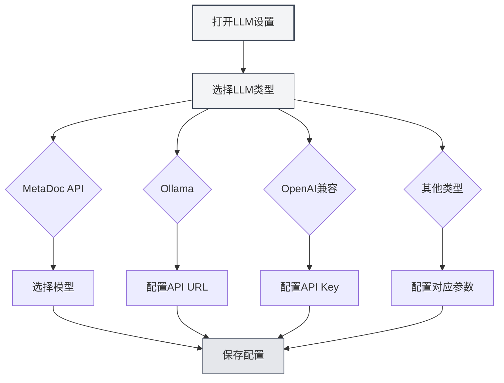

# LLM类型配置

## 概述

MetaDoc支持多种LLM服务提供商，每种类型都有不同的配置要求。本文档介绍如何配置各种LLM类型，包括MetaDoc API、Ollama、OpenAI、DeepSeek和Gemini。

## MetaDoc API

### 配置说明

MetaDoc API是MetaDoc官方提供的LLM服务，使用简单，无需配置API密钥。

### 配置步骤

1. 在LLM类型下拉框中选择"MetaDoc"
2. 在"选择模型"下拉框中选择可用的模型
3. 配置最大Token数（可选）

您可以通过顶部菜单栏访问LLM设置：

<MenuItemsDemo mode="demo" :items='[{"id": "settings"}]' />

### LLM配置界面演示

下图展示了LLM配置页面的主要功能区域：

<SettingLlmSection mode="demo" />

### 配置要求

- **登录账户**：需要登录MetaDoc账户才能使用
- **模型选择**：从可用模型列表中选择
- **最大Token数**：可选，限制单次请求的最大Token数

<MainTabs mode="demo" />

### 适用场景

- 快速开始使用AI功能
- 不需要配置外部服务
- 使用MetaDoc官方服务

<DialogDemo mode="demo" dialogType="llm-config" />

## Ollama

### 配置说明

Ollama是一个本地LLM运行环境，可以在本地运行大语言模型，无需网络连接。

### 配置步骤

1. 在LLM类型下拉框中选择"Ollama"
2. 配置API基础URL（默认：`http://localhost:11434/api`）
3. 点击"选择模型"下拉框，系统会自动获取本地可用的模型列表
4. 选择要使用的模型
5. 配置最大Token数（可选）

### 配置要求

- **安装Ollama**：需要先安装Ollama并启动服务
- **API URL**：默认是 `http://localhost:11434/api`，如果Ollama运行在其他地址，需要修改
- **模型下载**：需要先使用Ollama下载模型（如：`ollama pull llama2`）

### 获取模型列表

点击"选择模型"下拉框时，MetaDoc会自动连接到Ollama服务并获取可用模型列表。如果连接失败，请检查：

- Ollama服务是否正在运行
- API URL是否正确
- 网络连接是否正常

### 适用场景

- 本地运行LLM，保护数据隐私
- 不需要网络连接
- 有足够的计算资源（GPU推荐）

<DialogDemo mode="demo" dialogType="api-config" />

## OpenAI兼容

### 配置说明

OpenAI兼容API支持所有兼容OpenAI API格式的服务，包括OpenAI官方API和第三方兼容服务。

### 配置步骤

1. 在LLM类型下拉框中选择"OpenAI兼容"
2. 配置API基础URL（默认：`https://api.openai.com/v1`）
3. 输入API Key
4. 点击"选择模型"下拉框获取可用模型列表
5. 选择要使用的模型
6. 配置Completion后缀和Chat后缀（可选，用于自定义API路径）
7. 配置最大Token数（可选）

### 配置要求

- **API URL**：OpenAI官方API或兼容服务的API地址
- **API Key**：从服务提供商获取的API密钥
- **模型列表**：系统会自动获取可用模型列表

### API后缀配置

某些兼容服务可能需要自定义API路径：

- **Completion后缀**：用于Completion API的自定义路径后缀
- **Chat后缀**：用于Chat API的自定义路径后缀

大多数情况下不需要配置，使用默认值即可。

### 适用场景

- 使用OpenAI官方API
- 使用兼容OpenAI API的第三方服务
- 需要自定义API路径的服务

<QuickStartPanel mode="demo" />

<MainTabs mode="demo" />

## OpenAI官方

### 配置说明

OpenAI官方配置专门用于OpenAI官方API，配置更简单，API URL固定。

### 配置步骤

1. 在LLM类型下拉框中选择"OpenAI官方"
2. 输入OpenAI API Key
3. 点击"选择模型"下拉框获取可用模型列表
4. 选择要使用的模型
5. 配置最大Token数（可选）

### 配置要求

- **API Key**：从OpenAI官网获取的API密钥
- **API URL**：固定为 `https://api.openai.com/v1`，不可修改

### 获取API Key

1. 访问 [OpenAI官网](https://platform.openai.com/)
2. 注册或登录账户
3. 进入API Keys页面
4. 创建新的API Key
5. 复制API Key并粘贴到MetaDoc配置中

<ResizableDivider mode="demo" />

### 适用场景

- 使用OpenAI官方GPT模型
- 需要稳定的官方服务
- 有OpenAI账户和API配额

## DeepSeek

### 配置说明

DeepSeek是一个高性能的LLM服务提供商，提供强大的中文理解能力。

### 配置步骤

1. 在LLM类型下拉框中选择"DeepSeek"
2. 输入DeepSeek API Key
3. 选择模型（deepseek-chat 或 deepseek-reasoner）
4. 配置最大Token数（可选）

### 配置要求

- **API Key**：从DeepSeek官网获取的API密钥
- **模型选择**：
  - `deepseek-chat`：通用对话模型
  - `deepseek-reasoner`：推理模型

### 获取API Key

1. 访问 [DeepSeek官网](https://www.deepseek.com/)
2. 注册或登录账户
3. 进入API Keys页面
4. 创建新的API Key
5. 复制API Key并粘贴到MetaDoc配置中

### 适用场景

- 需要强大的中文理解能力
- 需要推理能力（使用deepseek-reasoner）
- 性价比高的LLM服务

<SettingKnowledgeBaseSection mode="demo" />

<CompletionSettingsPanel mode="demo" />

## Gemini

### 配置说明

Gemini是Google提供的LLM服务，支持多模态能力。

### 配置步骤

1. 在LLM类型下拉框中选择"Gemini"
2. 输入Gemini API Key
3. 点击"选择模型"下拉框获取可用模型列表
4. 选择要使用的模型
5. 配置最大Token数（可选）

### 配置要求

- **API Key**：从Google AI Studio获取的API密钥
- **模型选择**：系统会自动获取可用模型列表

### 获取API Key

1. 访问 [Google AI Studio](https://makersuite.google.com/app/apikey)
2. 使用Google账户登录
3. 创建新的API Key
4. 复制API Key并粘贴到MetaDoc配置中

### 适用场景

- 使用Google的LLM服务
- 需要多模态能力
- 有Google账户

<AgentView mode="demo" />

## 最大Token数配置

### 功能说明

最大Token数限制单次请求可以生成的最大Token数量。启用此功能可以：

- 控制生成内容的长度
- 节省API费用
- 避免生成过长的内容

### 配置方式

1. 启用"最大Token数"开关
2. 设置Token数量（范围：1-32768）
3. 保存配置

### 使用建议

- **短文本生成**：100-500 tokens
- **中等长度**：500-2000 tokens
- **长文本生成**：2000-8000 tokens
- **无限制**：关闭此选项

## 配置验证

### 测试配置

配置完成后，建议测试配置是否正常：

1. 保存配置
2. 启用LLM功能
3. 尝试使用AI对话功能
4. 如果出现错误，检查配置是否正确

### 常见问题

**连接失败**：

- 检查API URL是否正确
- 检查网络连接
- 检查服务是否正常运行

**认证失败**：

- 检查API Key是否正确
- 检查API Key是否过期
- 检查账户是否有足够的配额

**模型不可用**：

- 检查模型名称是否正确
- 检查账户是否有权限使用该模型
- 检查服务是否支持该模型

## 注意事项

1. **API密钥安全**：请妥善保管API密钥，不要分享给他人
2. **费用控制**：使用外部API可能产生费用，请注意使用量
3. **网络要求**：使用外部API需要稳定的网络连接
4. **服务可用性**：不同服务的可用性和稳定性可能不同
5. **模型选择**：不同模型有不同的能力和限制，请根据需求选择

## 相关文档

- [[settings.llm|LLM配置]]
- [[settings.llm-management|LLM配置管理]]
- [[ai.chat|AI对话功能]]
- [[ai.completion|AI自动补全]]

<MenuItemsDemo mode="demo" :items='[{"id": "file"}]' />

<ViewMenuItemsDemo mode="demo" :items='["settings"]' />

<SettingLlmSection mode="demo" />

<DialogDemo mode="demo" dialogType="llm-config" />

<MainTabs mode="demo" />
