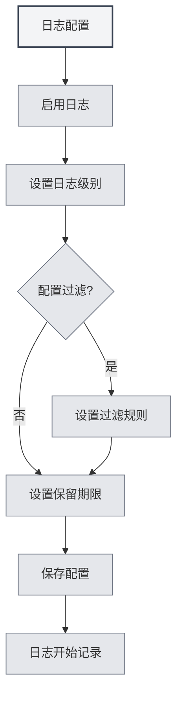

# 日志配置

## 概述

日志配置允许您管理MetaDoc的日志记录功能。通过配置日志，您可以记录应用的运行状态，便于问题排查和性能分析。

## 启用日志

### 开启日志功能

在日志设置页面，首先需要启用日志功能：

1. 找到"启用日志"开关
2. 将开关切换到"启用"状态
3. 日志会开始记录到文件

您可以通过顶部菜单栏访问日志设置：

<MenuItemsDemo mode="demo" :items='[{"id": "settings"}]' />

启用日志后，系统会记录应用的运行信息，包括：
- 操作记录
- 错误信息
- 警告信息
- 调试信息（如果启用）



**注意事项**：
- 日志会占用一定的磁盘空间
- 建议在需要排查问题时启用
- 生产环境可以关闭以减少资源占用

## 日志级别

### 级别说明

日志级别决定了记录哪些级别的日志：

- **DEBUG**：详细的调试信息，包括所有操作细节
- **INFO**：一般信息，记录重要的操作和状态
- **WARN**：警告信息，记录可能的问题
- **ERROR**：错误信息，记录错误和异常

### 级别优先级

日志级别有优先级关系：

```
DEBUG < INFO < WARN < ERROR
```

选择某个级别后，会记录该级别及更高级别的日志。例如：
- 选择INFO：记录INFO、WARN、ERROR
- 选择WARN：只记录WARN、ERROR
- 选择ERROR：只记录ERROR

### 级别选择建议

- **开发调试**：使用DEBUG级别，获取详细信息
- **日常使用**：使用INFO级别，记录重要操作
- **问题排查**：使用WARN级别，关注警告和错误
- **生产环境**：使用ERROR级别，只记录错误

## 日志过滤

### 过滤功能

日志过滤允许您只记录特定范围的日志：

- **按scope过滤**：只记录特定模块的日志
- **前缀匹配**：支持前缀匹配，如"ai-graph"会匹配所有以"ai-graph"开头的scope
- **精确匹配**：支持精确匹配，如"[ai-graph][WorkflowTool]"

### 过滤规则

过滤规则支持以下格式：

- **简单匹配**：`ai-graph` - 匹配所有包含"ai-graph"的scope
- **前缀匹配**：`ai-` - 匹配所有以"ai-"开头的scope
- **精确匹配**：`[ai-graph][WorkflowTool]` - 精确匹配该scope

### 使用场景

- **调试特定模块**：只记录某个模块的日志
- **减少日志量**：过滤掉不关心的日志
- **问题定位**：专注于特定功能的日志

### 过滤示例

**示例1：只记录AI相关日志**
```
过滤条件：ai-
```

**示例2：只记录工作流日志**
```
过滤条件：workflow
```

**示例3：只记录特定工具的日志**
```
过滤条件：[ai-graph][WorkflowTool]
```

## 日志保留期限

### 保留期限设置

日志保留期限决定了日志文件的保留时间：

- **不保留**：不自动清理日志
- **1天**：保留1天的日志
- **3天**：保留3天的日志
- **7天**：保留7天的日志
- **1个月**：保留1个月的日志
- **3个月**：保留3个月的日志
- **6个月**：保留6个月的日志
- **1年**：保留1年的日志
- **永久**：永久保留日志

### 自动清理

设置保留期限后，系统会自动清理过期的日志文件：

- **清理时机**：更改保留期限时立即执行清理
- **清理规则**：删除超过保留期限的日志文件
- **清理范围**：只清理日志目录中的文件

### 选择建议

- **开发环境**：使用较短的保留期限（1-3天）
- **生产环境**：使用中等保留期限（7天-1个月）
- **重要项目**：使用较长的保留期限（3-6个月）
- **审计需求**：使用永久保留

## 日志文件路径

### 查看日志路径

在日志设置页面，可以查看：

- **日志文件路径**：当前日志文件的完整路径
- **日志目录路径**：日志文件所在的目录路径

### 打开日志文件

1. 在日志设置页面，找到"日志文件路径"
2. 点击"打开日志文件"按钮
3. 系统会用默认文本编辑器打开日志文件

### 打开日志目录

1. 在日志设置页面，找到"日志目录"
2. 点击"打开日志目录"按钮
3. 系统会在文件管理器中打开日志目录

## 日志控制台

### 实时查看日志

日志设置页面提供了日志控制台，可以实时查看日志：

- **实时显示**：显示最新的日志条目
- **历史记录**：显示最近的日志历史（最多500条）
- **日志级别**：不同级别的日志用不同颜色显示

### 控制台功能

- **查看日志**：实时查看应用日志
- **过滤显示**：根据日志级别过滤显示
- **搜索日志**：在控制台中搜索日志内容

## 日志文件格式

### 文件命名

日志文件使用以下命名格式：

```
YYYY-MM-DD HH-mm-ss.log
```

例如：`2026-02-19 14-30-45.log`

### 日志格式

每条日志包含以下信息：

- **时间戳**：日志记录的时间
- **级别**：日志级别（DEBUG/INFO/WARN/ERROR）
- **进程类型**：main（主进程）或renderer（渲染进程）
- **Scope**：日志来源的模块或组件
- **消息**：日志消息内容

### 日志示例

```
[2026-02-19 14:30:45] [INFO] [main][Logger] 日志配置更新: enabled=true, level=info
[2026-02-19 14:30:46] [DEBUG] [renderer][Editor] 文档已保存
[2026-02-19 14:30:47] [WARN] [main][RAG] 知识库文件未找到
[2026-02-19 14:30:48] [ERROR] [renderer][LLM] API调用失败
```

## 最佳实践

1. **合理设置级别**：根据使用场景选择合适的日志级别
2. **使用过滤**：使用过滤功能减少日志量
3. **定期清理**：设置合理的保留期限，避免占用过多空间
4. **问题排查**：遇到问题时，临时提高日志级别获取详细信息
5. **日志备份**：重要日志建议备份保存

## 注意事项

1. **磁盘空间**：日志会占用磁盘空间，注意定期清理
2. **性能影响**：DEBUG级别可能影响性能，建议只在调试时使用
3. **隐私安全**：日志可能包含敏感信息，注意保护日志文件
4. **文件权限**：确保日志目录有写入权限
5. **日志位置**：日志文件位置由系统自动管理，不建议手动修改

## 相关文档

- [[settings.basic|基础设置]]
- [[settings.about|关于信息]]
